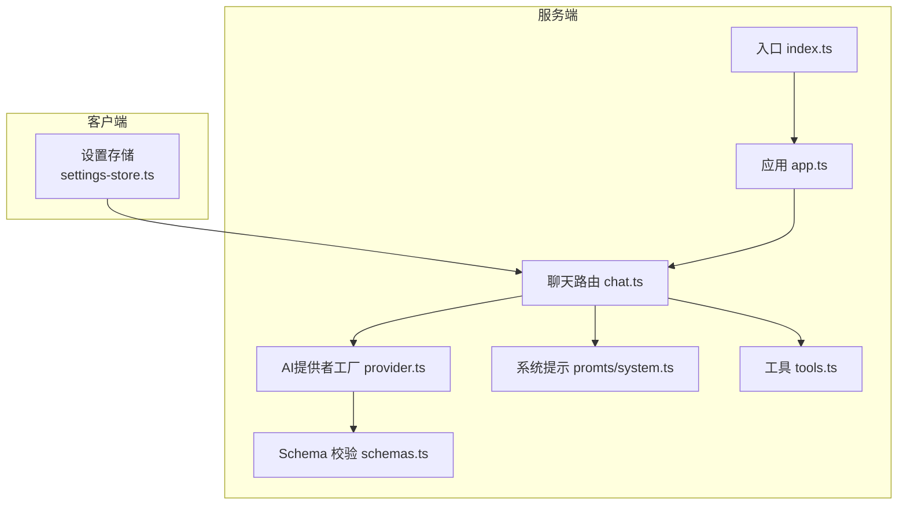
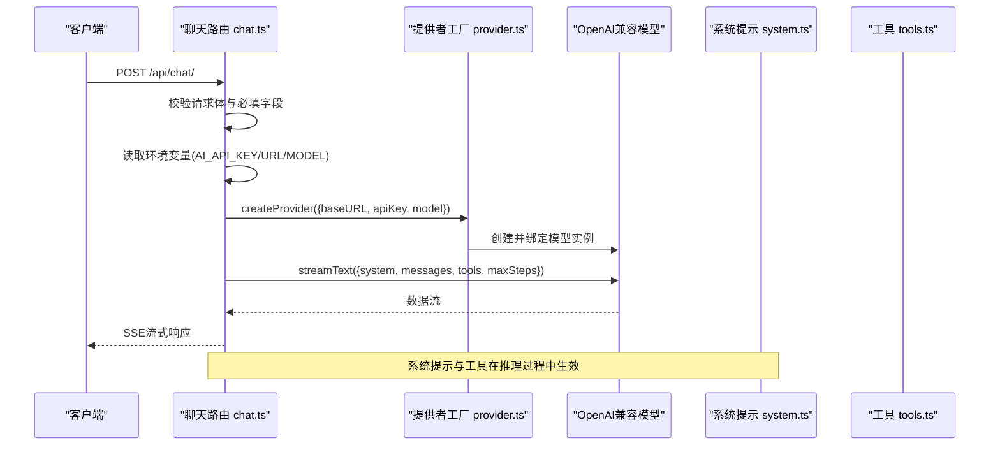
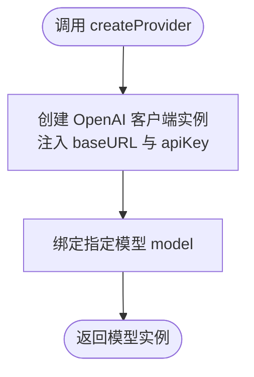
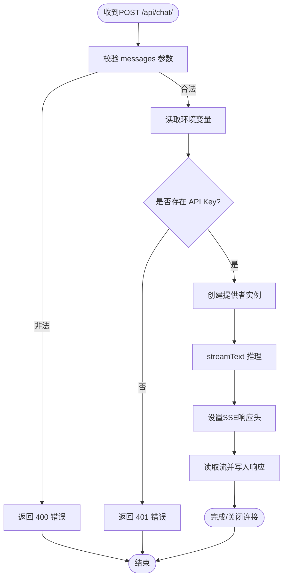
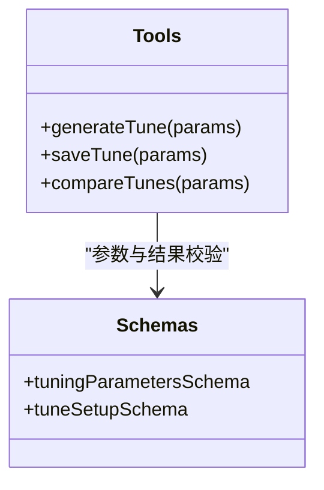
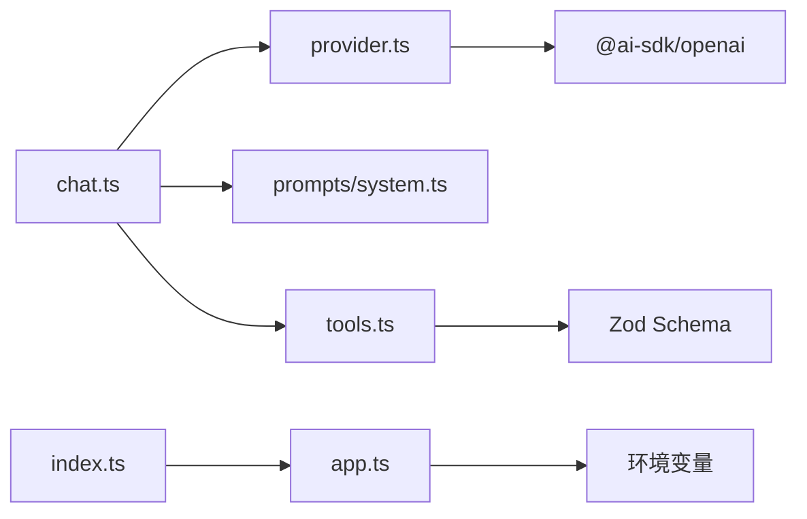

# AI提供商配置

<cite>
**本文引用的文件**
- [server/src/index.ts](file://server/src/index.ts)
- [server/src/app.ts](file://server/src/app.ts)
- [server/src/routes/chat.ts](file://server/src/routes/chat.ts)
- [server/src/ai/provider.ts](file://server/src/ai/provider.ts)
- [server/src/ai/prompts/system.ts](file://server/src/ai/prompts/system.ts)
- [server/src/ai/tools.ts](file://server/src/ai/tools.ts)
- [server/src/ai/schemas.ts](file://server/src/ai/schemas.ts)
- [shared/types/chat.ts](file://shared/types/chat.ts)
- [client/src/lib/store/settings-store.ts](file://client/src/lib/store/settings-store.ts)
</cite>

## 目录
1. [简介](#简介)
2. [项目结构](#项目结构)
3. [核心组件](#核心组件)
4. [架构总览](#架构总览)
5. [详细组件分析](#详细组件分析)
6. [依赖关系分析](#依赖关系分析)
7. [性能与成本考量](#性能与成本考量)
8. [故障排查指南](#故障排查指南)
9. [结论](#结论)
10. [附录](#附录)

## 简介
本文件系统性阐述本项目的AI提供商配置与集成方式，重点覆盖以下方面：
- OpenAI兼容的AI服务集成路径与配置项（API密钥、基础URL、模型名）
- provider.ts中的AI提供商初始化流程（认证、模型绑定）
- 支持的AI模型与参数约束（温度、最大令牌数等）
- 健康检查与运行时日志中的关键信息
- 开发与生产环境的配置策略与最佳实践
- 扩展支持其他AI提供商的接口适配与配置标准化方法

## 项目结构
项目采用前后端分离的典型结构，AI相关逻辑集中在后端的AI子模块，并通过Express路由对外提供聊天能力；前端通过状态管理维护AI配置预设。

图表来源
- [server/src/index.ts:1-11](file://server/src/index.ts#L1-L11)
- [server/src/app.ts:1-40](file://server/src/app.ts#L1-L40)
- [server/src/routes/chat.ts:1-74](file://server/src/routes/chat.ts#L1-L74)
- [server/src/ai/provider.ts:1-16](file://server/src/ai/provider.ts#L1-L16)
- [server/src/ai/prompts/system.ts:1-101](file://server/src/ai/prompts/system.ts#L1-L101)
- [server/src/ai/tools.ts:1-60](file://server/src/ai/tools.ts#L1-L60)
- [server/src/ai/schemas.ts:1-68](file://server/src/ai/schemas.ts#L1-L68)
- [client/src/lib/store/settings-store.ts:1-48](file://client/src/lib/store/settings-store.ts#L1-L48)

章节来源
- [server/src/index.ts:1-11](file://server/src/index.ts#L1-L11)
- [server/src/app.ts:1-40](file://server/src/app.ts#L1-L40)
- [server/src/routes/chat.ts:1-74](file://server/src/routes/chat.ts#L1-L74)
- [server/src/ai/provider.ts:1-16](file://server/src/ai/provider.ts#L1-L16)
- [server/src/ai/prompts/system.ts:1-101](file://server/src/ai/prompts/system.ts#L1-L101)
- [server/src/ai/tools.ts:1-60](file://server/src/ai/tools.ts#L1-L60)
- [server/src/ai/schemas.ts:1-68](file://server/src/ai/schemas.ts#L1-L68)
- [client/src/lib/store/settings-store.ts:1-48](file://client/src/lib/store/settings-store.ts#L1-L48)

## 核心组件
- AI提供者工厂：封装OpenAI兼容服务的初始化与模型绑定，统一认证与基础URL注入。
- 聊天路由：接收请求、校验输入、读取环境变量、调用AI提供者并以Server-Sent Events流式返回。
- 系统提示：定义专业领域、原则、参数体系、常见问题诊断与交互规范。
- 工具集：提供生成调校方案、保存方案、对比方案等工具声明与参数Schema。
- Schema校验：对调校参数与完整方案进行严格的数据结构与取值范围约束。
- 健康检查：暴露AI模型、基础URL、是否配置API Key等运行态信息。

章节来源
- [server/src/ai/provider.ts:1-16](file://server/src/ai/provider.ts#L1-L16)
- [server/src/routes/chat.ts:1-74](file://server/src/routes/chat.ts#L1-L74)
- [server/src/ai/prompts/system.ts:1-101](file://server/src/ai/prompts/system.ts#L1-L101)
- [server/src/ai/tools.ts:1-60](file://server/src/ai/tools.ts#L1-L60)
- [server/src/ai/schemas.ts:1-68](file://server/src/ai/schemas.ts#L1-L68)
- [server/src/app.ts:14-26](file://server/src/app.ts#L14-L26)

## 架构总览
后端通过Express提供REST接口，聊天请求进入路由后，使用AI提供者工厂创建OpenAI兼容模型实例，结合系统提示、工具与Schema进行推理与流式输出。健康检查接口用于快速验证运行态配置。

图表来源
- [server/src/routes/chat.ts:9-47](file://server/src/routes/chat.ts#L9-L47)
- [server/src/ai/provider.ts:9-15](file://server/src/ai/provider.ts#L9-L15)
- [server/src/ai/prompts/system.ts:1-101](file://server/src/ai/prompts/system.ts#L1-L101)
- [server/src/ai/tools.ts:5-27](file://server/src/ai/tools.ts#L5-L27)

## 详细组件分析

### AI提供者工厂（provider.ts）
- 职责：基于传入的baseURL、apiKey与model，创建OpenAI兼容的模型实例。
- 认证机制：通过apiKey注入到OpenAI兼容客户端，确保后续调用携带有效凭证。
- 连接池与重试：当前实现未显式配置连接池或重试策略，具体行为取决于底层SDK默认设置。
- 扩展点：可通过修改此处的创建逻辑以适配其他兼容OpenAI协议的提供商。

图表来源
- [server/src/ai/provider.ts:9-15](file://server/src/ai/provider.ts#L9-L15)

章节来源
- [server/src/ai/provider.ts:1-16](file://server/src/ai/provider.ts#L1-L16)

### 聊天路由（chat.ts）
- 输入校验：要求messages为非空数组，否则返回400。
- 环境变量读取：从进程环境读取AI_API_KEY、AI_BASE_URL、AI_MODEL。
- 认证前置：若未配置API Key，直接返回401。
- 流式输出：使用SSE头与toDataStream将模型输出以流式方式返回。
- 错误处理：在响应头未发送前返回JSON错误；若SSE已开始则发送error事件并结束连接。

图表来源
- [server/src/routes/chat.ts:9-73](file://server/src/routes/chat.ts#L9-L73)

章节来源
- [server/src/routes/chat.ts:1-74](file://server/src/routes/chat.ts#L1-L74)

### 系统提示（prompts/system.ts）
- 角色定位：作为“FH6调校师”，面向《地平线6》的车辆调校场景。
- 专业领域与原则：明确参数体系、诊断流程与交互规范。
- 参数范围：对轮胎、定位、弹簧、阻尼、防倾杆、空气动力学、制动、差速器、变速箱等参数给出取值范围与影响说明。
- 工具协作：强调使用generateTune、saveTune等工具生成与保存结构化调校方案。

章节来源
- [server/src/ai/prompts/system.ts:1-101](file://server/src/ai/prompts/system.ts#L1-L101)

### 工具与Schema（tools.ts、schemas.ts）
- 工具集：generateTune、saveTune、compareTunes，参数通过Zod Schema约束，确保调用时数据结构正确。
- Schema校验：对调校参数与完整方案进行严格的数值范围与字段约束，保障输出质量与一致性。

图表来源
- [server/src/ai/tools.ts:5-59](file://server/src/ai/tools.ts#L5-L59)
- [server/src/ai/schemas.ts:3-67](file://server/src/ai/schemas.ts#L3-L67)

章节来源
- [server/src/ai/tools.ts:1-60](file://server/src/ai/tools.ts#L1-L60)
- [server/src/ai/schemas.ts:1-68](file://server/src/ai/schemas.ts#L1-L68)

### 健康检查与运行时信息（app.ts、index.ts）
- 健康检查接口：返回AI模型、基础URL、是否配置API Key等信息，便于运维监控。
- 启动日志：打印当前使用的AI模型与端点，便于快速核对配置。

章节来源
- [server/src/app.ts:14-26](file://server/src/app.ts#L14-L26)
- [server/src/index.ts:6-10](file://server/src/index.ts#L6-L10)

### 前端配置预设（settings-store.ts）
- 提供者类型：支持deepseek、openai、ollama、custom四种类型。
- 预设基地址与模型：针对不同提供商给出常用默认值，便于快速切换。
- 本地持久化：使用zustand持久化存储，避免每次刷新丢失配置。

章节来源
- [client/src/lib/store/settings-store.ts:11-16](file://client/src/lib/store/settings-store.ts#L11-L16)
- [client/src/lib/store/settings-store.ts:18-48](file://client/src/lib/store/settings-store.ts#L18-L48)
- [shared/types/chat.ts:1-22](file://shared/types/chat.ts#L1-L22)

## 依赖关系分析
- 路由依赖提供者工厂：聊天路由通过createProvider创建模型实例。
- 提供者工厂依赖OpenAI兼容SDK：负责认证与模型绑定。
- 路由依赖系统提示与工具：推理阶段使用系统提示与工具集合。
- Schema依赖Zod：保证参数与结果的结构与取值合规。
- 健康检查依赖环境变量：用于展示当前运行态配置。

图表来源
- [server/src/routes/chat.ts:2-5](file://server/src/routes/chat.ts#L2-L5)
- [server/src/ai/provider.ts:1](file://server/src/ai/provider.ts#L1)
- [server/src/ai/tools.ts:1-3](file://server/src/ai/tools.ts#L1-L3)
- [server/src/app.ts:14-26](file://server/src/app.ts#L14-L26)
- [server/src/index.ts:1-2](file://server/src/index.ts#L1-L2)

章节来源
- [server/src/routes/chat.ts:1-74](file://server/src/routes/chat.ts#L1-L74)
- [server/src/ai/provider.ts:1-16](file://server/src/ai/provider.ts#L1-L16)
- [server/src/ai/tools.ts:1-60](file://server/src/ai/tools.ts#L1-L60)
- [server/src/app.ts:14-26](file://server/src/app.ts#L14-L26)
- [server/src/index.ts:1-11](file://server/src/index.ts#L1-L11)

## 性能与成本考量
- 模型选择与成本：不同提供商的单价与计费方式存在差异，建议在生产环境按需选择性价比更高的模型，并结合业务流量进行容量规划。
- 温度与最大令牌数：temperature越高，输出多样性越大但可控性下降；maxTokens影响单次输出长度与成本，需在体验与成本之间权衡。
- 流式传输：SSE流式返回有助于降低首字节延迟，改善用户体验，但需注意网络中断与重连策略。
- 运行时日志：健康检查与启动日志可帮助快速定位配置问题，减少排障时间。

## 故障排查指南
- 400错误：messages参数缺失或为空，检查前端请求体构造。
- 401错误：未配置AI_API_KEY，检查环境变量与部署配置。
- 500错误：AI调用失败，查看后端错误日志；若SSE已开始，将收到error事件。
- 健康检查：通过/api/health确认AI模型、基础URL与API Key状态。

章节来源
- [server/src/routes/chat.ts:12-24](file://server/src/routes/chat.ts#L12-L24)
- [server/src/routes/chat.ts:60-72](file://server/src/routes/chat.ts#L60-L72)
- [server/src/app.ts:14-26](file://server/src/app.ts#L14-L26)

## 结论
本项目通过统一的AI提供者工厂与OpenAI兼容SDK，实现了对多种提供商的标准化接入。配合系统提示、工具与Schema，能够稳定地输出高质量的结构化调校方案。建议在生产环境中完善重试与熔断策略，并结合实际业务对模型与参数进行精细化调优。

## 附录

### 环境变量与默认值
- AI_API_KEY：必需，用于认证。
- AI_BASE_URL：可选，默认指向DeepSeek端点。
- AI_MODEL：可选，默认为deepseek-chat。

章节来源
- [server/src/routes/chat.ts:17-19](file://server/src/routes/chat.ts#L17-L19)
- [server/src/index.ts:8-9](file://server/src/index.ts#L8-L9)

### 支持的AI提供商与默认配置
- deepseek：baseURL与model的默认值已在前端与后端分别设定。
- openai：提供者类型与默认模型可在前端预设中切换。
- ollama：本地推理默认端点与模型可在前端预设中选择。
- custom：允许自定义baseURL与model。

章节来源
- [client/src/lib/store/settings-store.ts:11-16](file://client/src/lib/store/settings-store.ts#L11-L16)
- [shared/types/chat.ts:15-22](file://shared/types/chat.ts#L15-L22)

### 扩展其他AI提供商的步骤
- 接口适配：在provider.ts中新增对应提供商的创建逻辑，保持与现有createProvider签名一致。
- 配置标准化：在shared/types/chat.ts中扩展AIProviderType枚举与默认配置，前端settings-store.ts中补充预设。
- 参数Schema：如新提供商有特殊参数，可在tools.ts与schemas.ts中扩展相应Schema。
- 健康检查：在app.ts中更新健康检查返回的可用模型列表，便于运维监控。

章节来源
- [server/src/ai/provider.ts:3-15](file://server/src/ai/provider.ts#L3-L15)
- [shared/types/chat.ts:1-22](file://shared/types/chat.ts#L1-L22)
- [client/src/lib/store/settings-store.ts:11-16](file://client/src/lib/store/settings-store.ts#L11-L16)