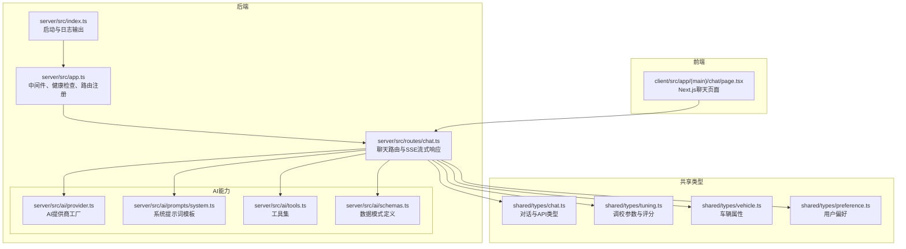
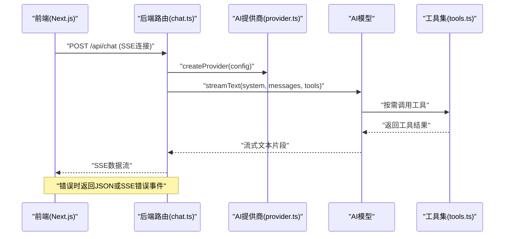
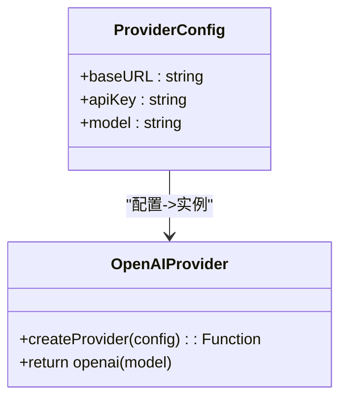
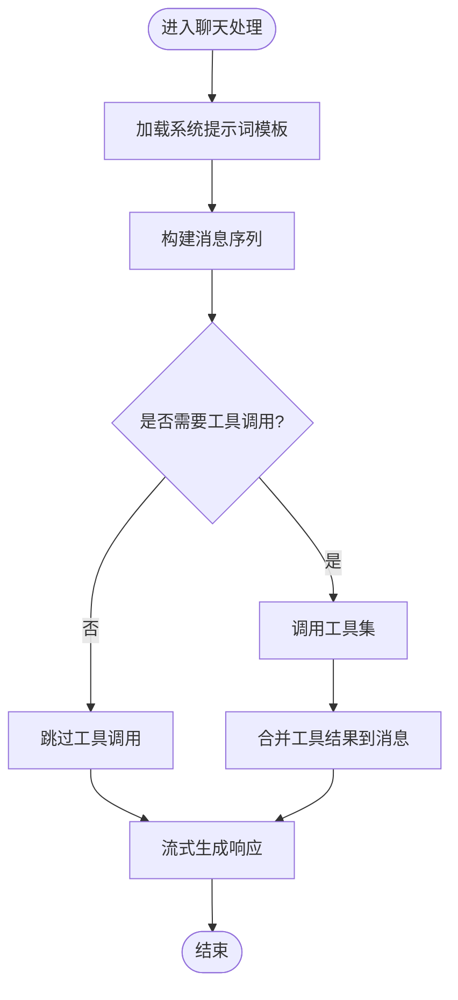
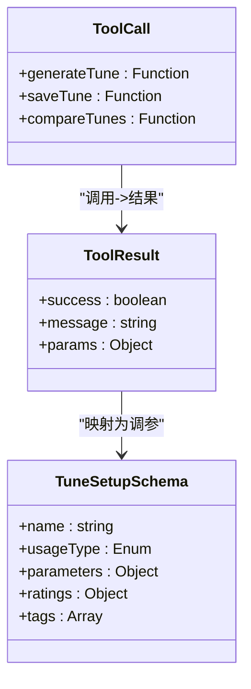
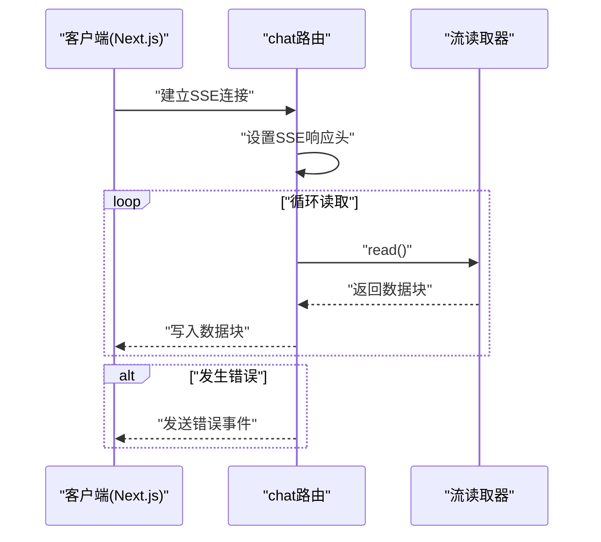
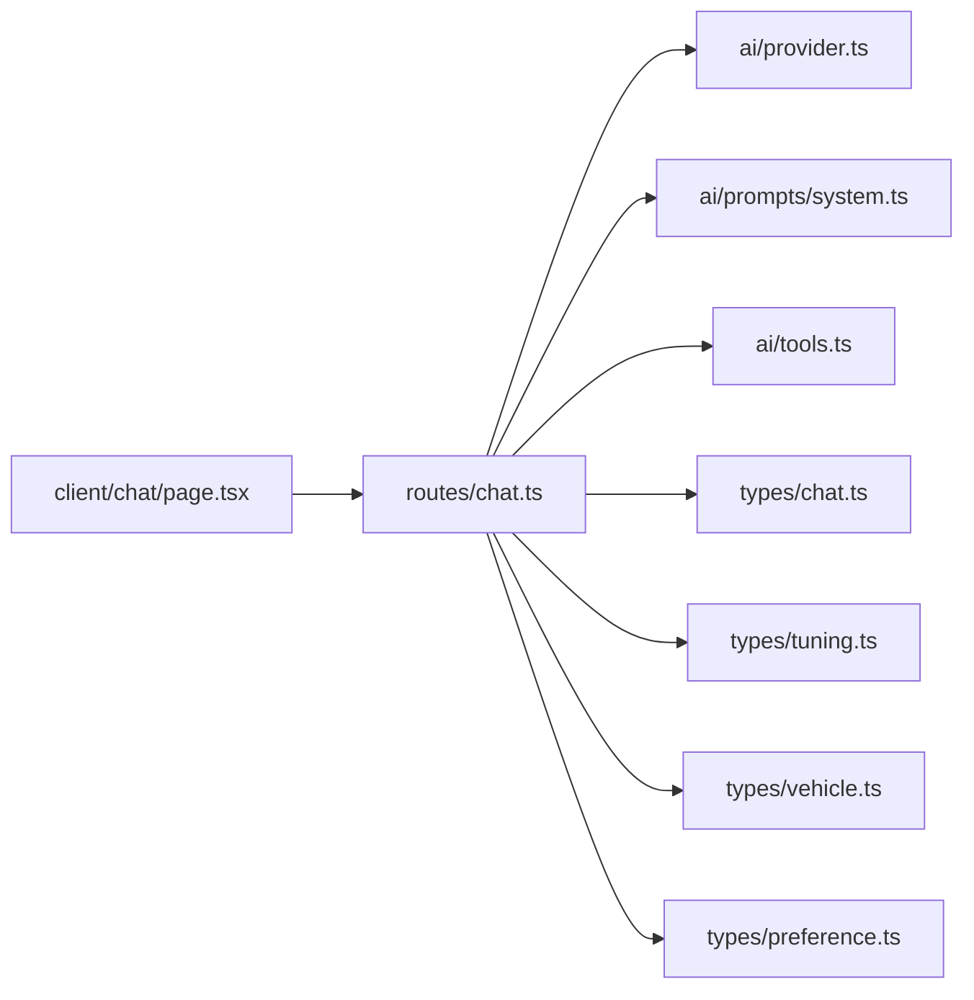

# AI集成模块

<cite>
**本文档引用的文件**
- [server/src/index.ts](file://server/src/index.ts)
- [server/src/app.ts](file://server/src/app.ts)
- [server/src/routes/chat.ts](file://server/src/routes/chat.ts)
- [server/src/ai/provider.ts](file://server/src/ai/provider.ts)
- [server/src/ai/prompts/system.ts](file://server/src/ai/prompts/system.ts)
- [server/src/ai/tools.ts](file://server/src/ai/tools.ts)
- [server/src/ai/schemas.ts](file://server/src/ai/schemas.ts)
- [shared/types/chat.ts](file://shared/types/chat.ts)
- [shared/types/tuning.ts](file://shared/types/tuning.ts)
- [shared/types/vehicle.ts](file://shared/types/vehicle.ts)
- [shared/types/preference.ts](file://shared/types/preference.ts)
- [client/src/app/(main)/chat/page.tsx](file://client/src/app/(main)/chat/page.tsx)
</cite>

## 目录
1. [简介](#简介)
2. [项目结构](#项目结构)
3. [核心组件](#核心组件)
4. [架构总览](#架构总览)
5. [详细组件分析](#详细组件分析)
6. [依赖关系分析](#依赖关系分析)
7. [性能考虑](#性能考虑)
8. [故障排除指南](#故障排除指南)
9. [结论](#结论)
10. [附录](#附录)

## 简介
本文件面向FH6汽车设置工具的AI集成模块，系统性阐述AI提供商配置机制、提示词系统设计、工具调用流程、流式响应（SSE）实现与客户端连接管理、AI模型配置与参数调优策略、性能优化建议以及故障排除与错误处理最佳实践。该模块基于Next.js客户端架构，通过统一的AI提供商抽象接入多种OpenAI兼容的服务，并以流式Server-Sent Events（SSE）向客户端推送AI响应。

## 项目结构
后端采用分层组织：入口与应用初始化、路由层、AI能力封装（提供商、提示词、工具、模式定义）、共享类型定义等。前端通过Next.js应用路由与后端交互，后端再通过AI SDK对接外部模型服务。

**图表来源**
- [server/src/index.ts:1-11](file://server/src/index.ts#L1-L11)
- [server/src/app.ts:1-40](file://server/src/app.ts#L1-L40)
- [server/src/routes/chat.ts:1-74](file://server/src/routes/chat.ts#L1-L74)
- [server/src/ai/provider.ts](file://server/src/ai/provider.ts)
- [server/src/ai/prompts/system.ts](file://server/src/ai/prompts/system.ts)
- [server/src/ai/tools.ts](file://server/src/ai/tools.ts)
- [server/src/ai/schemas.ts](file://server/src/ai/schemas.ts)
- [shared/types/chat.ts:1-75](file://shared/types/chat.ts#L1-L75)
- [shared/types/tuning.ts:1-126](file://shared/types/tuning.ts#L1-L126)
- [shared/types/vehicle.ts:1-30](file://shared/types/vehicle.ts#L1-L30)
- [shared/types/preference.ts:1-60](file://shared/types/preference.ts#L1-L60)
- [client/src/app/(main)/chat/page.tsx](file://client/src/app/(main)/chat/page.tsx)

**章节来源**
- [server/src/index.ts:1-11](file://server/src/index.ts#L1-L11)
- [server/src/app.ts:1-40](file://server/src/app.ts#L1-L40)
- [server/src/routes/chat.ts:1-74](file://server/src/routes/chat.ts#L1-L74)

## 核心组件
- 应用入口与启动：负责读取环境变量、监听端口并打印AI模型与端点信息。
- 应用主体：配置CORS、JSON解析、健康检查接口、路由挂载与全局错误处理。
- 聊天路由：接收消息列表与会话ID，校验输入，构造AI提供商，执行流式文本生成，通过SSE推送响应。
- AI提供商工厂：根据配置创建统一的AI模型实例，支持多提供商类型。
- 提示词系统：集中管理"系统提示词模板"，确保AI行为一致性与专业性。
- 工具集：定义可被AI调用的工具，用于将AI响应转化为具体调优建议。
- 数据模式：定义调校参数、评分、车辆属性与用户偏好等数据结构，保障前后端契约一致。
- Next.js客户端：基于App Router的聊天页面，实现与后端的SSE连接与消息展示。

**章节来源**
- [server/src/index.ts:1-11](file://server/src/index.ts#L1-L11)
- [server/src/app.ts:1-40](file://server/src/app.ts#L1-L40)
- [server/src/routes/chat.ts:1-74](file://server/src/routes/chat.ts#L1-L74)
- [server/src/ai/provider.ts](file://server/src/ai/provider.ts)
- [server/src/ai/prompts/system.ts](file://server/src/ai/prompts/system.ts)
- [server/src/ai/tools.ts](file://server/src/ai/tools.ts)
- [server/src/ai/schemas.ts](file://server/src/ai/schemas.ts)
- [shared/types/chat.ts:1-75](file://shared/types/chat.ts#L1-L75)
- [shared/types/tuning.ts:1-126](file://shared/types/tuning.ts#L1-L126)
- [shared/types/vehicle.ts:1-30](file://shared/types/vehicle.ts#L1-L30)
- [shared/types/preference.ts:1-60](file://shared/types/preference.ts#L1-L60)
- [client/src/app/(main)/chat/page.tsx](file://client/src/app/(main)/chat/page.tsx)

## 架构总览
AI集成模块遵循"请求-流式生成-工具调用-响应推送"的闭环流程。后端通过统一的AI提供商抽象屏蔽不同服务差异，利用工具集将自然语言建议转化为结构化调优参数，最终以SSE实时推送给前端。

**图表来源**
- [server/src/routes/chat.ts:9-73](file://server/src/routes/chat.ts#L9-L73)
- [server/src/ai/provider.ts](file://server/src/ai/provider.ts)
- [server/src/ai/tools.ts](file://server/src/ai/tools.ts)

## 详细组件分析

### AI提供商配置机制
- 支持的提供商类型：通过@ai-sdk/openai库支持多种OpenAI兼容的服务。
- 配置项：包含基础URL、API密钥、模型名等核心配置。
- 默认配置：提供默认值，便于快速启动与演示。
- 实际使用：路由层从环境变量读取配置，动态创建提供商实例。

**图表来源**
- [server/src/ai/provider.ts:3-15](file://server/src/ai/provider.ts#L3-L15)

**章节来源**
- [server/src/ai/provider.ts:1-16](file://server/src/ai/provider.ts#L1-L16)
- [server/src/routes/chat.ts:17-24](file://server/src/routes/chat.ts#L17-L24)

### 提示词系统设计
- 系统提示词模板：集中于系统提示词文件，确保AI始终遵循预设的专业语境与行为规范。
- 专业领域覆盖：包含FH6全部可调参数、不同车型调校策略、症状诊断能力。
- 交互规范：明确使用中文回复、专业术语使用、问题诊断流程等。
- 与工具调用结合：系统提示词明确AI在调用工具时的角色与约束，避免越权或不合规操作。

**图表来源**
- [server/src/routes/chat.ts:29-38](file://server/src/routes/chat.ts#L29-L38)
- [server/src/ai/prompts/system.ts:1-101](file://server/src/ai/prompts/system.ts#L1-L101)

**章节来源**
- [server/src/ai/prompts/system.ts:1-101](file://server/src/ai/prompts/system.ts#L1-L101)
- [server/src/routes/chat.ts:29-38](file://server/src/routes/chat.ts#L29-L38)

### 工具调用机制
- 工具定义：工具集定义了三种核心工具，用于生成、保存和对比调校方案。
- 调用流程：AI在生成过程中根据上下文决定是否调用工具；工具执行后返回结构化结果，供AI整合进回复。
- 参数验证：使用Zod Schema严格验证工具参数，确保数据完整性。
- 结果映射：工具返回与调校参数类型对齐，便于前端渲染与后续性能测试。

**图表来源**
- [server/src/ai/tools.ts:5-59](file://server/src/ai/tools.ts#L5-L59)
- [server/src/ai/schemas.ts:54-67](file://server/src/ai/schemas.ts#L54-L67)

**章节来源**
- [server/src/ai/tools.ts:1-60](file://server/src/ai/tools.ts#L1-L60)
- [server/src/ai/schemas.ts:1-68](file://server/src/ai/schemas.ts#L1-L68)

### 流式响应处理与SSE实现
- SSE响应头：设置正确的Content-Type与缓存控制，确保浏览器正确处理流式数据。
- 流式读取：通过AI SDK提供的数据流读取器逐段消费响应，边生成边推送。
- 错误处理：若响应头尚未发送，返回JSON错误；若SSE已开始，则发送SSE错误事件，保证客户端能感知异常。
- 连接管理：使用keep-alive和X-Accel-Buffering确保连接稳定和实时性。

**图表来源**
- [server/src/routes/chat.ts:40-72](file://server/src/routes/chat.ts#L40-L72)

**章节来源**
- [server/src/routes/chat.ts:40-72](file://server/src/routes/chat.ts#L40-L72)

### Next.js客户端集成
- App Router架构：使用Next.js 13+ App Router的流式组件模式。
- SSE连接管理：实现与后端的SSE连接，处理流式数据接收与错误处理。
- 用户界面：提供聊天界面，支持消息显示、工具调用反馈和调校方案展示。
- 状态管理：集成到Next.js的应用状态管理中，实现组件间的数据共享。

**章节来源**
- [client/src/app/(main)/chat/page.tsx](file://client/src/app/(main)/chat/page.tsx)

### AI模型配置与参数调优策略
- 模型选择：支持通过环境变量指定模型与基础URL，便于切换不同提供商或版本。
- 温度与Token限制：通过配置项控制生成多样性与输出长度，平衡质量与成本。
- 步数限制：限制工具调用与推理步数，避免长链路导致的资源消耗与延迟。
- 最大步数：设置maxSteps为5，平衡响应速度与调用准确性。

**章节来源**
- [server/src/routes/chat.ts:17-24](file://server/src/routes/chat.ts#L17-L24)
- [server/src/routes/chat.ts:37-38](file://server/src/routes/chat.ts#L37-L38)

## 依赖关系分析
- 路由依赖AI能力：聊天路由依赖提供商工厂、提示词模板与工具集。
- 类型契约：共享类型定义贯穿前后端，确保消息、会话、调参与车辆属性的一致性。
- 外部SDK：通过@ai-sdk/openai和ai库进行流式文本生成与工具调用，简化跨提供商的适配。
- Next.js集成：前端通过App Router与后端API交互，实现现代化的客户端架构。

**图表来源**
- [server/src/routes/chat.ts:1-7](file://server/src/routes/chat.ts#L1-L7)
- [shared/types/chat.ts:1-75](file://shared/types/chat.ts#L1-L75)
- [shared/types/tuning.ts:1-126](file://shared/types/tuning.ts#L1-L126)
- [shared/types/vehicle.ts:1-30](file://shared/types/vehicle.ts#L1-L30)
- [shared/types/preference.ts:1-60](file://shared/types/preference.ts#L1-L60)
- [client/src/app/(main)/chat/page.tsx](file://client/src/app/(main)/chat/page.tsx)

**章节来源**
- [server/src/routes/chat.ts:1-7](file://server/src/routes/chat.ts#L1-L7)

## 性能考虑
- 流式传输：优先使用SSE流式推送，降低首字节延迟，提升用户体验。
- 控制生成步数：合理设置最大步数，避免深度推理带来的超时与资源浪费。
- Token与温度：在保证质量的前提下，适当降低温度与最大Token数，减少计算开销。
- 连接管理：保持连接存活但避免不必要的缓冲，确保浏览器能及时接收数据块。
- 缓存与重试：对于外部API调用，可在网关层引入合理的缓存与重试策略（建议在生产环境中评估）。
- Next.js优化：利用App Router的流式组件特性，实现更好的性能表现。

## 故障排除指南
- 缺少API密钥：当环境变量未配置时，路由直接返回未授权错误，需检查配置。
- 健康检查：通过健康接口确认AI模型、基础URL与密钥状态，便于快速定位问题。
- SSE错误：若SSE已开始，错误将以事件形式发送至客户端；若响应头未发送，返回JSON错误。
- 全局错误处理：统一捕获未处理异常，记录日志并返回标准错误响应。
- Next.js连接：检查SSE连接状态，确保客户端能够正确接收流式数据。

**章节来源**
- [server/src/routes/chat.ts:21-24](file://server/src/routes/chat.ts#L21-L24)
- [server/src/app.ts:14-26](file://server/src/app.ts#L14-L26)
- [server/src/app.ts:31-39](file://server/src/app.ts#L31-L39)
- [server/src/routes/chat.ts:60-72](file://server/src/routes/chat.ts#L60-L72)

## 结论
本AI集成模块通过统一的提供商抽象、结构化的提示词与工具集、以及SSE流式推送，实现了对多提供商OpenAI兼容服务的灵活接入与高效调用。基于Next.js的现代客户端架构，提供了更好的用户体验和开发效率。配合完善的类型定义与错误处理机制，能够在保证易用性的同时满足复杂调优场景的需求。建议在生产环境中进一步完善缓存、限流与监控体系，持续优化生成质量与响应性能。

## 附录
- 环境变量参考
  - AI_API_KEY：AI服务访问密钥
  - AI_BASE_URL：AI服务基础URL
  - AI_MODEL：AI模型名称
  - PORT：服务监听端口
- 健康检查接口
  - GET /api/health：返回AI模型、基础URL与密钥状态
- 工具功能
  - generateTune：生成调校方案
  - saveTune：保存调校方案
  - compareTunes：对比调校方案

**章节来源**
- [server/src/index.ts:1-11](file://server/src/index.ts#L1-L11)
- [server/src/app.ts:14-26](file://server/src/app.ts#L14-L26)
- [server/src/ai/tools.ts:5-59](file://server/src/ai/tools.ts#L5-L59)