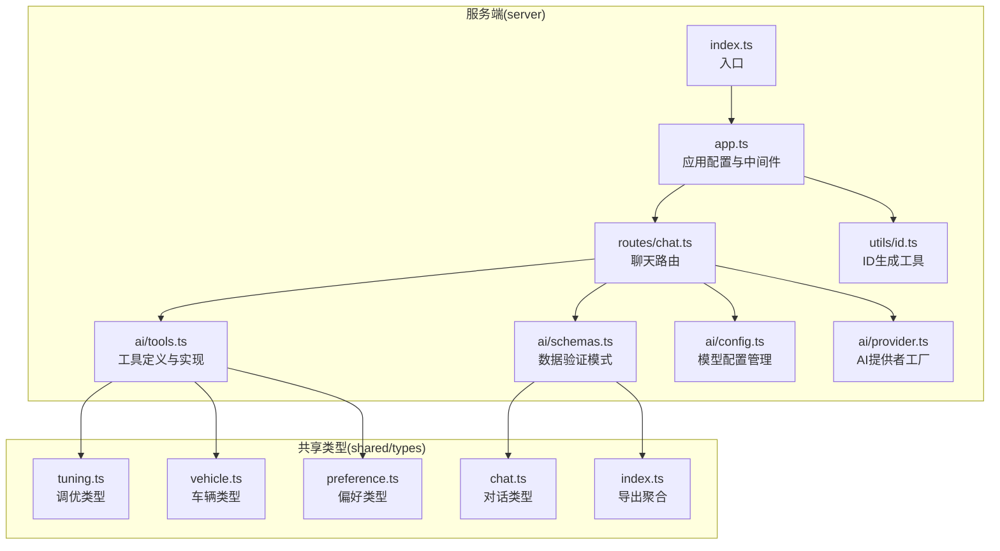
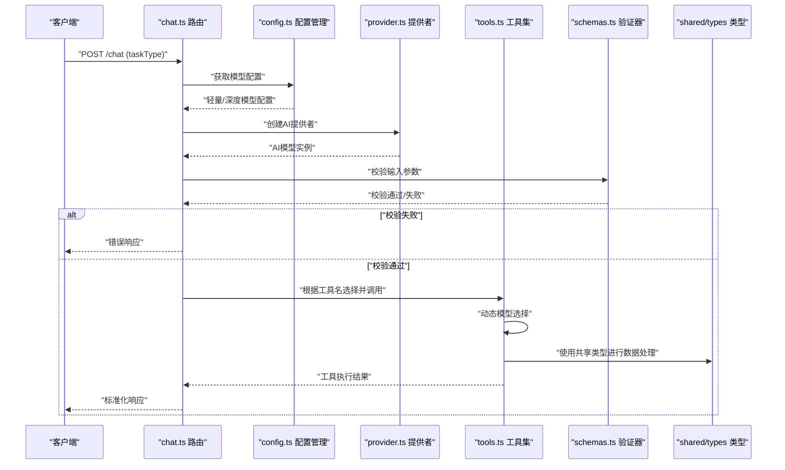
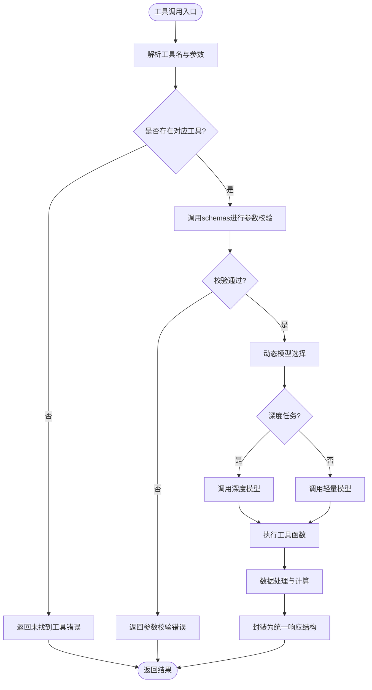
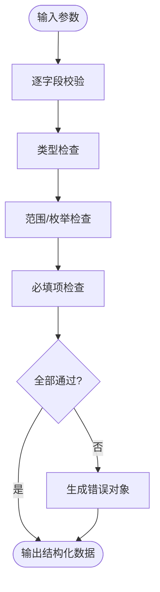
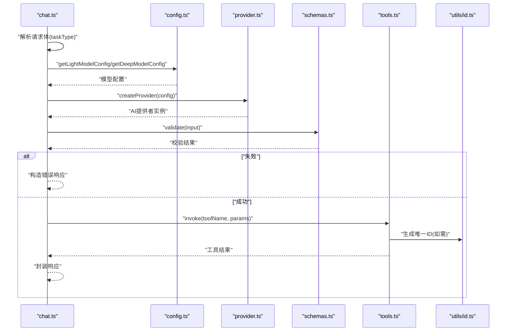
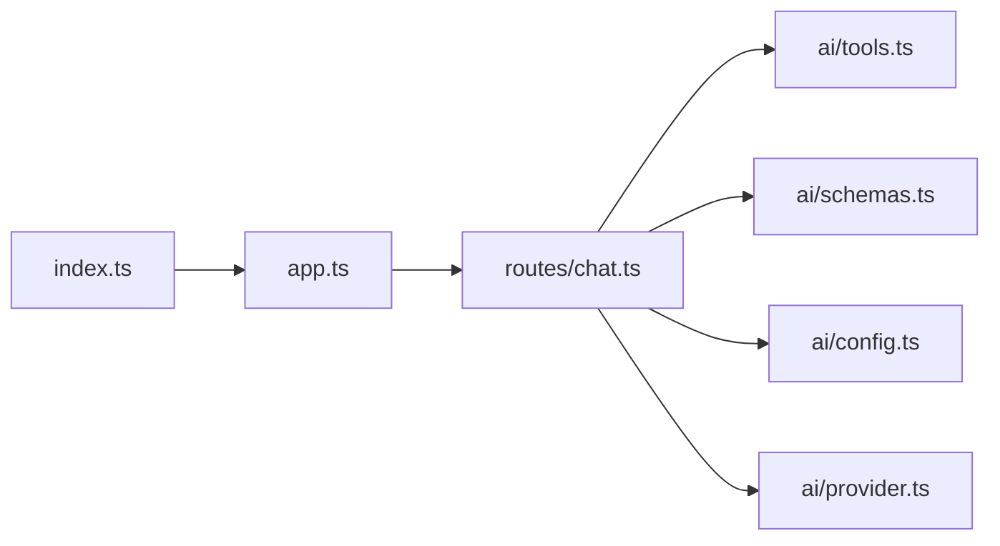
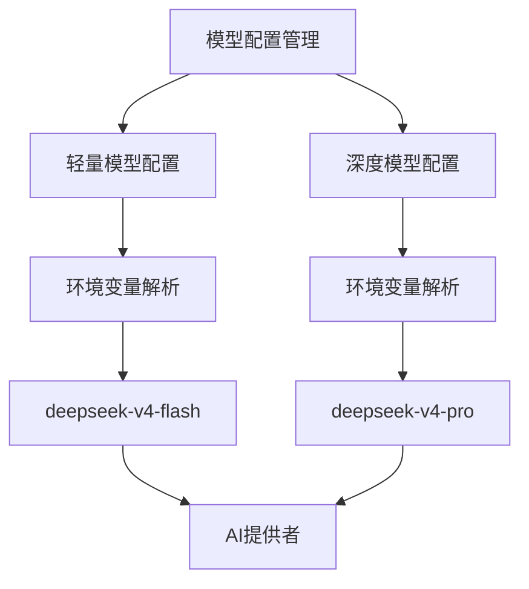
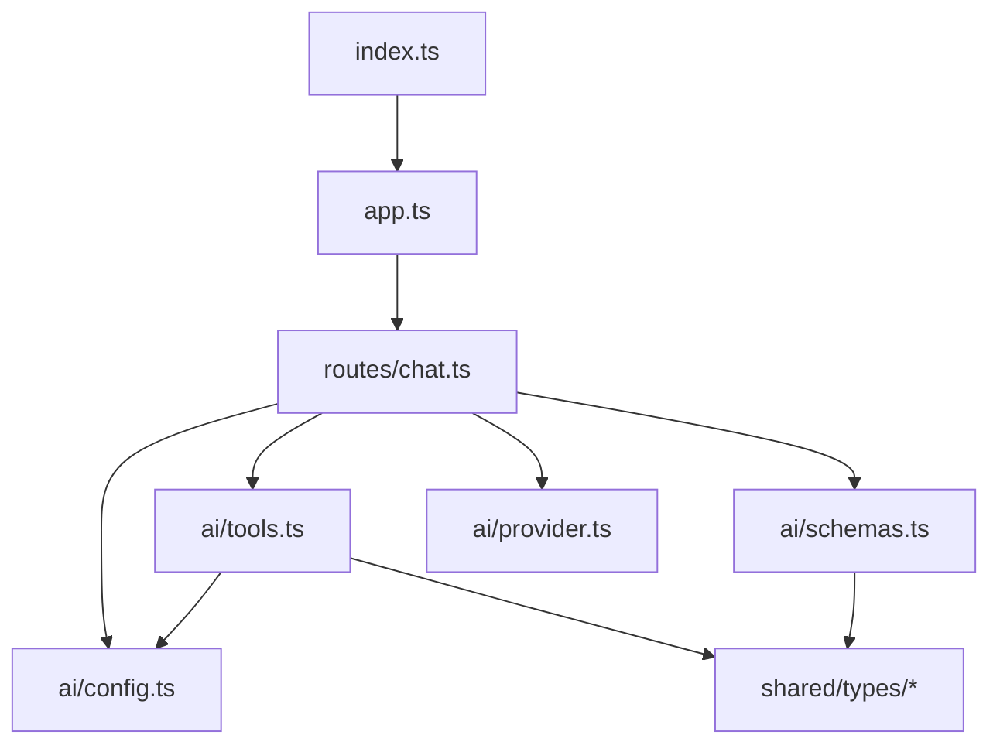

# 工具集成

<cite>
**本文引用的文件**
- [server/src/ai/tools.ts](file://server/src/ai/tools.ts)
- [server/src/ai/schemas.ts](file://server/src/ai/schemas.ts)
- [server/src/ai/config.ts](file://server/src/ai/config.ts)
- [server/src/ai/provider.ts](file://server/src/ai/provider.ts)
- [server/src/routes/chat.ts](file://server/src/routes/chat.ts)
- [server/src/app.ts](file://server/src/app.ts)
- [server/src/index.ts](file://server/src/index.ts)
- [server/src/utils/id.ts](file://server/src/utils/id.ts)
- [server/package.json](file://server/package.json)
- [shared/types/index.ts](file://shared/types/index.ts)
- [shared/types/tuning.ts](file://shared/types/tuning.ts)
- [shared/types/vehicle.ts](file://shared/types/vehicle.ts)
- [shared/types/preference.ts](file://shared/types/preference.ts)
- [shared/types/chat.ts](file://shared/types/chat.ts)
</cite>

## 目录
1. [简介](#简介)
2. [项目结构](#项目结构)
3. [核心组件](#核心组件)
4. [架构总览](#架构总览)
5. [详细组件分析](#详细组件分析)
6. [动态模型选择机制](#动态模型选择机制)
7. [依赖关系分析](#依赖关系分析)
8. [性能考虑](#性能考虑)
9. [故障排除指南](#故障排除指南)
10. [结论](#结论)
11. [附录](#附录)

## 简介
本文件面向FH6汽车调优工具的"工具集成"主题，系统性阐述AI工具调用机制，覆盖工具注册、参数验证与执行流程；重点解析server/src/ai/tools.ts中的工具定义与实现（含汽车调优相关函数与数据处理逻辑），以及server/src/ai/schemas.ts中的数据验证模式（输入参数校验、输出格式约束与错误处理）。特别关注新增的动态模型选择机制，包括深度模型与轻量模型的智能路由、回退策略和资源配置。同时提供工具扩展指南（新增工具的流程、接口规范与测试方法），并解释工具调用的异步处理、并发控制与资源管理策略。

## 项目结构
后端采用TypeScript + Express风格的模块化组织，AI工具与数据验证位于server/src/ai目录，路由入口在server/src/routes，应用启动在server/src/index与server/src/app中。共享类型定义位于shared/types目录，供前后端复用。

**图表来源**
- [server/src/app.ts](file://server/src/app.ts)
- [server/src/routes/chat.ts](file://server/src/routes/chat.ts)
- [server/src/ai/tools.ts](file://server/src/ai/tools.ts)
- [server/src/ai/schemas.ts](file://server/src/ai/schemas.ts)
- [server/src/ai/config.ts](file://server/src/ai/config.ts)
- [server/src/ai/provider.ts](file://server/src/ai/provider.ts)
- [server/src/utils/id.ts](file://server/src/utils/id.ts)
- [server/src/index.ts](file://server/src/index.ts)
- [shared/types/index.ts](file://shared/types/index.ts)
- [shared/types/tuning.ts](file://shared/types/tuning.ts)
- [shared/types/vehicle.ts](file://shared/types/vehicle.ts)
- [shared/types/preference.ts](file://shared/types/preference.ts)
- [shared/types/chat.ts](file://shared/types/chat.ts)

**章节来源**
- [server/src/app.ts](file://server/src/app.ts)
- [server/src/routes/chat.ts](file://server/src/routes/chat.ts)
- [server/src/ai/tools.ts](file://server/src/ai/tools.ts)
- [server/src/ai/schemas.ts](file://server/src/ai/schemas.ts)
- [server/src/ai/config.ts](file://server/src/ai/config.ts)
- [server/src/ai/provider.ts](file://server/src/ai/provider.ts)
- [server/src/utils/id.ts](file://server/src/utils/id.ts)
- [server/src/index.ts](file://server/src/index.ts)
- [shared/types/index.ts](file://shared/types/index.ts)
- [shared/types/tuning.ts](file://shared/types/tuning.ts)
- [shared/types/vehicle.ts](file://shared/types/vehicle.ts)
- [shared/types/preference.ts](file://shared/types/preference.ts)
- [shared/types/chat.ts](file://shared/types/chat.ts)

## 核心组件
- AI工具定义与实现：集中于server/src/ai/tools.ts，包含工具注册、参数校验、执行流程与结果封装，支持动态模型选择。
- 数据验证模式：集中于server/src/ai/schemas.ts，定义输入参数校验规则、输出格式约束与错误处理策略。
- 动态模型配置：server/src/ai/config.ts提供轻量模型和深度模型的配置管理，支持智能回退机制。
- AI提供者工厂：server/src/ai/provider.ts根据配置创建AI SDK语言模型实例。
- 路由与调用链：server/src/routes/chat.ts作为入口，负责接收请求、触发工具调用并返回响应。
- 应用与启动：server/src/app.ts配置中间件与路由，server/src/index.ts启动HTTP服务。
- 共享类型：shared/types下提供调优、车辆、偏好、对话等类型定义，确保前后端一致性。

**章节来源**
- [server/src/ai/tools.ts](file://server/src/ai/tools.ts)
- [server/src/ai/schemas.ts](file://server/src/ai/schemas.ts)
- [server/src/ai/config.ts](file://server/src/ai/config.ts)
- [server/src/ai/provider.ts](file://server/src/ai/provider.ts)
- [server/src/routes/chat.ts](file://server/src/routes/chat.ts)
- [server/src/app.ts](file://server/src/app.ts)
- [server/src/index.ts](file://server/src/index.ts)
- [shared/types/tuning.ts](file://shared/types/tuning.ts)
- [shared/types/vehicle.ts](file://shared/types/vehicle.ts)
- [shared/types/preference.ts](file://shared/types/preference.ts)
- [shared/types/chat.ts](file://shared/types/chat.ts)

## 架构总览
AI工具调用从HTTP路由进入，经过参数校验与工具选择，最终执行具体工具函数并返回标准化结果。工具与验证模式通过共享类型保证一致性，支持动态模型选择和智能回退机制。

**图表来源**
- [server/src/routes/chat.ts](file://server/src/routes/chat.ts)
- [server/src/ai/config.ts](file://server/src/ai/config.ts)
- [server/src/ai/provider.ts](file://server/src/ai/provider.ts)
- [server/src/ai/tools.ts](file://server/src/ai/tools.ts)
- [server/src/ai/schemas.ts](file://server/src/ai/schemas.ts)
- [shared/types/index.ts](file://shared/types/index.ts)

## 详细组件分析

### 工具定义与实现（server/src/ai/tools.ts）
- 工具注册与分发：工具以命名函数形式注册，路由层根据工具名选择对应实现，避免硬编码分支，便于扩展。
- 动态模型选择：调校工具现在支持智能模型路由，复杂任务使用深度模型，简单操作使用轻量模型。
- 汽车调优相关工具：
  - generateTune：使用深度模型生成调校方案，包含完整的参数验证和错误回退机制。
  - saveTune：轻量操作，直接返回结果，无需深度模型。
  - compareTunes：使用深度模型进行方案对比分析，支持智能回退。
- 数据处理逻辑：对输入数据进行清洗、归一化与边界检查，输出符合共享类型的结构化结果。
- 结果封装：统一返回包含状态码、消息与数据的对象，便于上层路由与前端消费。
- 异常处理：对非法输入、越界值与内部异常进行捕获与转换，保证调用链稳定。

**图表来源**
- [server/src/ai/tools.ts](file://server/src/ai/tools.ts)
- [server/src/ai/config.ts](file://server/src/ai/config.ts)
- [server/src/ai/schemas.ts](file://server/src/ai/schemas.ts)

**章节来源**
- [server/src/ai/tools.ts](file://server/src/ai/tools.ts)
- [shared/types/tuning.ts](file://shared/types/tuning.ts)
- [shared/types/vehicle.ts](file://shared/types/vehicle.ts)
- [shared/types/preference.ts](file://shared/types/preference.ts)

### 数据验证模式（server/src/ai/schemas.ts）
- 输入参数校验：针对工具调用所需的字段进行类型、范围与必填性检查，确保后续处理安全。
- 输出格式约束：定义工具返回的数据结构与字段约束，保证前后端契约一致。
- 错误处理：将校验失败转化为标准错误对象，包含错误码、字段与建议信息，便于路由层统一处理。
- 与共享类型协作：基于shared/types中的枚举与接口，确保校验规则与业务模型保持同步。

**图表来源**
- [server/src/ai/schemas.ts](file://server/src/ai/schemas.ts)
- [shared/types/index.ts](file://shared/types/index.ts)

**章节来源**
- [server/src/ai/schemas.ts](file://server/src/ai/schemas.ts)
- [shared/types/index.ts](file://shared/types/index.ts)

### 路由与调用链（server/src/routes/chat.ts）
- 请求入口：接收客户端请求，解析工具名与参数。
- 动态模型路由：根据taskType参数选择轻量或深度模型配置。
- 参数校验：委托给schemas模块进行严格校验。
- 工具分发：根据工具名调用tools模块中的对应函数。
- 响应封装：将工具返回结果按统一格式封装后返回客户端。
- 中间件与上下文：在app.ts中配置的中间件可在此处生效，如CORS、日志与限流。

**图表来源**
- [server/src/routes/chat.ts](file://server/src/routes/chat.ts)
- [server/src/ai/config.ts](file://server/src/ai/config.ts)
- [server/src/ai/provider.ts](file://server/src/ai/provider.ts)
- [server/src/ai/schemas.ts](file://server/src/ai/schemas.ts)
- [server/src/ai/tools.ts](file://server/src/ai/tools.ts)
- [server/src/utils/id.ts](file://server/src/utils/id.ts)

**章节来源**
- [server/src/routes/chat.ts](file://server/src/routes/chat.ts)
- [server/src/ai/config.ts](file://server/src/ai/config.ts)
- [server/src/ai/provider.ts](file://server/src/ai/provider.ts)
- [server/src/ai/schemas.ts](file://server/src/ai/schemas.ts)
- [server/src/ai/tools.ts](file://server/src/ai/tools.ts)
- [server/src/utils/id.ts](file://server/src/utils/id.ts)

### 应用与启动（server/src/app.ts, server/src/index.ts）
- 应用配置：设置中间件、静态资源、路由挂载与错误处理。
- 健康检查：提供模型配置状态检查接口。
- 模型管理：提供可用模型列表查询接口，支持前端模型选择器。
- 启动入口：监听端口，输出启动日志，暴露健康检查或调试端点（如有）。
- 与工具链集成：确保路由与工具模块在应用生命周期内可用。

**图表来源**
- [server/src/index.ts](file://server/src/index.ts)
- [server/src/app.ts](file://server/src/app.ts)
- [server/src/routes/chat.ts](file://server/src/routes/chat.ts)
- [server/src/ai/tools.ts](file://server/src/ai/tools.ts)
- [server/src/ai/schemas.ts](file://server/src/ai/schemas.ts)
- [server/src/ai/config.ts](file://server/src/ai/config.ts)
- [server/src/ai/provider.ts](file://server/src/ai/provider.ts)

**章节来源**
- [server/src/index.ts](file://server/src/index.ts)
- [server/src/app.ts](file://server/src/app.ts)

## 动态模型选择机制

### 模型配置管理
系统实现了智能的双模型配置管理，支持轻量模型和深度模型的动态切换：

- 轻量模型配置：适用于日常问答、简单操作，响应速度快，资源消耗低。
- 深度模型配置：适用于复杂调校任务，推理能力强，但资源消耗较高。
- 智能回退机制：深度模型调用失败时自动回退到轻量模型。

**图表来源**
- [server/src/ai/config.ts](file://server/src/ai/config.ts)

### 模型选择策略
系统根据任务类型和复杂度智能选择合适的模型：

- 自动选择：根据taskType参数自动选择轻量或深度模型。
- 手动指定：客户端可以明确指定使用哪种模型。
- 智能回退：深度模型失败时自动降级到轻量模型。
- 资源优化：复杂任务使用深度模型，简单操作使用轻量模型。

**章节来源**
- [server/src/ai/config.ts](file://server/src/ai/config.ts)
- [server/src/ai/provider.ts](file://server/src/ai/provider.ts)
- [server/src/routes/chat.ts](file://server/src/routes/chat.ts)

## 依赖关系分析
- 工具模块依赖共享类型：工具函数在处理数据时使用共享类型中的枚举与接口，确保业务语义一致。
- 动态配置依赖：工具模块依赖config.ts提供的模型配置管理，实现智能模型选择。
- 提供者工厂依赖：路由层依赖provider.ts创建AI模型实例。
- 路由模块依赖工具与验证：路由层仅负责编排，不直接参与业务计算，降低耦合度。
- 应用模块依赖路由与工具：通过模块化导入，形成清晰的依赖链。

**图表来源**
- [server/src/routes/chat.ts](file://server/src/routes/chat.ts)
- [server/src/ai/tools.ts](file://server/src/ai/tools.ts)
- [server/src/ai/schemas.ts](file://server/src/ai/schemas.ts)
- [server/src/ai/config.ts](file://server/src/ai/config.ts)
- [server/src/ai/provider.ts](file://server/src/ai/provider.ts)
- [server/src/app.ts](file://server/src/app.ts)
- [server/src/index.ts](file://server/src/index.ts)
- [shared/types/index.ts](file://shared/types/index.ts)

**章节来源**
- [server/src/routes/chat.ts](file://server/src/routes/chat.ts)
- [server/src/ai/tools.ts](file://server/src/ai/tools.ts)
- [server/src/ai/schemas.ts](file://server/src/ai/schemas.ts)
- [server/src/ai/config.ts](file://server/src/ai/config.ts)
- [server/src/ai/provider.ts](file://server/src/ai/provider.ts)
- [server/src/app.ts](file://server/src/app.ts)
- [server/src/index.ts](file://server/src/index.ts)
- [shared/types/index.ts](file://shared/types/index.ts)

## 性能考虑
- 异步处理：工具函数应采用异步模式，避免阻塞事件循环；对于IO密集场景（如外部API调用），使用Promise与超时控制。
- 动态模型优化：根据任务复杂度选择合适模型，避免深度模型处理简单任务的资源浪费。
- 并发控制：在路由层引入队列或信号量限制并发数，防止工具执行阶段资源争用；对高耗时工具提供进度反馈或分片处理。
- 智能回退：深度模型失败时自动回退到轻量模型，确保系统可用性。
- 资源管理：对临时文件、连接池与缓存进行显式释放；对大对象进行及时GC提示；对外部依赖设置合理的重试与熔断策略。
- 缓存与去重：对重复请求进行去重与缓存，减少无效计算；对只读数据建立只读缓存。
- 日志与监控：记录工具执行时间、错误率与资源占用，便于定位瓶颈。

## 故障排除指南
- 参数校验失败：检查输入字段是否满足schemas.ts中的类型、范围与必填要求；核对共享类型定义是否与前端一致。
- 工具未找到：确认工具名大小写与拼写正确；检查工具是否已注册到tools.ts的分发表中。
- 模型配置错误：检查环境变量配置是否正确；验证API密钥和基础URL设置。
- 深度模型调用失败：查看智能回退机制是否正常工作；检查网络连接和API限制。
- 执行异常：查看工具函数内部异常捕获与错误转换逻辑；结合日志定位具体步骤。
- 响应格式异常：核对工具返回结构是否符合统一封装约定；检查路由层响应构建逻辑。
- 并发问题：排查路由层并发限制与工具内部锁竞争；必要时引入分布式锁或幂等设计。

**章节来源**
- [server/src/ai/schemas.ts](file://server/src/ai/schemas.ts)
- [server/src/ai/tools.ts](file://server/src/ai/tools.ts)
- [server/src/ai/config.ts](file://server/src/ai/config.ts)
- [server/src/routes/chat.ts](file://server/src/routes/chat.ts)

## 结论
本项目通过模块化的工具与验证体系，实现了清晰的AI工具调用链路。新增的动态模型选择机制进一步提升了系统的智能化水平，能够根据任务复杂度自动选择合适的模型，同时提供智能回退保障系统稳定性。tools.ts集中表达业务能力，schemas.ts保障数据一致性，config.ts和provider.ts提供灵活的模型配置管理，路由层承担编排职责。配合共享类型与严格的错误处理，系统具备良好的可扩展性与稳定性。建议在新增工具时遵循既定规范，确保类型与校验规则同步更新，并配套完善的测试与监控。

## 附录

### 工具扩展指南
- 新增工具流程
  - 在tools.ts中新增工具函数，遵循统一的参数签名与返回结构。
  - 在schemas.ts中为该工具补充输入参数校验规则与输出格式约束。
  - 在路由层增加工具名到函数的映射，或通过反射自动注册（如需）。
  - 更新共享类型（如涉及新增枚举或字段），确保前后端一致。
- 接口规范
  - 参数：必填字段、可选字段、默认值与范围约束。
  - 返回：统一的状态码、消息与数据结构，支持分页与增量返回。
  - 错误：标准化错误对象，包含错误码、字段与修复建议。
- 动态模型选择最佳实践
  - 复杂任务使用深度模型：涉及大量推理、数据分析或生成性任务。
  - 简单任务使用轻量模型：涉及简单的查询、确认或状态更新。
  - 实现智能回退：在深度模型失败时自动降级到轻量模型。
  - 性能监控：监控不同类型任务的响应时间和资源消耗。
- 测试方法
  - 单元测试：覆盖正常路径、边界值与异常路径。
  - 集成测试：模拟路由调用，验证从输入到输出的完整链路。
  - 性能测试：评估高并发下的延迟与吞吐，识别瓶颈。
  - 回归测试：当共享类型或校验规则变更时，确保工具兼容性。
  - 模型测试：验证动态模型选择和回退机制的正确性。

**章节来源**
- [server/src/ai/tools.ts](file://server/src/ai/tools.ts)
- [server/src/ai/schemas.ts](file://server/src/ai/schemas.ts)
- [server/src/ai/config.ts](file://server/src/ai/config.ts)
- [server/src/ai/provider.ts](file://server/src/ai/provider.ts)
- [shared/types/index.ts](file://shared/types/index.ts)