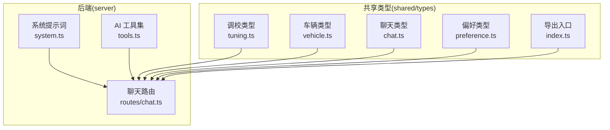
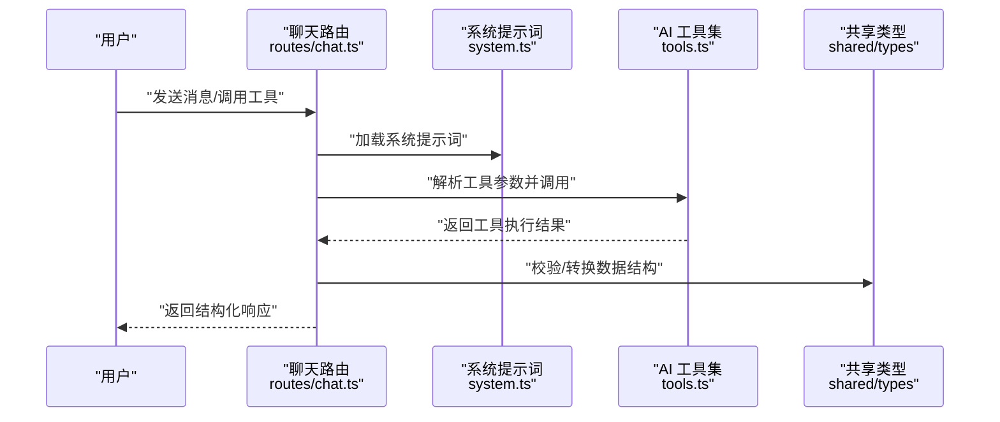
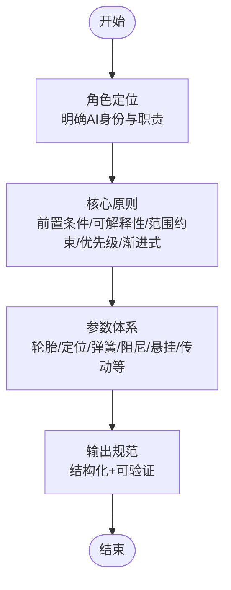
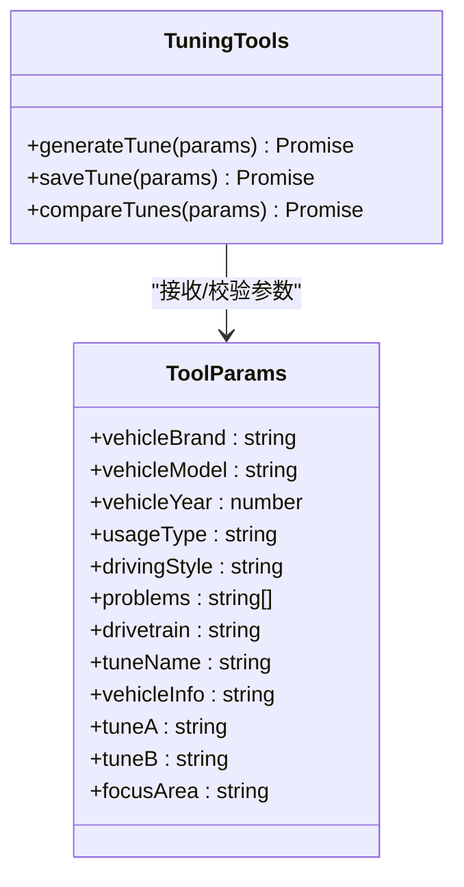
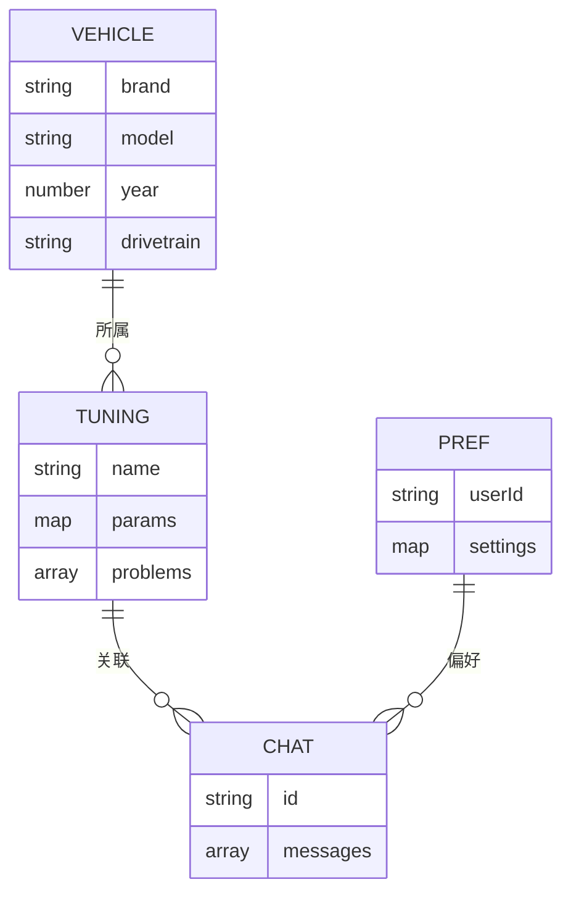
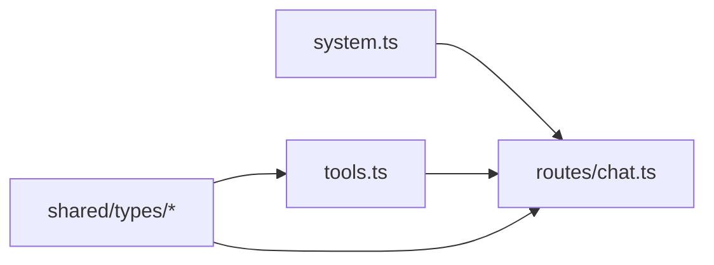

# 提示词系统

<cite>
**本文引用的文件**
- [server/src/ai/prompts/system.ts](file://server/src/ai/prompts/system.ts)
- [server/src/ai/tools.ts](file://server/src/ai/tools.ts)
- [server/src/routes/chat.ts](file://server/src/routes/chat.ts)
- [shared/types/index.ts](file://shared/types/index.ts)
- [shared/types/tuning.ts](file://shared/types/tuning.ts)
- [shared/types/vehicle.ts](file://shared/types/vehicle.ts)
- [shared/types/chat.ts](file://shared/types/chat.ts)
- [shared/types/preference.ts](file://shared/types/preference.ts)
</cite>

## 目录
1. [简介](#简介)
2. [项目结构](#项目结构)
3. [核心组件](#核心组件)
4. [架构总览](#架构总览)
5. [详细组件分析](#详细组件分析)
6. [依赖关系分析](#依赖关系分析)
7. [性能考量](#性能考量)
8. [故障排查指南](#故障排查指南)
9. [结论](#结论)
10. [附录](#附录)

## 简介
本文件面向“提示词系统”的设计与实现，聚焦于系统提示词模板在汽车调优领域的应用。系统以《极限竞速：地平线6》（Forza Horizon 6）为背景，围绕“调校”这一专业主题，通过系统提示词明确角色定位、核心原则、参数体系与输出规范，确保AI在不同车辆类型与使用场景下提供一致、可解释且可操作的调校建议。同时，系统通过工具化接口与类型定义，支撑调校方案生成、保存与对比等关键流程。

## 项目结构
该仓库采用前后端分离与共享类型层的组织方式：
- server：后端服务，包含AI提示词与工具定义、聊天路由等
- shared：共享类型定义，统一前后端数据契约
- client：前端工程（当前未直接参与提示词逻辑）

图表来源
- [server/src/ai/prompts/system.ts:1-33](file://server/src/ai/prompts/system.ts#L1-L33)
- [server/src/ai/tools.ts:1-59](file://server/src/ai/tools.ts#L1-L59)
- [server/src/routes/chat.ts](file://server/src/routes/chat.ts)
- [shared/types/index.ts:1-4](file://shared/types/index.ts#L1-L4)
- [shared/types/tuning.ts](file://shared/types/tuning.ts)
- [shared/types/vehicle.ts](file://shared/types/vehicle.ts)
- [shared/types/chat.ts](file://shared/types/chat.ts)
- [shared/types/preference.ts](file://shared/types/preference.ts)

章节来源
- [server/src/ai/prompts/system.ts:1-33](file://server/src/ai/prompts/system.ts#L1-L33)
- [server/src/ai/tools.ts:1-59](file://server/src/ai/tools.ts#L1-L59)
- [shared/types/index.ts:1-4](file://shared/types/index.ts#L1-L4)

## 核心组件
- 系统提示词模板：定义角色、原则、参数体系与输出规范，确保AI在调校场景下的专业性与一致性
- AI 工具集：封装生成、保存、对比调校方案的工具接口，约束参数与执行行为
- 聊天路由：承载对话流程，整合系统提示词与工具调用
- 共享类型：统一调校、车辆、聊天、偏好等数据结构，保障前后端契约一致

章节来源
- [server/src/ai/prompts/system.ts:1-33](file://server/src/ai/prompts/system.ts#L1-L33)
- [server/src/ai/tools.ts:1-59](file://server/src/ai/tools.ts#L1-L59)
- [server/src/routes/chat.ts](file://server/src/routes/chat.ts)
- [shared/types/index.ts:1-4](file://shared/types/index.ts#L1-L4)

## 架构总览
系统提示词作为“系统角色与规则”的载体，贯穿对话生成与工具调用的全链路。聊天路由在请求到达时注入系统提示词，并结合工具参数进行结构化输出引导；共享类型为调校方案的数据结构提供约束，确保前后端一致。

图表来源
- [server/src/routes/chat.ts](file://server/src/routes/chat.ts)
- [server/src/ai/prompts/system.ts:1-33](file://server/src/ai/prompts/system.ts#L1-L33)
- [server/src/ai/tools.ts:1-59](file://server/src/ai/tools.ts#L1-L59)
- [shared/types/index.ts:1-4](file://shared/types/index.ts#L1-L4)

## 详细组件分析

### 系统提示词模板（system.ts）
- 角色定位：专业《地平线6》车辆调校顾问，强调“先了解车辆与用途，再给建议”的前置条件
- 核心原则：要求每次建议附带原因与预期效果；参数需在游戏允许范围内；优先推荐对性能影响最大的改动；提供渐进式调校方案
- 参数体系：覆盖轮胎、定位、弹簧、阻尼、悬挂高度、传动与差速器等关键调校维度，明确取值范围与物理意义
- 输出规范：强调可解释性与可操作性，避免空泛建议

图表来源
- [server/src/ai/prompts/system.ts:1-33](file://server/src/ai/prompts/system.ts#L1-L33)

章节来源
- [server/src/ai/prompts/system.ts:1-33](file://server/src/ai/prompts/system.ts#L1-L33)

### AI 工具集（tools.ts）
- generateTune：根据车辆品牌、型号、年份、用途、风格、问题与驱动形式生成完整调校方案
- saveTune：保存调校方案至用户记录
- compareTunes：对比两个方案的参数差异，支持关注领域筛选

图表来源
- [server/src/ai/tools.ts:1-59](file://server/src/ai/tools.ts#L1-L59)

章节来源
- [server/src/ai/tools.ts:1-59](file://server/src/ai/tools.ts#L1-L59)

### 聊天路由（routes/chat.ts）
- 职责：处理聊天请求，整合系统提示词与工具调用，返回结构化响应
- 关键点：在请求进入时注入系统提示词；解析工具调用参数；校验与转换共享类型；返回统一格式的响应

章节来源
- [server/src/routes/chat.ts](file://server/src/routes/chat.ts)

### 共享类型（shared/types）
- tuning.ts：调校相关数据结构定义
- vehicle.ts：车辆信息结构定义
- chat.ts：聊天交互结构定义
- preference.ts：用户偏好结构定义
- index.ts：统一导出入口

图表来源
- [shared/types/tuning.ts](file://shared/types/tuning.ts)
- [shared/types/vehicle.ts](file://shared/types/vehicle.ts)
- [shared/types/chat.ts](file://shared/types/chat.ts)
- [shared/types/preference.ts](file://shared/types/preference.ts)
- [shared/types/index.ts:1-4](file://shared/types/index.ts#L1-L4)

章节来源
- [shared/types/index.ts:1-4](file://shared/types/index.ts#L1-L4)
- [shared/types/tuning.ts](file://shared/types/tuning.ts)
- [shared/types/vehicle.ts](file://shared/types/vehicle.ts)
- [shared/types/chat.ts](file://shared/types/chat.ts)
- [shared/types/preference.ts](file://shared/types/preference.ts)

## 依赖关系分析
- 系统提示词依赖聊天路由注入到对话上下文中
- 工具集依赖共享类型进行参数校验与结构化输出
- 路由层聚合提示词与工具，形成端到端的调校建议流程

图表来源
- [server/src/ai/prompts/system.ts:1-33](file://server/src/ai/prompts/system.ts#L1-L33)
- [server/src/ai/tools.ts:1-59](file://server/src/ai/tools.ts#L1-L59)
- [server/src/routes/chat.ts](file://server/src/routes/chat.ts)
- [shared/types/index.ts:1-4](file://shared/types/index.ts#L1-L4)

章节来源
- [server/src/ai/prompts/system.ts:1-33](file://server/src/ai/prompts/system.ts#L1-L33)
- [server/src/ai/tools.ts:1-59](file://server/src/ai/tools.ts#L1-L59)
- [server/src/routes/chat.ts](file://server/src/routes/chat.ts)
- [shared/types/index.ts:1-4](file://shared/types/index.ts#L1-L4)

## 性能考量
- 提示词模板长度与复杂度：系统提示词应保持精炼，避免冗余信息导致上下文浪费
- 工具参数校验：通过Zod Schema在工具层进行参数校验，减少无效调用与错误分支
- 结构化输出：统一的数据结构与类型约束有助于前端快速渲染，降低解析成本
- 缓存与复用：在路由层可考虑对常用调校模式进行缓存，减少重复计算

## 故障排查指南
- 症状：AI建议缺乏可解释性或超出游戏参数范围
  - 排查要点：核对系统提示词中的“核心原则”是否被严格遵循；确认参数取值范围与物理意义
  - 参考位置：系统提示词模板的核心原则与参数体系
- 症状：工具调用失败或参数不匹配
  - 排查要点：检查工具参数Schema与调用方传参是否一致；确认共享类型定义是否更新
  - 参考位置：工具参数定义与共享类型导出入口
- 症状：响应格式不一致或前端渲染异常
  - 排查要点：核对路由层的数据转换与类型校验；确保共享类型在前后端同步

章节来源
- [server/src/ai/prompts/system.ts:1-33](file://server/src/ai/prompts/system.ts#L1-L33)
- [server/src/ai/tools.ts:1-59](file://server/src/ai/tools.ts#L1-L59)
- [shared/types/index.ts:1-4](file://shared/types/index.ts#L1-L4)

## 结论
系统提示词模板在汽车调优场景中承担“角色定义+规则约束+输出规范”的三重职责，配合工具集与共享类型，形成从输入到输出的一致性闭环。通过明确的参数体系与渐进式建议策略，系统能够在不同车辆类型与使用场景下提供高质量、可解释的调校建议。后续可在版本控制、A/B测试与效果评估方面进一步完善，以持续优化AI响应质量。

## 附录

### 自定义提示词编写指南
- 上下文构建：先明确角色与专业领域，再设定核心原则与参数体系，最后定义输出规范
- 指令清晰度：每条原则与参数说明应具备可操作性与边界条件
- 输出格式规范：统一结构化输出，便于前端解析与展示

### 场景适配与车辆类型调整
- 不同用途（竞速、漂移、拉力赛、直线加速等）与驾驶风格（激进/平衡/保守）会影响参数优先级与取值范围
- 驱动形式（FWD/RWD/AWD）与车辆特性（轿车/跑车/越野车）需要差异化建议
- 当前工具参数已涵盖上述维度，可据此扩展或细化提示词

### 版本控制、A/B测试与效果评估
- 版本控制：对系统提示词与工具参数进行版本标记，确保变更可追溯
- A/B测试：对不同提示词版本与工具参数组合进行对照实验，收集用户反馈与指标
- 效果评估：基于响应质量、可解释性评分、用户采纳率与调校效果验证等指标进行评估