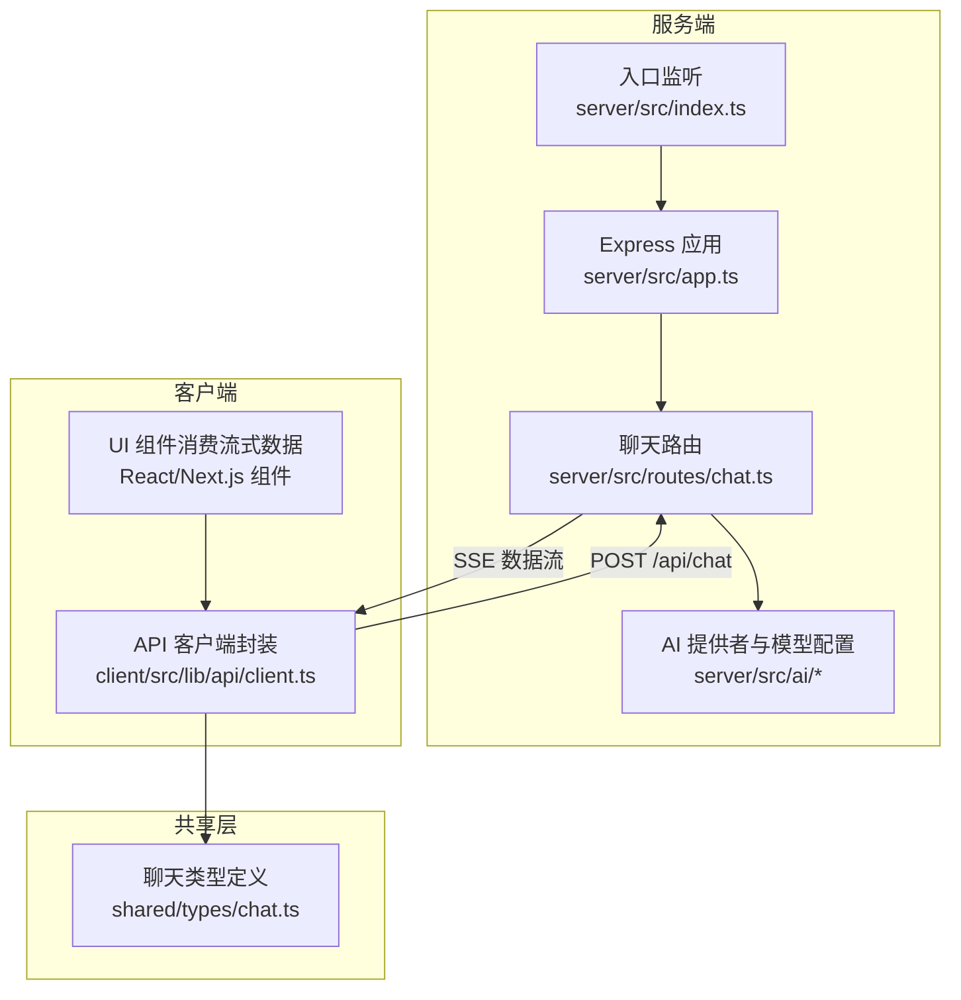
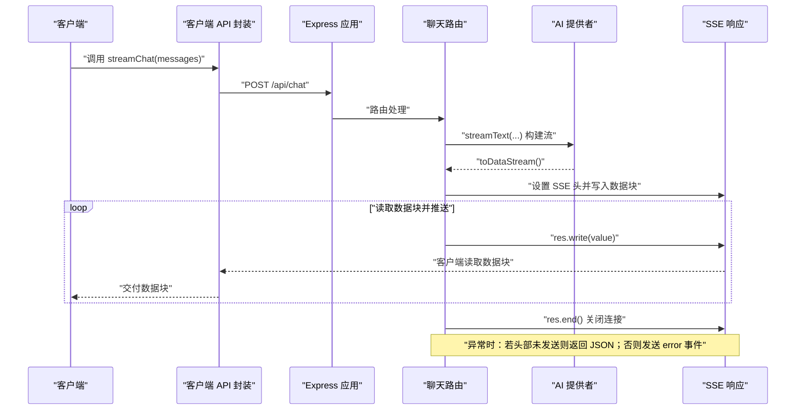
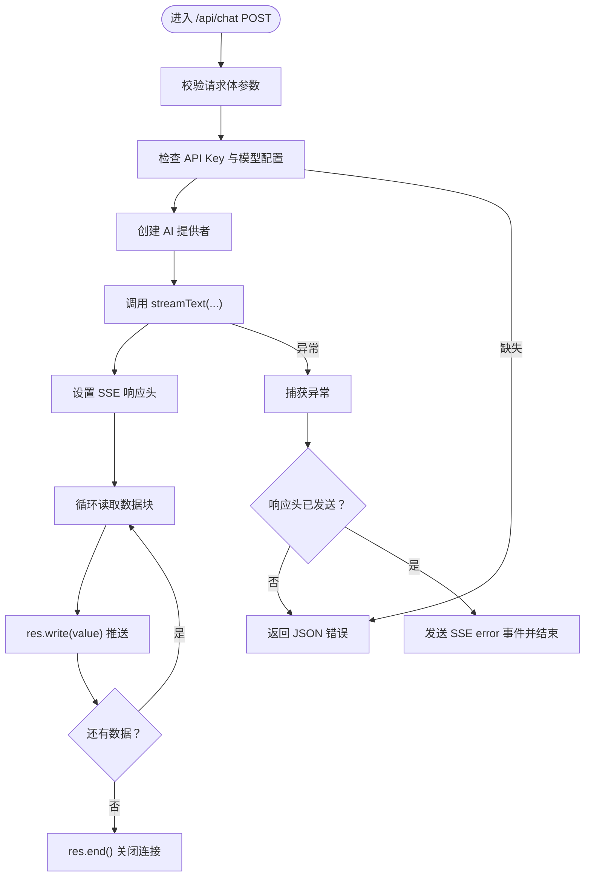
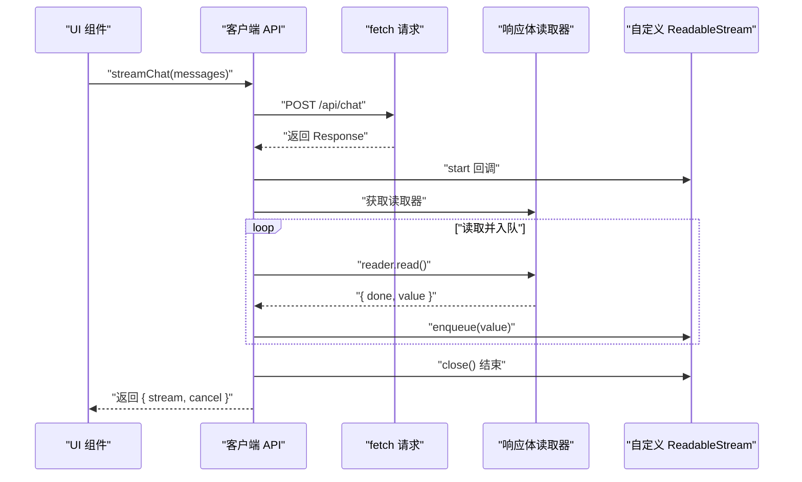
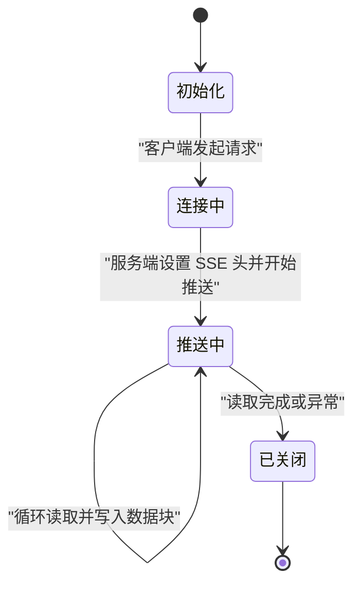
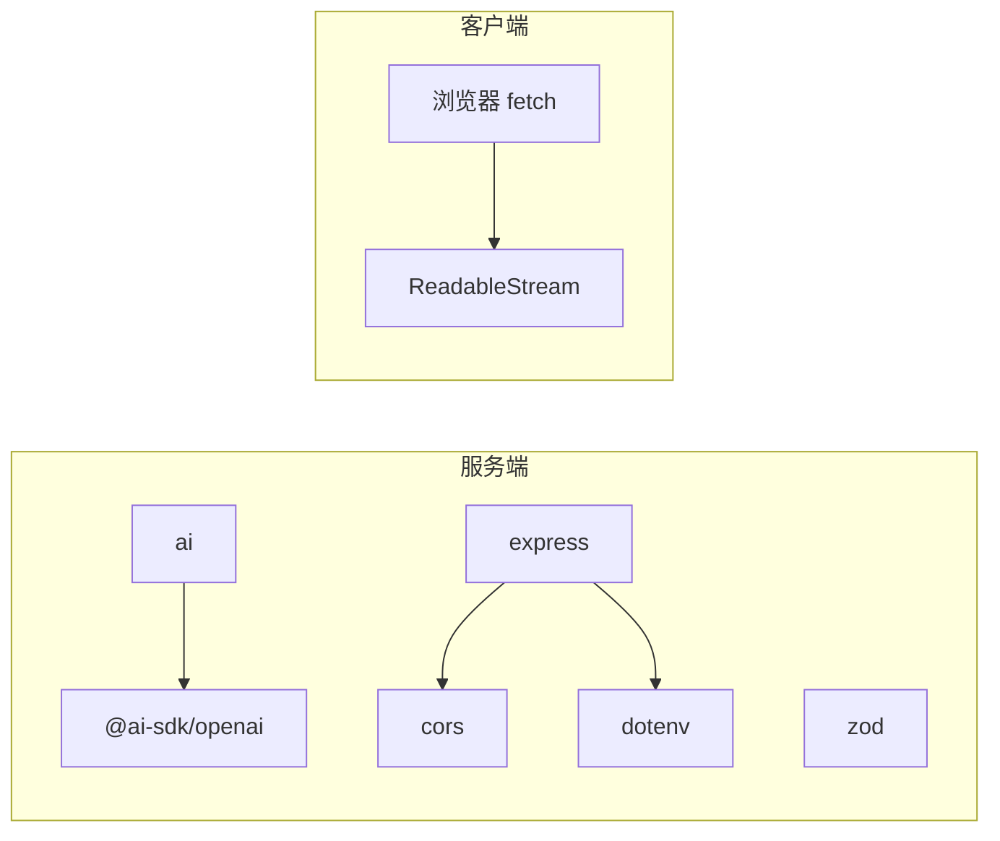

# 流式响应处理

<cite>
**本文档引用的文件**
- [server/src/routes/chat.ts](file://server/src/routes/chat.ts)
- [server/src/app.ts](file://server/src/app.ts)
- [server/src/index.ts](file://server/src/index.ts)
- [client/src/lib/api/client.ts](file://client/src/lib/api/client.ts)
- [shared/types/chat.ts](file://shared/types/chat.ts)
- [server/src/utils/id.ts](file://server/src/utils/id.ts)
- [server/package.json](file://server/package.json)
- [package.json](file://package.json)
</cite>

## 目录
1. [简介](#简介)
2. [项目结构](#项目结构)
3. [核心组件](#核心组件)
4. [架构总览](#架构总览)
5. [详细组件分析](#详细组件分析)
6. [依赖分析](#依赖分析)
7. [性能考虑](#性能考虑)
8. [故障排除指南](#故障排除指南)
9. [结论](#结论)

## 简介
本文件系统性阐述本项目的流式响应处理机制，重点围绕 Server-Sent Events（SSE）的实现与客户端连接管理，深入解析 chat.ts 中的流式数据传输机制（事件流格式、缓冲区管理、连接状态监控），并给出流式响应生命周期管理（连接建立、数据推送、连接关闭）、客户端集成指南（EventSource API 使用、错误处理与重连机制）、性能优化策略（背压处理、内存管理、网络带宽控制），以及故障排除与调试技巧。内容基于仓库中实际源码进行分析，确保可操作性与准确性。

## 项目结构
本项目采用前后端分离的多工作区结构：
- server：后端服务，提供 SSE 接口与健康检查
- client：前端客户端，负责发起 SSE 请求与消费流式数据
- shared：共享类型定义，统一前后端数据契约
- 根目录 package.json：统一开发脚本与工作区管理

图表来源
- [server/src/app.ts:1-40](file://server/src/app.ts#L1-L40)
- [server/src/routes/chat.ts:1-74](file://server/src/routes/chat.ts#L1-L74)
- [server/src/index.ts:1-11](file://server/src/index.ts#L1-L11)
- [client/src/lib/api/client.ts:1-70](file://client/src/lib/api/client.ts#L1-L70)
- [shared/types/chat.ts:1-75](file://shared/types/chat.ts#L1-L75)

章节来源
- [package.json:1-23](file://package.json#L1-L23)
- [server/src/app.ts:1-40](file://server/src/app.ts#L1-L40)
- [server/src/index.ts:1-11](file://server/src/index.ts#L1-L11)

## 核心组件
- 服务端聊天路由：负责接收消息、构建 AI 请求、开启 SSE 流式响应、逐块推送数据，并在异常时发送错误事件或回退为 JSON 错误。
- Express 应用：配置 CORS、中间件、健康检查端点与全局错误处理。
- 客户端 API 封装：通过 fetch 发起 SSE 请求，包装为 ReadableStream，支持取消与错误传播。
- 共享类型：统一消息、会话、API 响应等数据结构，保证前后端一致性。

章节来源
- [server/src/routes/chat.ts:1-74](file://server/src/routes/chat.ts#L1-L74)
- [server/src/app.ts:1-40](file://server/src/app.ts#L1-L40)
- [client/src/lib/api/client.ts:1-70](file://client/src/lib/api/client.ts#L1-L70)
- [shared/types/chat.ts:1-75](file://shared/types/chat.ts#L1-L75)

## 架构总览
下图展示从客户端到服务端的完整流式交互路径，包括请求发起、SSE 建立、数据分块推送与错误处理。

图表来源
- [client/src/lib/api/client.ts:23-70](file://client/src/lib/api/client.ts#L23-L70)
- [server/src/routes/chat.ts:9-74](file://server/src/routes/chat.ts#L9-L74)
- [server/src/app.ts:28-39](file://server/src/app.ts#L28-L39)

## 详细组件分析

### 服务端聊天路由（SSE 实现）
该路由负责：
- 参数校验与环境变量检查
- 构建 AI 提供者与流式文本生成
- 设置 SSE 必需响应头（Content-Type、Cache-Control、Connection、X-Accel-Buffering）
- 以流式方式读取数据块并逐块写入响应
- 异常处理：根据响应头是否已发送选择 JSON 错误或发送 SSE error 事件

图表来源
- [server/src/routes/chat.ts:9-74](file://server/src/routes/chat.ts#L9-L74)

章节来源
- [server/src/routes/chat.ts:1-74](file://server/src/routes/chat.ts#L1-L74)

### Express 应用与中间件
- CORS 配置允许本地开发域访问
- JSON 解析中间件
- 健康检查端点返回 AI 模型、基础 URL 与密钥状态
- 全局错误处理器统一返回 JSON 错误

章节来源
- [server/src/app.ts:1-40](file://server/src/app.ts#L1-L40)

### 客户端 API 封装（ReadableStream 包装）
客户端通过 fetch 发起 SSE 请求，并将响应体包装为 ReadableStream：
- 使用 AbortController 支持取消
- 在 start 回调中获取响应体读取器，循环读取并 enqueue 到自定义流
- 在 cancel 回调中 abort 控制器
- 错误处理：非 AbortError 时向流抛出错误

图表来源
- [client/src/lib/api/client.ts:23-70](file://client/src/lib/api/client.ts#L23-L70)

章节来源
- [client/src/lib/api/client.ts:1-70](file://client/src/lib/api/client.ts#L1-L70)

### 共享类型定义
- AI 提供者类型与默认配置
- 消息角色、工具调用与结果、聊天消息与会话
- API 请求/响应通用格式
- Chat API 请求体结构

章节来源
- [shared/types/chat.ts:1-75](file://shared/types/chat.ts#L1-L75)

### 连接生命周期管理
- 建立：客户端发起 POST 请求，服务端设置 SSE 头并开始推送数据块
- 数据推送：服务端循环读取流并写入响应，客户端持续从 ReadableStream 读取
- 关闭：服务端在读取完成时调用 end，客户端在流 close 时停止消费

图表来源
- [server/src/routes/chat.ts:40-59](file://server/src/routes/chat.ts#L40-L59)
- [client/src/lib/api/client.ts:39-63](file://client/src/lib/api/client.ts#L39-L63)

## 依赖分析
- 服务端依赖
  - @ai-sdk/openai 与 ai：提供流式文本生成能力与 SSE 数据流
  - express：Web 服务器框架
  - cors：跨域支持
  - dotenv：环境变量加载
  - zod：类型验证（在共享层使用）

- 客户端依赖
  - 浏览器原生 fetch 与 ReadableStream（SSE 客户端侧实现）

图表来源
- [server/package.json:10-24](file://server/package.json#L10-L24)
- [shared/types/chat.ts:14-22](file://shared/types/chat.ts#L14-L22)

章节来源
- [server/package.json:1-26](file://server/package.json#L1-L26)
- [shared/types/chat.ts:1-75](file://shared/types/chat.ts#L1-L75)

## 性能考虑
- 背压处理
  - 服务端：使用流式读取与逐块写入，避免一次性缓存大量数据
  - 客户端：通过 ReadableStream 的 backpressure 机制，按消费者速度消费数据
- 内存管理
  - 服务端：及时释放读取锁与结束响应，防止资源泄漏
  - 客户端：在不需要时调用 cancel 取消流，避免无谓的网络与内存占用
- 网络带宽控制
  - 服务端：设置 X-Accel-Buffering=no（适用于某些反向代理）以减少缓冲
  - 客户端：合理设置超时与重试策略，避免长时间占用连接
- 并发与连接数
  - 服务端：限制并发连接数量与单连接最大步数（maxSteps），避免资源耗尽
  - 客户端：复用连接或在 UI 层合并多次请求，减少连接开销

## 故障排除指南
- 常见问题与定位
  - AI API Key 未配置：服务端会在缺少密钥时返回 JSON 错误；检查环境变量与部署配置
  - 响应头已发送：异常发生时服务端会尝试发送 SSE error 事件；客户端需监听 error 事件
  - CORS 错误：确认服务端 CORS 配置允许前端域名
  - 健康检查失败：通过 /api/health 确认服务运行状态与 AI 配置
- 调试技巧
  - 服务端：启用详细日志，关注异常堆栈与响应头发送时机
  - 客户端：使用浏览器开发者工具 Network 面板观察 SSE 流，检查事件类型与数据格式
  - 连接中断：记录断开时间点与最后收到的数据块，结合服务端日志定位问题
- 重连机制建议
  - 客户端：在连接断开或 error 事件出现时，指数退避重试并携带 last-event-id（如需要）
  - 服务端：在必要时支持断点续传（基于事件 ID），但当前实现未显式使用

章节来源
- [server/src/routes/chat.ts:21-24](file://server/src/routes/chat.ts#L21-L24)
- [server/src/routes/chat.ts:60-72](file://server/src/routes/chat.ts#L60-L72)
- [server/src/app.ts:14-26](file://server/src/app.ts#L14-L26)

## 结论
本项目通过 @ai-sdk 的 streamText 与 SSE 技术实现了高效的流式对话体验。服务端以最小内存占用与良好的背压控制推送数据块，客户端通过 ReadableStream 与 fetch 实现简洁的流式消费与取消能力。结合健康检查、CORS 与统一类型定义，系统具备良好的可维护性与扩展性。建议在生产环境中进一步完善断点续传、连接池与限流策略，并加强客户端的错误恢复与用户反馈。