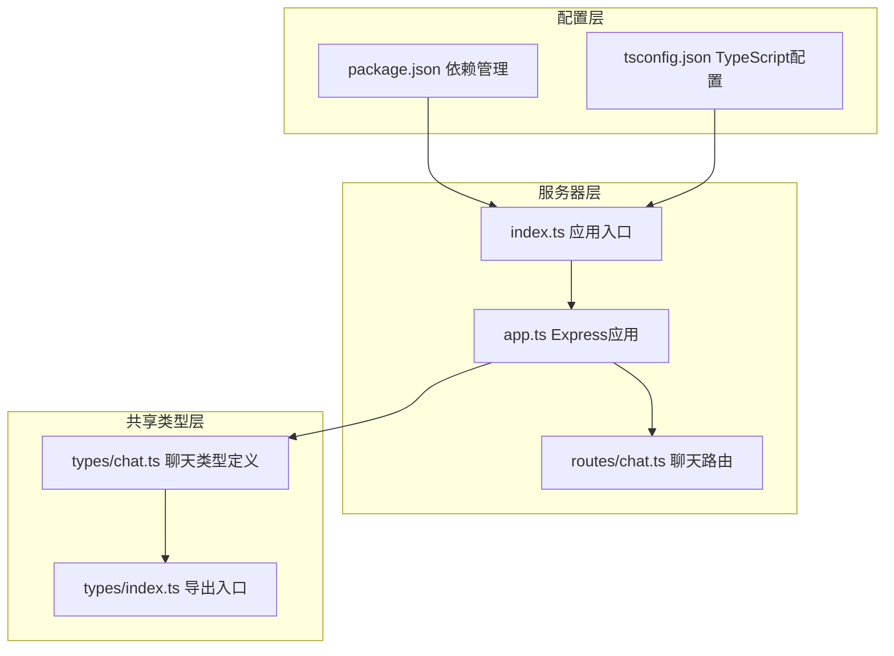
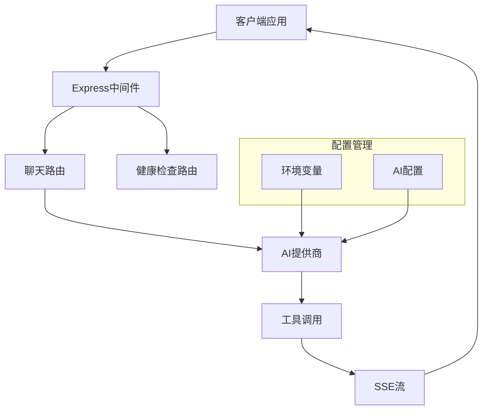
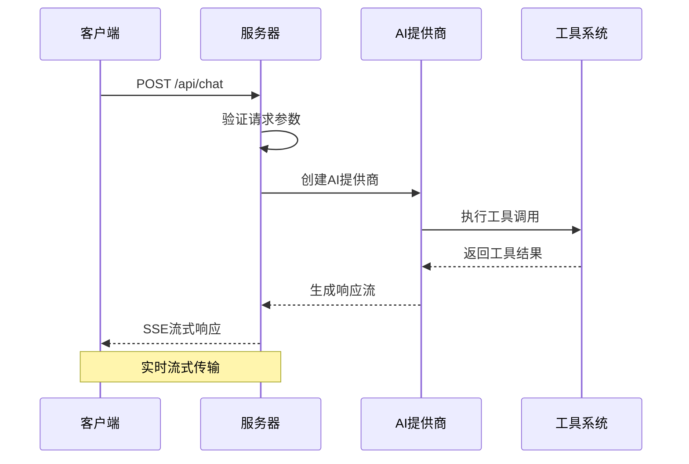
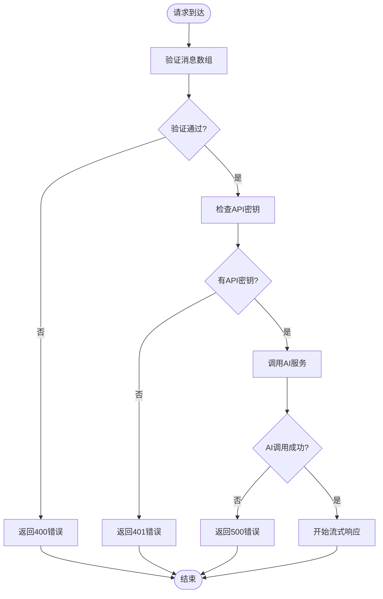
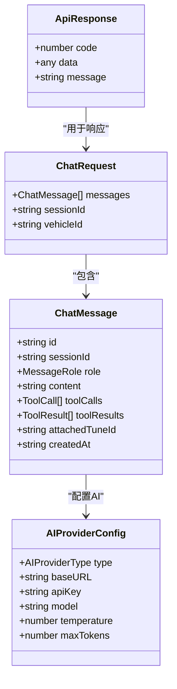

# API参考文档

<cite>
**本文档引用的文件**
- [server/src/index.ts](file://server/src/index.ts)
- [server/src/app.ts](file://server/src/app.ts)
- [server/src/routes/chat.ts](file://server/src/routes/chat.ts)
- [shared/types/chat.ts](file://shared/types/chat.ts)
- [shared/types/index.ts](file://shared/types/index.ts)
- [server/package.json](file://server/package.json)
- [shared/package.json](file://shared/package.json)
</cite>

## 目录
1. [简介](#简介)
2. [项目结构](#项目结构)
3. [核心组件](#核心组件)
4. [架构概览](#架构概览)
5. [详细组件分析](#详细组件分析)
6. [依赖关系分析](#依赖关系分析)
7. [性能考虑](#性能考虑)
8. [故障排除指南](#故障排除指南)
9. [结论](#结论)
10. [附录](#附录)

## 简介
FH6汽车设置工具是一个基于Express.js构建的后端服务，提供AI驱动的汽车调优对话功能。该系统通过流式服务器推送事件(SSE)实现实时对话交互，支持多种AI提供商集成，并提供了标准化的API响应格式。

## 项目结构
项目采用分层架构设计，主要包含以下组件：



**图表来源**
- [server/src/index.ts:1-11](file://server/src/index.ts#L1-L11)
- [server/src/app.ts:1-40](file://server/src/app.ts#L1-L40)
- [server/src/routes/chat.ts:1-74](file://server/src/routes/chat.ts#L1-L74)
- [shared/types/chat.ts:1-75](file://shared/types/chat.ts#L1-L75)

**章节来源**
- [server/src/index.ts:1-11](file://server/src/index.ts#L1-L11)
- [server/src/app.ts:1-40](file://server/src/app.ts#L1-L40)
- [shared/types/index.ts:1-5](file://shared/types/index.ts#L1-L5)

## 核心组件
系统的核心组件包括：

### 应用入口组件
- **文件**: server/src/index.ts
- **职责**: 应用程序启动、环境变量加载、端口监听
- **特性**: 支持动态端口配置，默认3001端口

### Express应用组件
- **文件**: server/src/app.ts
- **职责**: 中间件配置、路由注册、错误处理
- **特性**: CORS配置、JSON解析、健康检查端点

### 聊天路由组件
- **文件**: server/src/routes/chat.ts
- **职责**: 处理AI对话请求、流式响应生成
- **特性**: SSE流式传输、工具调用支持、多步推理

### 共享类型定义
- **文件**: shared/types/chat.ts
- **职责**: 定义API数据模型和类型规范
- **特性**: 统一的响应格式、消息角色定义、工具调用接口

**章节来源**
- [server/src/index.ts:1-11](file://server/src/index.ts#L1-L11)
- [server/src/app.ts:1-40](file://server/src/app.ts#L1-L40)
- [server/src/routes/chat.ts:1-74](file://server/src/routes/chat.ts#L1-L74)
- [shared/types/chat.ts:1-75](file://shared/types/chat.ts#L1-L75)

## 架构概览
系统采用模块化架构，实现了清晰的关注点分离：



**图表来源**
- [server/src/app.ts:14-29](file://server/src/app.ts#L14-L29)
- [server/src/routes/chat.ts:9-38](file://server/src/routes/chat.ts#L9-L38)

## 详细组件分析

### 健康检查接口
**HTTP方法**: GET  
**URL模式**: `/api/health`  
**请求参数**: 无  
**响应格式**: 标准API响应格式

#### 响应结构
```json
{
  "code": 0,
  "data": {
    "status": "ok",
    "aiModel": "deepseek-chat",
    "aiBaseURL": "https://api.deepseek.com/v1",
    "hasApiKey": true
  },
  "message": "success"
}
```

#### 状态码说明
- `200 OK`: 服务正常运行
- `500 Internal Server Error`: 服务器内部错误

**章节来源**
- [server/src/app.ts:14-26](file://server/src/app.ts#L14-L26)

### 聊天接口
**HTTP方法**: POST  
**URL模式**: `/api/chat`  
**请求参数**: JSON对象

#### 请求体结构
```json
{
  "messages": [
    {
      "role": "user",
      "content": "如何优化我的汽车性能？"
    }
  ],
  "sessionId": "session-123",
  "vehicleId": "vehicle-456"
}
```

#### 响应格式
接口支持两种响应模式：

1. **标准JSON响应**（错误情况）
```json
{
  "code": 400,
  "data": null,
  "message": "messages 不能为空"
}
```

2. **SSE流式响应**（成功情况）
- Content-Type: `text/event-stream`
- 数据格式：事件流协议

#### 成功响应流程


**图表来源**
- [server/src/routes/chat.ts:9-73](file://server/src/routes/chat.ts#L9-L73)

#### 错误处理机制


**图表来源**
- [server/src/routes/chat.ts:12-24](file://server/src/routes/chat.ts#L12-L24)
- [server/src/routes/chat.ts:60-72](file://server/src/routes/chat.ts#L60-L72)

**章节来源**
- [server/src/routes/chat.ts:1-74](file://server/src/routes/chat.ts#L1-L74)

### 数据模型定义
系统使用统一的API响应格式和类型定义：



**图表来源**
- [shared/types/chat.ts:62-75](file://shared/types/chat.ts#L62-L75)
- [shared/types/chat.ts:40-60](file://shared/types/chat.ts#L40-L60)
- [shared/types/chat.ts:4-22](file://shared/types/chat.ts#L4-L22)

**章节来源**
- [shared/types/chat.ts:1-75](file://shared/types/chat.ts#L1-L75)

## 依赖关系分析

### 依赖层次结构
```mermaid
graph TB
subgraph "运行时依赖"
A[express 4.21.0]
B[cors 2.8.5]
C[ai 4.1.0]
D[@ai-sdk/openai 1.3.0]
E[dotenv 16.4.7]
end
subgraph "开发时依赖"
F[typescript 5.7.0]
G[tsx 4.19.0]
H[@types/express 5.0.0]
I[@types/node 22.0.0]
end
J[server] --> A
J --> B
J --> C
J --> E
C --> D
J --> F
J --> G
J --> H
J --> I
```

**图表来源**
- [server/package.json:10-24](file://server/package.json#L10-L24)

### 版本控制策略
- **语义化版本**: 主版本号.次版本号.修订号
- **向后兼容性**: 保持API响应格式稳定
- **依赖更新**: 使用^符号允许次版本更新

**章节来源**
- [server/package.json:1-26](file://server/package.json#L1-L26)
- [shared/package.json:1-8](file://shared/package.json#L1-L8)

## 性能考虑
系统在设计时考虑了以下性能因素：

### 流式传输优化
- 使用SSE实现实时响应
- 支持长连接保持
- 减少内存占用

### 连接管理
- CORS配置限制允许的源
- 缓存控制避免不必要的缓存
- X-Accel-Buffering禁用代理缓冲

### 错误恢复
- 及时释放流资源
- 异常情况下的资源清理
- 连接超时处理

## 故障排除指南

### 常见问题诊断

#### 400错误 - 请求参数无效
**症状**: `messages 不能为空`
**解决方案**: 确保请求体包含有效的messages数组

#### 401错误 - 认证失败
**症状**: `AI API Key 未配置`
**解决方案**: 在.env文件中设置AI_API_KEY环境变量

#### 500错误 - 服务器内部错误
**症状**: AI调用失败
**解决方案**: 检查AI提供商服务状态和网络连接

### 调试建议
1. 启用详细的日志记录
2. 验证环境变量配置
3. 测试AI提供商连接
4. 检查网络防火墙设置

**章节来源**
- [server/src/routes/chat.ts:12-24](file://server/src/routes/chat.ts#L12-L24)
- [server/src/routes/chat.ts:60-72](file://server/src/routes/chat.ts#L60-L72)
- [server/src/app.ts:31-39](file://server/src/app.ts#L31-L39)

## 结论
FH6汽车设置工具提供了一个功能完整、设计合理的API接口。系统通过流式SSE响应实现了高效的实时对话体验，同时保持了良好的错误处理和性能表现。统一的API响应格式确保了客户端集成的便利性。

## 附录

### 环境变量配置
- `PORT`: 服务器端口，默认3001
- `AI_API_KEY`: AI提供商API密钥
- `AI_BASE_URL`: AI提供商基础URL
- `AI_MODEL`: AI模型名称

### 客户端集成最佳实践
1. 实现SSE连接管理
2. 处理流式数据解析
3. 实现重连机制
4. 验证API响应格式
5. 处理网络异常情况

### API版本控制
- 当前版本: 1.0.0
- 向后兼容性: 保持响应格式稳定
- 更新策略: 小版本号变更不影响现有功能