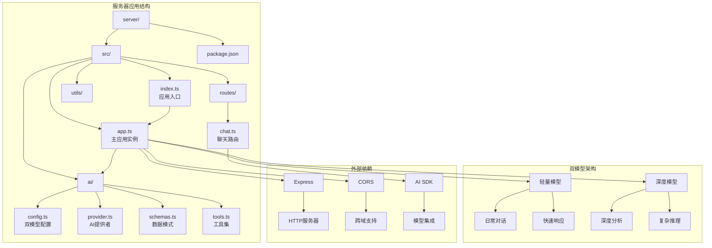
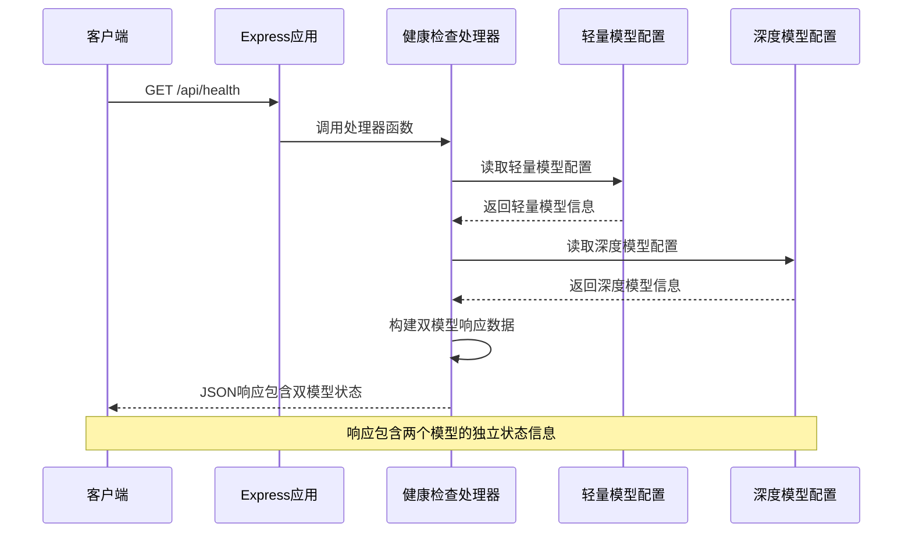
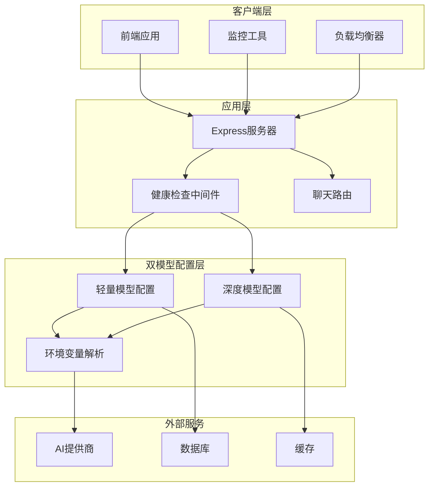
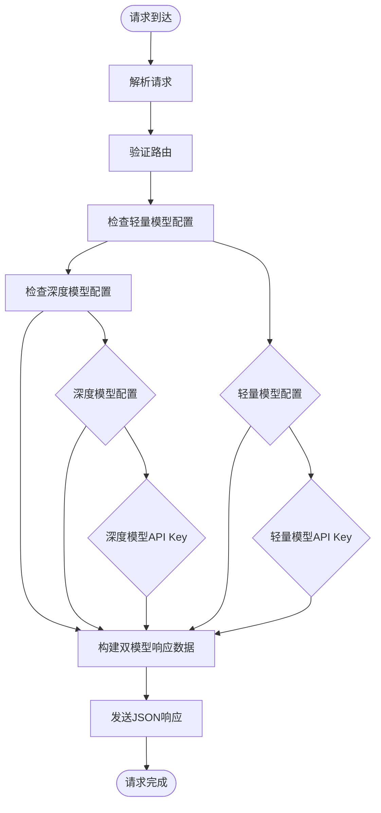
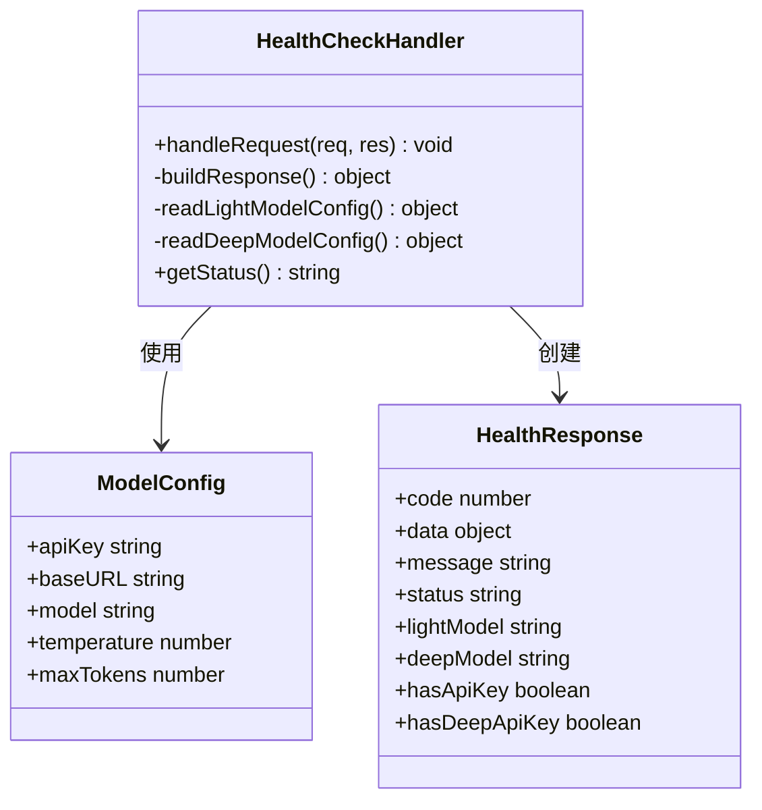
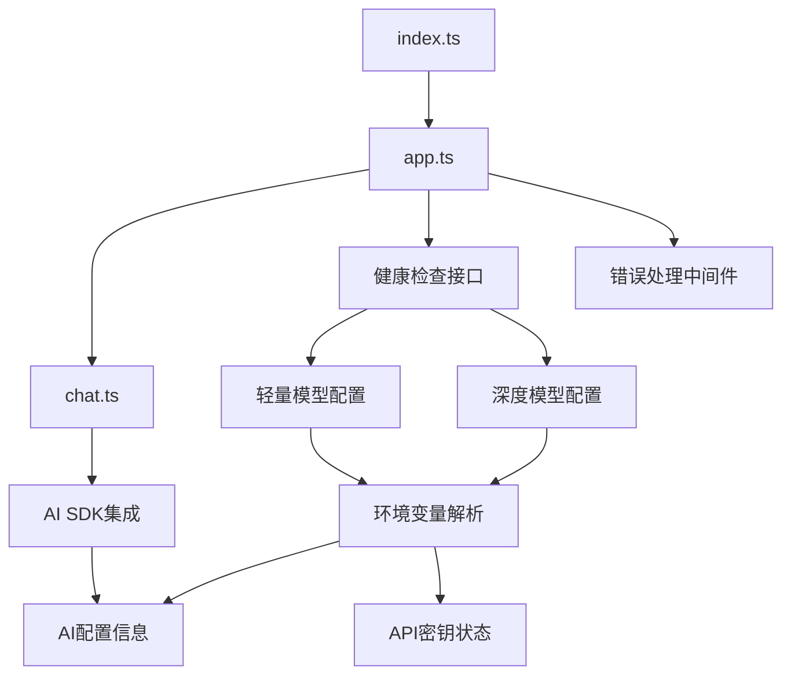
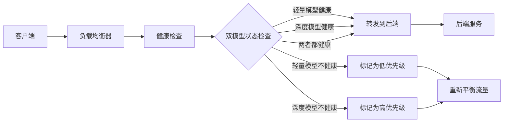

# 健康检查接口

<cite>
**本文档引用的文件**
- [server/src/app.ts](file://server/src/app.ts)
- [server/src/index.ts](file://server/src/index.ts)
- [server/src/ai/config.ts](file://server/src/ai/config.ts)
- [server/src/routes/chat.ts](file://server/src/routes/chat.ts)
- [server/package.json](file://server/package.json)
</cite>

## 更新摘要
**所做更改**
- 更新了健康检查接口以支持双模型配置架构
- 新增了轻量模型和深度模型的独立状态显示
- 更新了模型名称显示逻辑，包括默认模型名称变更
- 扩展了响应数据结构以包含双模型配置信息
- 更新了环境变量配置以支持双模型分离

## 目录
1. [简介](#简介)
2. [项目结构](#项目结构)
3. [核心组件](#核心组件)
4. [架构概览](#架构概览)
5. [详细组件分析](#详细组件分析)
6. [依赖关系分析](#依赖关系分析)
7. [性能考虑](#性能考虑)
8. [故障排除指南](#故障排除指南)
9. [结论](#结论)

## 简介

健康检查接口是现代Web应用程序中不可或缺的重要组件，用于验证服务的可用性和运行状态。本项目实现了标准的健康检查API端点，为系统监控、负载均衡和容器编排提供可靠的服务状态信息。

该健康检查接口采用RESTful设计原则，使用HTTP GET方法访问`/api/health`路径，返回标准化的JSON响应格式，包含服务状态、双模型配置信息和API密钥状态等关键信息。新版本支持轻量模型和深度模型的独立配置，提供更精细的模型管理能力。

## 项目结构

FH6 Car Setting Tool是一个基于Node.js和Express的后端服务，主要包含以下核心模块：



**图表来源**
- [server/src/index.ts:1-13](file://server/src/index.ts#L1-L13)
- [server/src/app.ts:1-51](file://server/src/app.ts#L1-L51)
- [server/src/ai/config.ts:1-32](file://server/src/ai/config.ts#L1-L32)

**章节来源**
- [server/src/index.ts:1-13](file://server/src/index.ts#L1-L13)
- [server/src/app.ts:1-51](file://server/src/app.ts#L1-L51)
- [server/src/ai/config.ts:1-32](file://server/src/ai/config.ts#L1-L32)

## 核心组件

### 健康检查接口实现

健康检查接口位于主应用实例中，现已升级为支持双模型配置的实现方式：



**图表来源**
- [server/src/app.ts:15-30](file://server/src/app.ts#L15-L30)

### 接口规范

健康检查接口遵循RESTful API设计标准，提供标准化的HTTP响应：

- **HTTP方法**: `GET`
- **URL模式**: `/api/health`
- **内容类型**: `application/json`
- **响应状态码**: `200 OK` (成功时)

**章节来源**
- [server/src/app.ts:15-30](file://server/src/app.ts#L15-L30)

## 架构概览

### 系统架构图



**图表来源**
- [server/src/app.ts:1-51](file://server/src/app.ts#L1-L51)
- [server/src/index.ts:1-13](file://server/src/index.ts#L1-L13)
- [server/src/ai/config.ts:1-32](file://server/src/ai/config.ts#L1-L32)

### 数据流分析

健康检查接口的数据流现在包含双模型配置的处理：



**图表来源**
- [server/src/app.ts:15-30](file://server/src/app.ts#L15-L30)
- [server/src/ai/config.ts:11-32](file://server/src/ai/config.ts#L11-L32)

## 详细组件分析

### 健康检查处理器实现

健康检查处理器是整个接口的核心组件，现已升级为支持双模型配置：



**图表来源**
- [server/src/app.ts:15-30](file://server/src/app.ts#L15-L30)
- [server/src/ai/config.ts:3-32](file://server/src/ai/config.ts#L3-L32)

### 响应数据结构

健康检查接口返回标准化的JSON响应格式，现包含双模型配置信息：

| 字段名 | 类型 | 描述 | 示例值 |
|--------|------|------|--------|
| `code` | number | 响应状态码 | `0` |
| `data` | object | 主要响应数据 | `{}` |
| `message` | string | 人类可读的消息 | `'success'` |
| `data.status` | string | 服务状态 | `'ok'` |
| `data.lightModel` | string | 轻量模型名称 | `'deepseek-v4-flash'` |
| `data.deepModel` | string | 深度模型名称 | `'deepseek-v4-pro'` |
| `data.hasApiKey` | boolean | 轻量模型是否配置API密钥 | `true` |
| `data.hasDeepApiKey` | boolean | 深度模型是否配置API密钥 | `false` |

### 环境变量配置

健康检查接口现在支持双模型的独立配置：

| 环境变量 | 类型 | 必需性 | 默认值 | 描述 |
|----------|------|--------|--------|------|
| `PORT` | number | 可选 | `3001` | 服务器监听端口 |
| `AI_MODEL` | string | 可选 | `'deepseek-v4-flash'` | 轻量模型名称 |
| `AI_BASE_URL` | string | 可选 | `'https://api.deepseek.com/v1'` | 轻量模型基础URL |
| `AI_API_KEY` | string | 可选 | 无 | 轻量模型API密钥 |
| `AI_TEMPERATURE` | number | 可选 | `0.7` | 轻量模型温度参数 |
| `AI_MAX_TOKENS` | number | 可选 | `4096` | 轻量模型最大令牌数 |
| `AI_DEEP_MODEL` | string | 可选 | `'deepseek-v4-pro'` | 深度模型名称 |
| `AI_DEEP_BASE_URL` | string | 可选 | `AI_BASE_URL` | 深度模型基础URL（可继承轻量模型） |
| `AI_DEEP_API_KEY` | string | 可选 | `AI_API_KEY` | 深度模型API密钥（可继承轻量模型） |
| `AI_DEEP_TEMPERATURE` | number | 可选 | `0.3` | 深度模型温度参数 |
| `AI_DEEP_MAX_TOKENS` | number | 可选 | `8192` | 深度模型最大令牌数 |

**章节来源**
- [server/src/app.ts:15-30](file://server/src/app.ts#L15-L30)
- [server/src/ai/config.ts:11-32](file://server/src/ai/config.ts#L11-L32)
- [server/src/index.ts:1-13](file://server/src/index.ts#L1-L13)

## 依赖关系分析

### 外部依赖关系

```mermaid
graph LR
subgraph "核心依赖"
A[express] --> B[HTTP服务器]
C[cors] --> D[跨域支持]
E[dotenv] --> F[环境变量管理]
end
subgraph "AI集成"
G[@ai-sdk/openai] --> H[OpenAI SDK]
I[ai] --> J[AI工具集]
end
subgraph "开发工具"
K[typescript] --> L[类型定义]
M[tsx] --> N[热重载]
end
A --> G
A --> I
E --> O[process.env]
O --> P[环境变量]
```

**图表来源**
- [server/package.json:10-24](file://server/package.json#L10-L24)

### 内部模块依赖

健康检查接口与其他模块的依赖关系已扩展为支持双模型架构：



**图表来源**
- [server/src/app.ts:1-51](file://server/src/app.ts#L1-L51)
- [server/src/index.ts:1-13](file://server/src/index.ts#L1-L13)
- [server/src/ai/config.ts:1-32](file://server/src/ai/config.ts#L1-L32)

**章节来源**
- [server/package.json:1-26](file://server/package.json#L1-L26)

## 性能考虑

### 健康检查性能特征

健康检查接口具有以下性能特点：

- **响应时间**: 极快（毫秒级）
- **内存占用**: 非常低（仅读取环境变量和构建响应）
- **CPU消耗**: 极少（字符串拼接和JSON序列化）
- **并发处理**: 支持高并发请求
- **双模型开销**: 额外的配置读取和响应构建成本极小

### 最佳实践建议

#### 检查频率优化
- **生产环境**: 每30-60秒一次
- **开发环境**: 每5-10秒一次
- **容器编排**: 根据部署规模调整

#### 超时设置
- **请求超时**: 5-10秒
- **连接超时**: 2-3秒
- **读取超时**: 3-5秒

#### 重试策略
- **指数退避**: 1s, 2s, 4s, 8s
- **最大重试次数**: 3次
- **错误分类**: 区分网络错误和服务错误

## 故障排除指南

### 常见问题诊断

#### 网络连接问题
**症状**: 请求超时或连接拒绝
**诊断步骤**:
1. 检查服务器是否正在运行
2. 验证端口配置 (`PORT`)
3. 确认防火墙设置
4. 测试本地回环连接

**解决方案**:
```bash
# 检查服务状态
netstat -an | grep :3001

# 测试本地连接
curl -I http://localhost:3001/api/health

# 检查进程
ps aux | grep node
```

#### 服务启动延迟
**症状**: 健康检查响应缓慢
**可能原因**:
- 依赖服务启动延迟
- 环境变量加载
- 双模型配置初始化

**诊断方法**:
```bash
# 查看启动日志
npm run dev

# 监控启动过程
time curl http://localhost:3001/api/health
```

#### 双模型配置问题
**症状**: 模型状态异常或API密钥配置错误
**诊断步骤**:
1. 检查 `.env` 文件中的双模型配置
2. 验证API密钥有效性
3. 确认网络可达性
4. 检查模型名称和参数配置

**解决方案**:
```bash
# 验证轻量模型配置
echo $AI_MODEL
echo $AI_BASE_URL
echo $AI_API_KEY

# 验证深度模型配置
echo $AI_DEEP_MODEL
echo $AI_DEEP_BASE_URL
echo $AI_DEEP_API_KEY

# 测试AI连接
curl -s --head https://api.deepseek.com/v1
```

### 健康检查最佳实践

#### 监控指标
- **可用性**: 99.9%以上
- **响应时间**: <100ms
- **错误率**: <0.1%
- **吞吐量**: 支持数千QPS

#### 负载均衡集成


#### 容器编排配置
在Kubernetes中配置健康检查探针：

```yaml
livenessProbe:
  httpGet:
    path: /api/health
    port: 3001
  initialDelaySeconds: 30
  periodSeconds: 30
  timeoutSeconds: 5
  failureThreshold: 3

readinessProbe:
  httpGet:
    path: /api/health
    port: 3001
  initialDelaySeconds: 5
  periodSeconds: 5
  timeoutSeconds: 3
  failureThreshold: 1
```

**章节来源**
- [server/src/app.ts:15-30](file://server/src/app.ts#L15-L30)

## 结论

健康检查接口作为FH6 Car Setting Tool的重要组成部分，现已升级为支持双模型架构的完整版本。通过标准化的JSON响应格式和双模型配置管理，该接口能够满足现代微服务架构对健康检查的需求。

### 关键优势

1. **双模型支持**: 提供轻量模型和深度模型的独立状态监控
2. **配置灵活性**: 支持两套独立的环境变量配置
3. **向后兼容**: 保持原有接口格式，不影响现有集成
4. **性能优异**: 极低的资源消耗和响应时间
5. **易于集成**: 符合主流监控和编排工具的标准

### 新特性概述

- **轻量模型配置**: 适用于日常对话和快速响应场景
- **深度模型配置**: 适用于深度分析和复杂推理场景
- **API密钥分离**: 支持不同模型使用不同的API密钥
- **智能回退机制**: 深度模型配置缺失时自动使用轻量模型配置

### 未来改进建议

1. **扩展状态信息**: 添加更详细的双模型使用统计
2. **动态配置更新**: 支持运行时配置更新
3. **安全增强**: 添加访问控制和认证机制
4. **监控集成**: 提供Prometheus等监控指标
5. **多模型支持**: 扩展到更多模型类型的管理

该健康检查接口为整个系统的稳定运行提供了重要保障，是构建可靠分布式系统的基础组件之一。双模型架构的引入进一步增强了系统的灵活性和可扩展性，为不同场景下的AI应用提供了更好的支持。