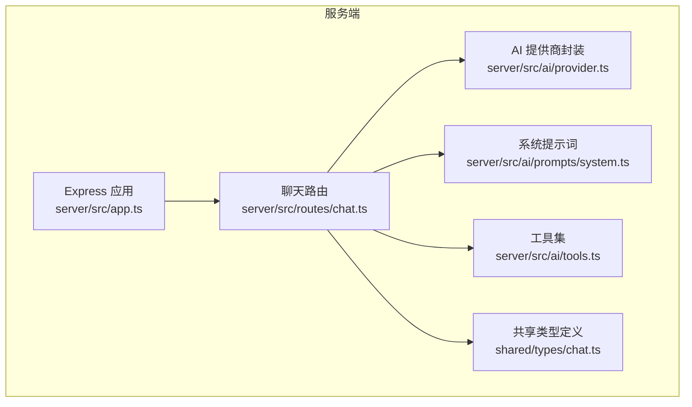
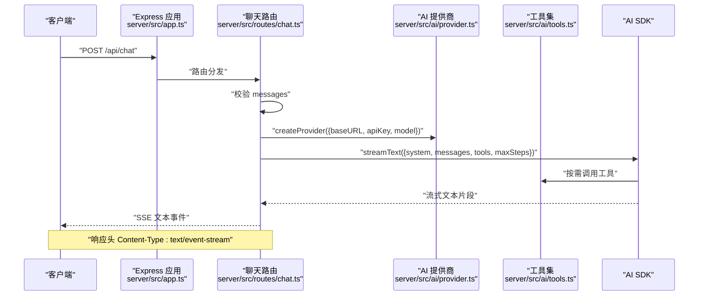
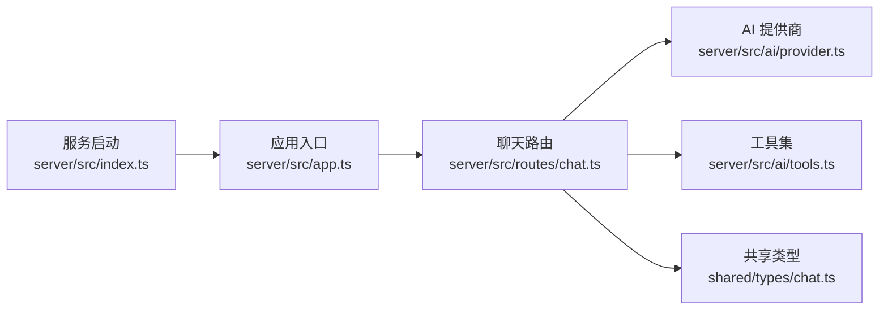
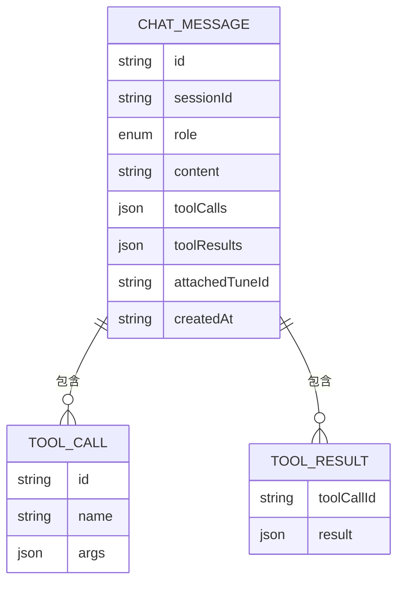

# 聊天接口

<cite>
**本文引用的文件**
- [server\src\routes\chat.ts](file://server/src/routes/chat.ts)
- [server\src\app.ts](file://server/src/app.ts)
- [server\src\index.ts](file://server/src/index.ts)
- [server\src\ai\provider.ts](file://server/src/ai/provider.ts)
- [server\src\ai\prompts\system.ts](file://server/src/ai/prompts/system.ts)
- [server\src\ai\tools.ts](file://server/src/ai/tools.ts)
- [server\src\ai\schemas.ts](file://server/src/ai/schemas.ts)
- [shared\types\chat.ts](file://shared/types/chat.ts)
</cite>

## 目录
1. [简介](#简介)
2. [项目结构](#项目结构)
3. [核心组件](#核心组件)
4. [架构总览](#架构总览)
5. [详细组件分析](#详细组件分析)
6. [依赖关系分析](#依赖关系分析)
7. [性能考虑](#性能考虑)
8. [故障排除指南](#故障排除指南)
9. [结论](#结论)
10. [附录](#附录)

## 简介
本文件为 POST /api/chat 聊天接口的完整技术文档，涵盖接口的 HTTP 方法与 URL、请求与响应格式、messages 数组参数结构、流式 SSE 响应机制、sessionId 参数作用、AI 提供商配置对接口行为的影响、典型汽车调优咨询场景的请求/响应示例、错误处理机制（400、401、500），以及 maxSteps 与工具调用机制。

## 项目结构
该接口位于后端服务的路由层，通过 Express 应用暴露，并使用 AI SDK 进行流式文本生成。系统还包含共享类型定义、AI 提供商封装、系统提示词与工具集等模块。

图表来源
- [server\src\app.ts:1-40](file://server/src/app.ts#L1-L40)
- [server\src\routes\chat.ts:1-74](file://server/src/routes/chat.ts#L1-L74)
- [server\src\ai\provider.ts:1-15](file://server/src/ai/provider.ts#L1-L15)
- [server\src\ai\prompts\system.ts:1-33](file://server/src/ai/prompts/system.ts#L1-L33)
- [server\src\ai\tools.ts:1-59](file://server/src/ai/tools.ts#L1-L59)
- [shared\types\chat.ts:1-75](file://shared/types/chat.ts#L1-L75)

章节来源
- [server\src\app.ts:1-40](file://server/src/app.ts#L1-L40)
- [server\src\index.ts:1-11](file://server/src/index.ts#L1-L11)

## 核心组件
- 路由处理器：接收 POST /api/chat 的请求，进行输入校验、AI 配置加载、流式响应与错误处理。
- AI 提供商封装：基于 @ai-sdk/openai 创建统一模型实例，支持自定义 baseURL、apiKey、model。
- 系统提示词：定义 AI 的角色与调校领域的专业性、原则与参数体系。
- 工具集：提供 generateTune/saveTune/compareTunes 等工具，用于生成、保存与对比调校方案。
- 共享类型：定义消息角色、工具调用/结果、对话消息与会话、API 统一响应格式等。

章节来源
- [server\src\routes\chat.ts:1-74](file://server/src/routes/chat.ts#L1-L74)
- [server\src\ai\provider.ts:1-15](file://server/src/ai/provider.ts#L1-L15)
- [server\src\ai\prompts\system.ts:1-33](file://server/src/ai/prompts/system.ts#L1-L33)
- [server\src\ai\tools.ts:1-59](file://server/src/ai/tools.ts#L1-L59)
- [shared\types\chat.ts:1-75](file://shared/types/chat.ts#L1-L75)

## 架构总览
POST /api/chat 的调用链路如下：

图表来源
- [server\src\app.ts:28-29](file://server/src/app.ts#L28-L29)
- [server\src\routes\chat.ts:9-73](file://server/src/routes/chat.ts#L9-L73)
- [server\src\ai\provider.ts:9-15](file://server/src/ai/provider.ts#L9-L15)
- [server\src\ai\tools.ts:5-59](file://server/src/ai/tools.ts#L5-L59)

## 详细组件分析

### 接口定义
- HTTP 方法：POST
- URL 模式：/api/chat
- 请求体字段：
  - messages: 数组，元素为对象，包含 role 与 content 字段
  - sessionId: 可选字符串，用于标识会话上下文
  - vehicleId: 可选字符串，用于关联车辆信息（类型定义存在，但路由未使用）
- 响应：
  - 成功：SSE 流式响应，Content-Type: text/event-stream
  - 失败：JSON 响应，包含 code、data、message

章节来源
- [server\src\routes\chat.ts:9-15](file://server/src/routes/chat.ts#L9-L15)
- [shared\types\chat.ts:69-74](file://shared/types/chat.ts#L69-L74)

### messages 数组参数结构
- 角色（role）取值：
  - user：用户输入
  - assistant：AI 输出
  - system：系统提示词（在接口中作为 system prompt 使用）
  - tool：工具调用结果（类型定义存在）
- content：字符串，承载具体文本内容
- 工具调用：
  - messages 中可包含工具调用与工具结果（类型定义存在）
  - 实际工具调用由 AI SDK 基于工具集触发

章节来源
- [shared\types\chat.ts:24-50](file://shared/types/chat.ts#L24-L50)
- [server\src\routes\chat.ts:32-35](file://server/src/routes/chat.ts#L32-L35)

### 流式 SSE 响应机制
- 响应头设置：
  - Content-Type: text/event-stream
  - Cache-Control: no-cache
  - Connection: keep-alive
  - X-Accel-Buffering: no（Nginx 缓冲绕过）
- 数据流格式：
  - 以事件流形式推送，每个片段为二进制字节流
  - 若发生错误且响应头尚未发送，返回 JSON 错误
  - 若响应头已发送，则以 SSE 事件形式发送 error 事件

章节来源
- [server\src\routes\chat.ts:40-72](file://server/src/routes/chat.ts#L40-L72)

### sessionId 参数的作用与使用场景
- 作用：标识会话上下文，便于后续关联消息与会话记录
- 使用场景：前端可携带 sessionId 将多轮对话归档至同一会话；后端可据此维护会话历史或持久化存储
- 当前路由未对 sessionId 做额外处理，仅透传给上游逻辑

章节来源
- [server\src\routes\chat.ts](file://server/src/routes/chat.ts#L10)
- [shared\types\chat.ts:53-60](file://shared/types/chat.ts#L53-L60)

### AI 提供商配置对接口行为的影响
- 配置项：
  - AI_API_KEY：必填，未配置时返回 401
  - AI_BASE_URL：可选，默认 deepseek 端点
  - AI_MODEL：可选，默认 deepseek-chat
- 影响：
  - 决定实际调用的 AI 服务端点与模型
  - 通过 createProvider(baseURL, apiKey, model) 构建模型实例

章节来源
- [server\src\routes\chat.ts:17-24](file://server/src/routes/chat.ts#L17-L24)
- [server\src\ai\provider.ts:9-15](file://server/src/ai/provider.ts#L9-L15)

### 系统提示词与工具调用机制
- 系统提示词：定义 AI 的角色、原则与参数体系，确保输出符合 FH6 调校语境
- 工具集：
  - generateTune：根据车辆与用途生成完整调校方案
  - saveTune：保存调校方案
  - compareTunes：对比两个调校方案
- 调用方式：AI SDK 基于对话内容自动决定是否调用工具，工具执行在后端返回确认信息

章节来源
- [server\src\ai\prompts\system.ts:1-33](file://server/src/ai/prompts/system.ts#L1-L33)
- [server\src\ai\tools.ts:5-59](file://server/src/ai/tools.ts#L5-L59)

### maxSteps 参数与工具调用
- maxSteps：限制推理与工具调用的最大步数（默认 5）
- 作用：控制对话复杂度与调用次数，避免过度推理或循环调用

章节来源
- [server\src\routes\chat.ts](file://server/src/routes/chat.ts#L37)

### 典型请求/响应示例（汽车调优咨询场景）
- 请求（简化示意）：
  - URL：POST /api/chat
  - Headers：Content-Type: application/json
  - Body：
    - messages: [{ role: "user", content: "我的 BMW M4 2023，主要用于竞速，如何调校？" }, ...]
    - sessionId: "会话唯一标识"
- 响应（简化示意）：
  - 成功：SSE 流式文本事件，逐步返回 AI 回复
  - 失败：
    - 400：messages 为空或非数组
    - 401：未配置 AI_API_KEY
    - 500：AI 调用异常（响应头未发送时返回 JSON；已发送时返回 SSE error 事件）

章节来源
- [server\src\routes\chat.ts:12-24](file://server/src/routes/chat.ts#L12-L24)
- [server\src\routes\chat.ts:60-72](file://server/src/routes/chat.ts#L60-L72)

### 错误处理机制
- 400（请求无效）：messages 为空或非数组
- 401（未授权）：未配置 AI_API_KEY
- 500（服务器错误）：
  - 若响应头未发送：返回 JSON 错误
  - 若响应头已发送：发送 SSE error 事件并结束连接

章节来源
- [server\src\routes\chat.ts:12-24](file://server/src/routes/chat.ts#L12-L24)
- [server\src\routes\chat.ts:60-72](file://server/src/routes/chat.ts#L60-L72)

## 依赖关系分析
- 路由依赖：
  - 依赖 AI 提供商封装与工具集
  - 依赖系统提示词与共享类型
- 应用层：
  - Express 应用注册路由与中间件（CORS、JSON 解析）
  - 健康检查接口暴露 AI 配置状态

图表来源
- [server\src\routes\chat.ts:1-5](file://server/src/routes/chat.ts#L1-L5)
- [server\src\ai\provider.ts:1-15](file://server/src/ai/provider.ts#L1-L15)
- [server\src\ai\tools.ts:1-59](file://server/src/ai/tools.ts#L1-L59)
- [shared\types\chat.ts:1-75](file://shared/types/chat.ts#L1-L75)
- [server\src\app.ts:1-40](file://server/src/app.ts#L1-L40)
- [server\src\index.ts:1-11](file://server/src/index.ts#L1-L11)

章节来源
- [server\src\app.ts:1-40](file://server/src/app.ts#L1-L40)
- [server\src\index.ts:1-11](file://server/src/index.ts#L1-L11)

## 性能考虑
- 流式传输：使用 SSE 逐步推送，降低首字节延迟
- 缓冲控制：设置 no-cache 与 X-Accel-Buffering=no，避免代理层缓存导致的延迟
- 步数限制：maxSteps 控制工具调用与推理深度，防止长对话造成资源占用
- 配置优化：合理设置 AI_BASE_URL 与 AI_MODEL，选择就近节点与合适模型

## 故障排除指南
- 400 错误（messages 为空）：
  - 检查请求体是否包含 messages 字段，且为非空数组
- 401 错误（API Key 未配置）：
  - 确认环境变量 AI_API_KEY 已正确设置
- 500 错误（AI 调用失败）：
  - 查看服务端日志中的错误堆栈
  - 若已开始 SSE 流，检查客户端是否收到 error 事件

章节来源
- [server\src\routes\chat.ts:12-24](file://server/src/routes/chat.ts#L12-L24)
- [server\src\routes\chat.ts:60-72](file://server/src/routes/chat.ts#L60-L72)

## 结论
POST /api/chat 接口通过流式 SSE 提供实时对话体验，结合系统提示词与工具集实现 FH6 车辆调校的专业问答。通过 sessionId 支持会话管理，借助 AI 提供商配置灵活适配不同服务端点与模型。合理的错误处理与性能优化保障了生产可用性。

## 附录

### 数据模型图（消息与工具）

图表来源
- [shared\types\chat.ts:41-50](file://shared/types/chat.ts#L41-L50)
- [shared\types\chat.ts:28-38](file://shared/types/chat.ts#L28-L38)