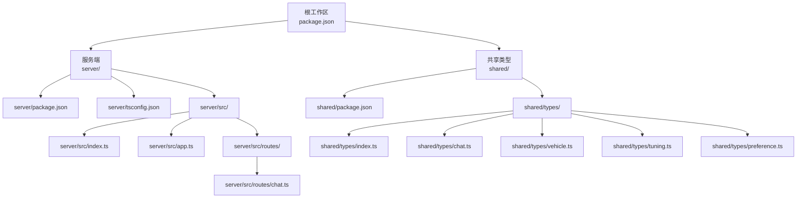
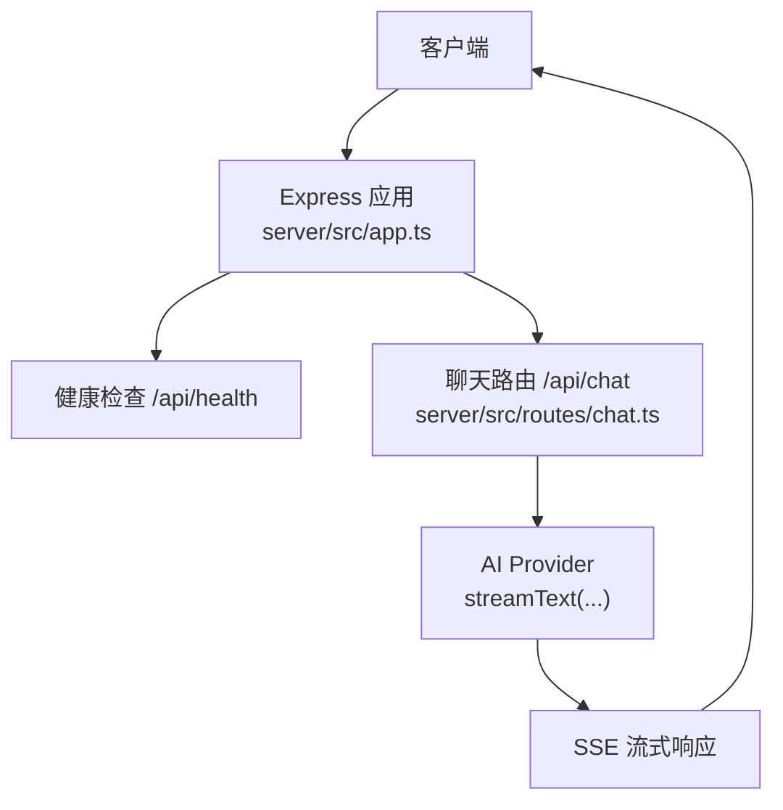
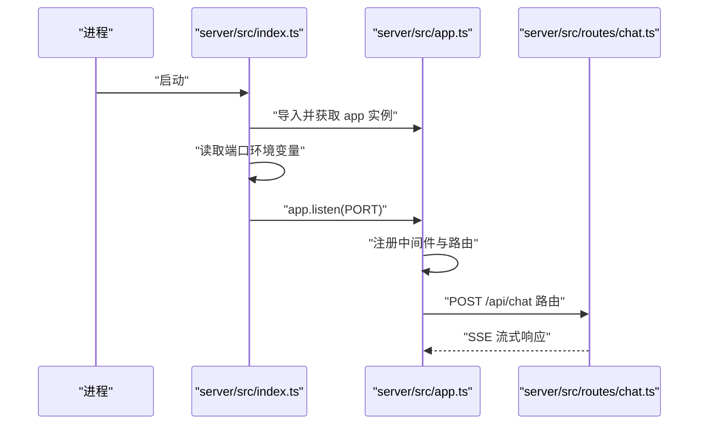
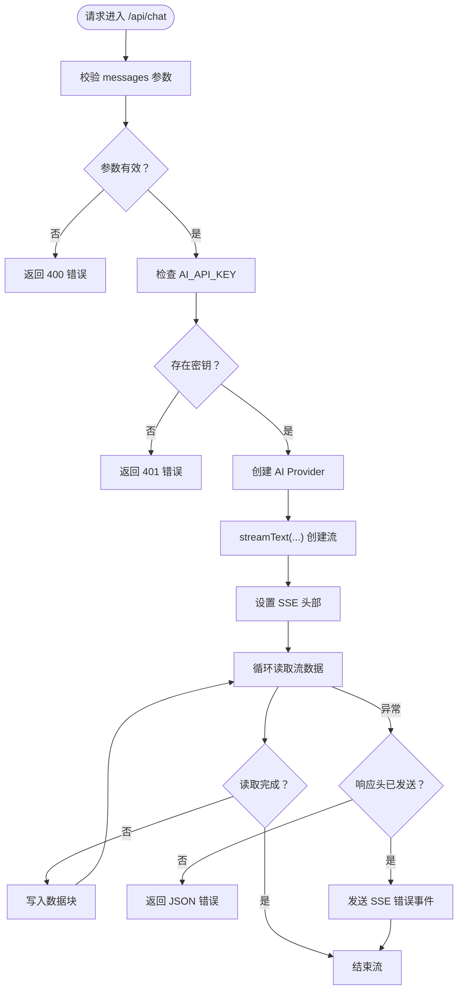
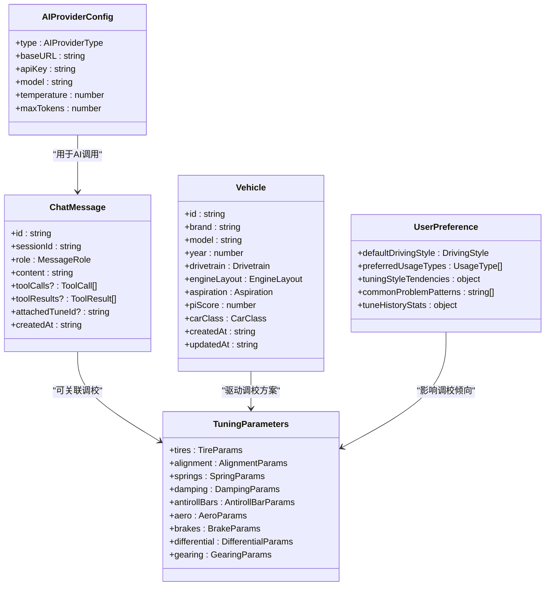
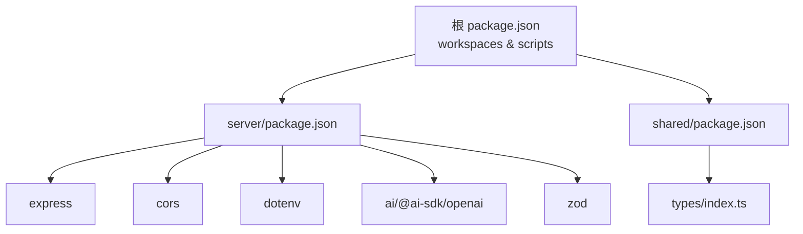

# 开发指南

<cite>
**本文引用的文件**
- [根包配置](file://package.json)
- [服务端包配置](file://server/package.json)
- [共享类型包配置](file://shared/package.json)
- [服务端TypeScript配置](file://server/tsconfig.json)
- [服务端入口](file://server/src/index.ts)
- [服务端应用](file://server/src/app.ts)
- [聊天路由](file://server/src/routes/chat.ts)
- [共享类型索引](file://shared/types/index.ts)
- [聊天类型定义](file://shared/types/chat.ts)
- [车辆类型定义](file://shared/types/vehicle.ts)
- [调校类型定义](file://shared/types/tuning.ts)
- [偏好类型定义](file://shared/types/preference.ts)
</cite>

## 目录
1. [简介](#简介)
2. [项目结构](#项目结构)
3. [核心组件](#核心组件)
4. [架构总览](#架构总览)
5. [详细组件分析](#详细组件分析)
6. [依赖关系分析](#依赖关系分析)
7. [性能考虑](#性能考虑)
8. [故障排除指南](#故障排除指南)
9. [结论](#结论)
10. [附录](#附录)

## 简介
本指南面向FH6汽车设置工具的开发者，提供从代码贡献到部署运维的全流程开发文档。项目采用Monorepo结构，包含服务端、共享类型与工作区脚本，支持TypeScript编译与热重载开发，并通过Express提供REST接口与Server-Sent Events流式响应。

## 项目结构
项目采用工作区（workspaces）组织，主要模块如下：
- 根工作区：统一脚本与依赖管理
- server：后端服务，基于Express，提供健康检查与聊天接口
- shared：共享类型定义，供前后端复用
- .gitignore：版本控制忽略规则

**图表来源**
- [根包配置:1-23](file://package.json#L1-L23)
- [服务端包配置:1-26](file://server/package.json#L1-L26)
- [共享类型包配置:1-8](file://shared/package.json#L1-L8)
- [服务端入口:1-11](file://server/src/index.ts#L1-L11)
- [服务端应用:1-40](file://server/src/app.ts#L1-L40)
- [聊天路由:1-74](file://server/src/routes/chat.ts#L1-L74)
- [共享类型索引:1-5](file://shared/types/index.ts#L1-L5)
- [聊天类型定义:1-75](file://shared/types/chat.ts#L1-L75)
- [车辆类型定义:1-30](file://shared/types/vehicle.ts#L1-L30)
- [调校类型定义:1-126](file://shared/types/tuning.ts#L1-L126)
- [偏好类型定义:1-60](file://shared/types/preference.ts#L1-L60)

**章节来源**
- [根包配置:1-23](file://package.json#L1-L23)
- [服务端包配置:1-26](file://server/package.json#L1-L26)
- [共享类型包配置:1-8](file://shared/package.json#L1-L8)

## 核心组件
- 服务端入口：加载环境变量并启动Express应用，监听端口
- 应用实例：配置CORS、JSON解析、健康检查、路由与全局错误处理
- 聊天路由：接收消息数组，校验参数，调用AI模型，以SSE流式返回结果
- 共享类型：定义车辆、调校、聊天、偏好等跨模块数据结构

**章节来源**
- [服务端入口:1-11](file://server/src/index.ts#L1-L11)
- [服务端应用:1-40](file://server/src/app.ts#L1-L40)
- [聊天路由:1-74](file://server/src/routes/chat.ts#L1-L74)
- [共享类型索引:1-5](file://shared/types/index.ts#L1-L5)

## 架构总览
系统采用客户端-服务端架构，服务端通过REST接口与SSE向客户端推送AI生成内容。共享类型确保前后端数据契约一致。

**图表来源**
- [服务端应用:14-29](file://server/src/app.ts#L14-L29)
- [聊天路由:9-73](file://server/src/routes/chat.ts#L9-L73)

## 详细组件分析

### 服务端入口与应用
- 入口负责读取环境变量并启动HTTP服务
- 应用配置CORS白名单、JSON解析、健康检查端点与统一错误处理

**图表来源**
- [服务端入口:1-11](file://server/src/index.ts#L1-L11)
- [服务端应用:1-40](file://server/src/app.ts#L1-L40)
- [聊天路由:9-73](file://server/src/routes/chat.ts#L9-L73)

**章节来源**
- [服务端入口:1-11](file://server/src/index.ts#L1-L11)
- [服务端应用:1-40](file://server/src/app.ts#L1-L40)

### 聊天路由与AI集成
- 参数校验：确保消息数组非空且为数组
- 认证：检查AI API Key是否存在
- 流式响应：使用SSE向客户端推送增量内容
- 错误处理：根据响应头是否发送决定返回JSON或SSE错误事件

**图表来源**
- [聊天路由:9-73](file://server/src/routes/chat.ts#L9-L73)

**章节来源**
- [聊天路由:1-74](file://server/src/routes/chat.ts#L1-L74)

### 共享类型体系
共享类型涵盖AI配置、对话消息、车辆信息、调校参数与用户偏好，确保前后端一致性。

**图表来源**
- [聊天类型定义:1-75](file://shared/types/chat.ts#L1-L75)
- [车辆类型定义:1-30](file://shared/types/vehicle.ts#L1-L30)
- [调校类型定义:1-126](file://shared/types/tuning.ts#L1-L126)
- [偏好类型定义:1-60](file://shared/types/preference.ts#L1-L60)

**章节来源**
- [共享类型索引:1-5](file://shared/types/index.ts#L1-L5)
- [聊天类型定义:1-75](file://shared/types/chat.ts#L1-L75)
- [车辆类型定义:1-30](file://shared/types/vehicle.ts#L1-L30)
- [调校类型定义:1-126](file://shared/types/tuning.ts#L1-L126)
- [偏好类型定义:1-60](file://shared/types/preference.ts#L1-L60)

## 依赖关系分析
- 根工作区通过NPM workspaces管理多包，提供统一的开发与构建脚本
- 服务端依赖Express、CORS、dotenv、AI SDK与Zod进行类型校验
- 共享类型作为纯TypeScript声明包，无运行时依赖

**图表来源**
- [根包配置:6-18](file://package.json#L6-L18)
- [服务端包配置:10-24](file://server/package.json#L10-L24)
- [共享类型包配置:1-8](file://shared/package.json#L1-L8)

**章节来源**
- [根包配置:1-23](file://package.json#L1-L23)
- [服务端包配置:1-26](file://server/package.json#L1-L26)
- [共享类型包配置:1-8](file://shared/package.json#L1-L8)

## 性能考虑
- 编译目标与模块：ES2022目标与CommonJS模块便于Node运行时兼容
- 严格模式与类型声明：开启严格模式与生成.d.ts与.d.ts.map提升类型安全性与IDE体验
- 源码映射：启用sourceMap便于生产调试
- 路径映射：@shared路径别名简化导入
- SSE流式：聊天接口使用SSE减少一次性响应体积，提升交互体验
- 内存管理：流式读取避免大对象堆积；错误处理中释放reader锁并结束响应

**章节来源**
- [服务端TypeScript配置:1-23](file://server/tsconfig.json#L1-L23)
- [聊天路由:47-59](file://server/src/routes/chat.ts#L47-L59)

## 故障排除指南
- 端口占用：确认端口配置与防火墙设置
- CORS错误：检查前端地址是否在CORS白名单内
- AI密钥缺失：确保环境变量AI_API_KEY已正确设置
- SSE连接中断：检查网络稳定性与代理设置
- 类型不匹配：使用共享类型保持前后端契约一致

**章节来源**
- [服务端应用:8-11](file://server/src/app.ts#L8-L11)
- [聊天路由:21-24](file://server/src/routes/chat.ts#L21-L24)
- [共享类型索引:1-5](file://shared/types/index.ts#L1-L5)

## 结论
本指南提供了FH6汽车设置工具的开发流程、架构理解与最佳实践。通过Monorepo结构、严格的TypeScript配置与共享类型体系，团队可以高效协作并保证代码质量与可维护性。

## 附录

### 代码贡献流程
- 分支策略
  - 主分支：保护分支，仅允许通过Pull Request合并
  - 功能分支：按功能命名，如feature/chat-enhancement
  - 修复分支：按问题编号命名，如fix/issue-123
- 提交规范
  - 标题：简明描述变更，遵循“类型: 内容”的格式
  - 类型：feat、fix、docs、style、refactor、test、chore
  - 内容：说明动机与影响范围，必要时引用Issue
- Pull Request流程
  - 关联Issue：PR描述中引用相关Issue
  - 代码审查：至少一名维护者审查
  - 自动化检查：通过CI后再合并
  - 合并策略：squash或rebase以保持历史整洁

### TypeScript配置与编译设置
- 目标与模块：ES2022 + CommonJS
- 严格模式：启用严格类型检查
- 声明文件：生成.d.ts与.d.ts.map
- 源码映射：启用sourceMap
- 路径映射：@shared指向shared目录
- 包含与排除：仅编译src，排除node_modules与dist

**章节来源**
- [服务端TypeScript配置:1-23](file://server/tsconfig.json#L1-L23)

### 测试策略指导
- 单元测试
  - 针对纯函数与工具方法，使用最小化依赖模拟
  - 使用Mock拦截外部依赖（如AI SDK）
- 集成测试
  - 覆盖路由层与中间件行为
  - 使用内存数据库或Mock存储验证业务逻辑
- 执行方式
  - 使用NPM脚本统一执行测试任务
  - 在CI中并行运行不同测试套件

### 调试技巧与开发工具
- VS Code配置
  - 使用TypeScript调试器附加到Node进程
  - 配置launch.json以支持工作区多包调试
- 断点设置
  - 在入口与关键路由处设置断点
  - 利用条件断点监控SSE流状态
- 日志与追踪
  - 统一错误日志格式，包含上下文信息
  - 使用环境变量切换日志级别

### 代码质量标准
- 代码风格
  - 使用一致的缩进与分号策略
  - 接口与类型命名采用PascalCase
- 注释规范
  - 公共API与复杂逻辑需提供清晰注释
  - 使用JSDoc描述参数、返回值与异常
- 文档要求
  - 新增类型或接口需同步更新共享类型
  - 重要变更在README或设计文档中记录

### 常见开发问题与最佳实践
- 端口冲突：修改端口或停止占用进程
- 跨域问题：确保前端地址在CORS白名单
- 环境变量：使用dotenv管理本地配置，避免硬编码
- 版本兼容：保持TypeScript与Node版本兼容
- 依赖升级：定期更新依赖并在测试环境中验证

### 性能优化与内存管理
- 编译优化：合理使用严格模式与声明文件
- 运行时优化：使用SSE流式传输，避免一次性大响应
- 内存管理：及时释放流读取器，避免内存泄漏
- 监控指标：添加健康检查端点与错误统计