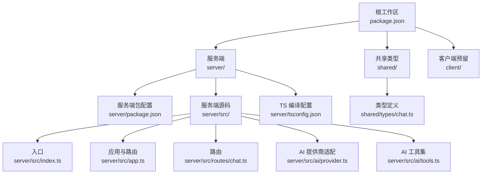
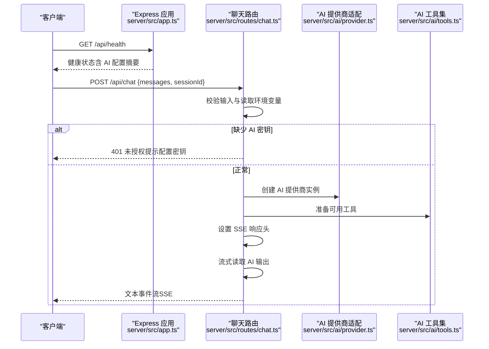
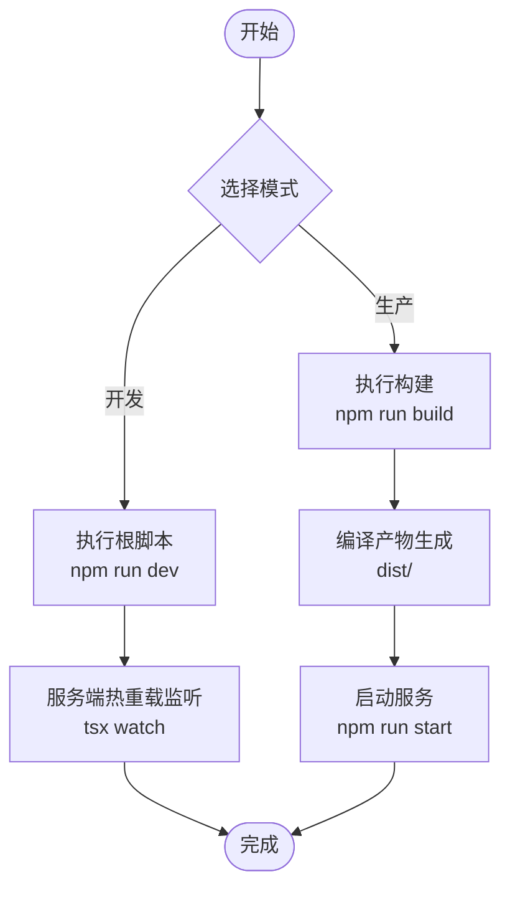
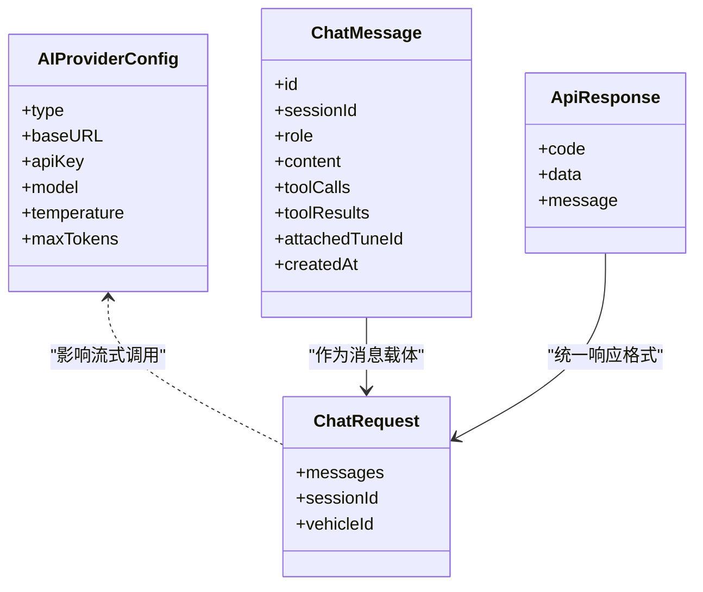
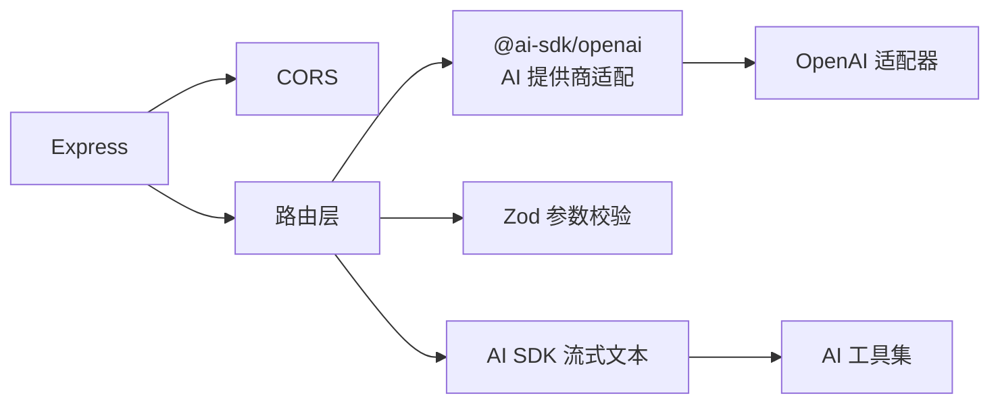

# 快速开始

<cite>
**本文引用的文件**
- [根包配置](file://package.json)
- [服务端包配置](file://server/package.json)
- [共享类型包配置](file://shared/package.json)
- [服务端入口](file://server/src/index.ts)
- [应用与路由](file://server/src/app.ts)
- [聊天路由](file://server/src/routes/chat.ts)
- [AI 提供商适配器](file://server/src/ai/provider.ts)
- [AI 工具集](file://server/src/ai/tools.ts)
- [聊天类型定义](file://shared/types/chat.ts)
- [TS 编译配置（服务端）](file://server/tsconfig.json)
</cite>

## 目录
1. [简介](#简介)
2. [项目结构](#项目结构)
3. [核心组件](#核心组件)
4. [架构总览](#架构总览)
5. [详细组件分析](#详细组件分析)
6. [依赖分析](#依赖分析)
7. [性能考虑](#性能考虑)
8. [故障排查指南](#故障排查指南)
9. [结论](#结论)
10. [附录](#附录)

## 简介
本指南面向首次接触 FH6 汽车设置工具的开发者，帮助你在本地快速搭建并运行后端服务，完成 AI 服务提供商密钥配置、本地开发服务器启动、基础 API 测试以及常见初始化问题排查。该工具采用多工作区（workspaces）组织，包含共享类型、服务端（Express + AI 流式对话）等模块。

## 项目结构
项目采用根级工作区管理，核心目录与职责如下：
- 根目录：统一脚本与工作区声明，支持并发启动前后端、统一构建
- server：后端服务，基于 Express，提供健康检查与聊天流式接口，集成 AI SDK
- shared：共享类型定义，统一前后端数据契约
- client：工作区声明存在但当前未提供具体实现（不影响后端启动）

**图表来源**
- [根包配置:1-23](file://package.json#L1-L23)
- [服务端包配置:1-26](file://server/package.json#L1-L26)
- [共享类型包配置:1-8](file://shared/package.json#L1-L8)
- [服务端入口:1-11](file://server/src/index.ts#L1-L11)
- [应用与路由:1-40](file://server/src/app.ts#L1-L40)
- [聊天路由:1-74](file://server/src/routes/chat.ts#L1-L74)
- [AI 提供商适配器:1-15](file://server/src/ai/provider.ts#L1-L15)
- [AI 工具集:1-59](file://server/src/ai/tools.ts#L1-L59)
- [聊天类型定义:1-75](file://shared/types/chat.ts#L1-L75)
- [TS 编译配置（服务端）:1-23](file://server/tsconfig.json#L1-L23)

**章节来源**
- [根包配置:1-23](file://package.json#L1-L23)
- [服务端包配置:1-26](file://server/package.json#L1-L26)
- [共享类型包配置:1-8](file://shared/package.json#L1-L8)

## 核心组件
- 后端服务（Express）
  - 提供健康检查接口与聊天流式接口
  - 支持跨域访问（本地前端地址）
  - 统一错误处理中间件
- AI 集成
  - 使用 AI SDK 的流式文本能力
  - 通过环境变量配置 AI 提供商端点、模型与密钥
  - 内置工具：生成调校方案、保存调校方案、对比调校方案
- 共享类型
  - 定义 AI 提供商类型、默认配置、消息角色、会话与请求响应格式

**章节来源**
- [应用与路由:1-40](file://server/src/app.ts#L1-L40)
- [聊天路由:1-74](file://server/src/routes/chat.ts#L1-L74)
- [AI 提供商适配器:1-15](file://server/src/ai/provider.ts#L1-L15)
- [AI 工具集:1-59](file://server/src/ai/tools.ts#L1-L59)
- [聊天类型定义:1-75](file://shared/types/chat.ts#L1-L75)

## 架构总览
下图展示了从客户端发起聊天请求到后端流式返回的关键交互路径，以及 AI 提供商适配层的作用。

**图表来源**
- [应用与路由:14-29](file://server/src/app.ts#L14-L29)
- [聊天路由:9-73](file://server/src/routes/chat.ts#L9-L73)
- [AI 提供商适配器:9-15](file://server/src/ai/provider.ts#L9-L15)
- [AI 工具集:5-59](file://server/src/ai/tools.ts#L5-L59)

## 详细组件分析

### 环境与依赖准备
- Node.js 版本与运行时
  - 服务端使用 ES2022 目标与 CommonJS 模块，建议使用较新 LTS 或稳定版 Node.js（例如 18.x/20.x/22.x）以获得最佳兼容性
- 全局依赖
  - concurrently：用于同时启动多个工作区进程（根脚本已内置）
- 项目依赖
  - 服务端依赖：Express、CORS、dotenv、AI SDK、Zod、@ai-sdk/openai 等
  - 开发依赖：tsx（热重载）、TypeScript、相关类型声明
- 工作区构建
  - 根脚本提供统一构建命令，可一次性构建 shared、server、client（client 当前为空）

**章节来源**
- [根包配置:11-18](file://package.json#L11-L18)
- [服务端包配置:5-24](file://server/package.json#L5-L24)
- [TS 编译配置（服务端）:2-18](file://server/tsconfig.json#L2-L18)

### 环境变量配置（重点）
- 必需项
  - AI_API_KEY：AI 提供商密钥（未配置时聊天接口返回 401）
- 可选项
  - PORT：服务端口，默认 3001
  - AI_MODEL：模型名称，默认 deepseek-chat
  - AI_BASE_URL：AI 端点，默认 DeepSeek V1
- 配置位置
  - 通过 dotenv 自动加载（入口文件已导入 dotenv 配置）

**章节来源**
- [服务端入口:1-10](file://server/src/index.ts#L1-L10)
- [应用与路由:15-26](file://server/src/app.ts#L15-L26)
- [聊天路由:17-24](file://server/src/routes/chat.ts#L17-L24)

### 本地开发服务器启动
- 开发模式
  - 根脚本：npm run dev（同时启动 server 与 client 工作区）
  - 服务端独立开发：npm run dev:server（tsx watch 监听热重载）
- 生产模式
  - 先构建：npm run build（构建 shared、server、client）
  - 启动：服务端脚本 npm run start（运行 dist/index.js）

**图表来源**
- [根包配置:11-18](file://package.json#L11-L18)
- [服务端包配置:5-8](file://server/package.json#L5-L8)

**章节来源**
- [根包配置:11-18](file://package.json#L11-L18)
- [服务端包配置:5-8](file://server/package.json#L5-L8)

### 基础 API 测试
- 健康检查
  - 地址：GET /api/health
  - 作用：确认服务运行、查看当前 AI 配置摘要（模型、端点、是否具备密钥）
- 聊天接口（流式）
  - 地址：POST /api/chat
  - 请求体字段：messages（数组，至少一条）、sessionId（可选）
  - 响应：SSE 文本事件流；若尚未发送响应头且发生错误，将以 JSON 返回错误
- 测试方式
  - curl：使用 -N（保持连接）与 --no-buffer（禁用缓冲）以接收 SSE
  - Postman：选择 POST，Body 选择 raw JSON，勾选“保持连接”或使用支持 SSE 的客户端

**章节来源**
- [应用与路由:14-29](file://server/src/app.ts#L14-L29)
- [聊天路由:9-73](file://server/src/routes/chat.ts#L9-L73)

### 数据模型与类型
以下为与聊天与 AI 配置相关的核心类型关系：

**图表来源**
- [聊天类型定义:4-74](file://shared/types/chat.ts#L4-L74)

**章节来源**
- [聊天类型定义:1-75](file://shared/types/chat.ts#L1-L75)

## 依赖分析
- 外部依赖
  - @ai-sdk/openai：AI 提供商适配与模型调用
  - ai：流式文本生成与工具集成
  - express：Web 服务框架
  - cors：跨域中间件
  - dotenv：环境变量加载
  - zod：参数校验
- 内部依赖
  - 路由依赖 AI 提供商适配器与工具集
  - 应用层依赖路由与错误处理中间件
  - 类型层为前后端共享契约

**图表来源**
- [服务端包配置:10-16](file://server/package.json#L10-L16)
- [AI 提供商适配器:1-15](file://server/src/ai/provider.ts#L1-L15)
- [AI 工具集:1-59](file://server/src/ai/tools.ts#L1-L59)
- [聊天路由:1-5](file://server/src/routes/chat.ts#L1-L5)

**章节来源**
- [服务端包配置:10-16](file://server/package.json#L10-L16)

## 性能考虑
- 流式响应（SSE）
  - 使用流式传输减少首字节延迟，适合长文本生成
  - 注意客户端正确处理事件分片与断连重试
- 并发与资源
  - 开发阶段使用热重载，生产阶段确保单实例部署
  - 控制工具调用步数与消息长度，避免过长上下文导致超时
- 环境变量与缓存
  - 将敏感配置置于环境变量，避免硬编码
  - 如需缓存，可在网关或应用层增加轻量缓存策略（不在当前代码中）

## 故障排查指南
- 启动后无法访问 /api/health
  - 检查服务端口（默认 3001），确认未被占用
  - 查看控制台日志是否打印健康检查信息
- 聊天接口返回 401
  - 未配置 AI_API_KEY，按提示在 .env 中添加密钥
- 聊天接口返回 400
  - messages 字段缺失或非数组，确保请求体包含合法 messages 数组
- SSE 无输出或连接中断
  - 使用支持 SSE 的客户端或 curl 的相应选项
  - 检查网络代理与防火墙对长连接的限制
- 端点或模型不匹配
  - 检查 AI_BASE_URL 与 AI_MODEL 是否与所选提供商一致
- 构建失败
  - 清理 node_modules 并重新安装依赖
  - 确认 TypeScript 与 tsconfig 配置符合当前 Node.js 版本

**章节来源**
- [服务端入口:4-9](file://server/src/index.ts#L4-L9)
- [应用与路由:15-26](file://server/src/app.ts#L15-L26)
- [聊天路由:12-24](file://server/src/routes/chat.ts#L12-L24)

## 结论
通过本快速开始指南，你可以在本地完成环境准备、依赖安装、AI 密钥配置与开发服务器启动，并使用健康检查与聊天接口进行基础验证。建议在开发过程中持续关注 SSE 客户端兼容性与环境变量安全存储，逐步完善生产部署与监控策略。

## 附录

### 环境要求与安装步骤
- 环境要求
  - Node.js：建议使用 LTS 或稳定版本（与 ES2022/TS 兼容）
  - 包管理器：npm（支持工作区）
- 安装步骤
  - 安装根依赖：在仓库根目录执行安装（自动处理 workspaces）
  - 安装服务端依赖：进入 server 目录执行安装
  - 安装共享类型依赖：进入 shared 目录执行安装
- 构建与启动
  - 开发：根脚本 npm run dev 或单独运行 npm run dev:server
  - 生产：先 npm run build，再 npm run start

**章节来源**
- [根包配置:6-18](file://package.json#L6-L18)
- [服务端包配置:5-8](file://server/package.json#L5-L8)