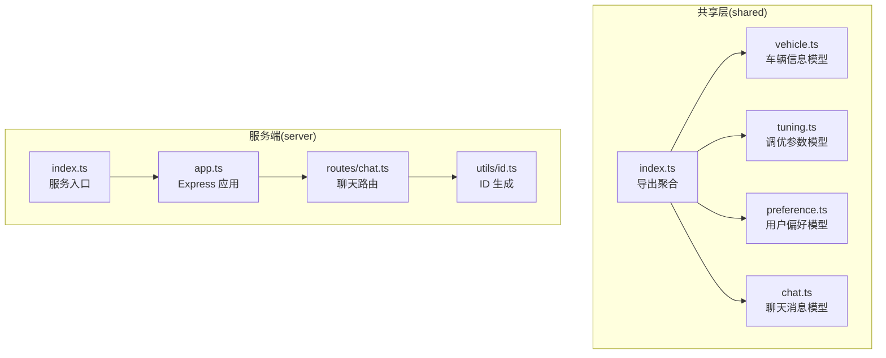
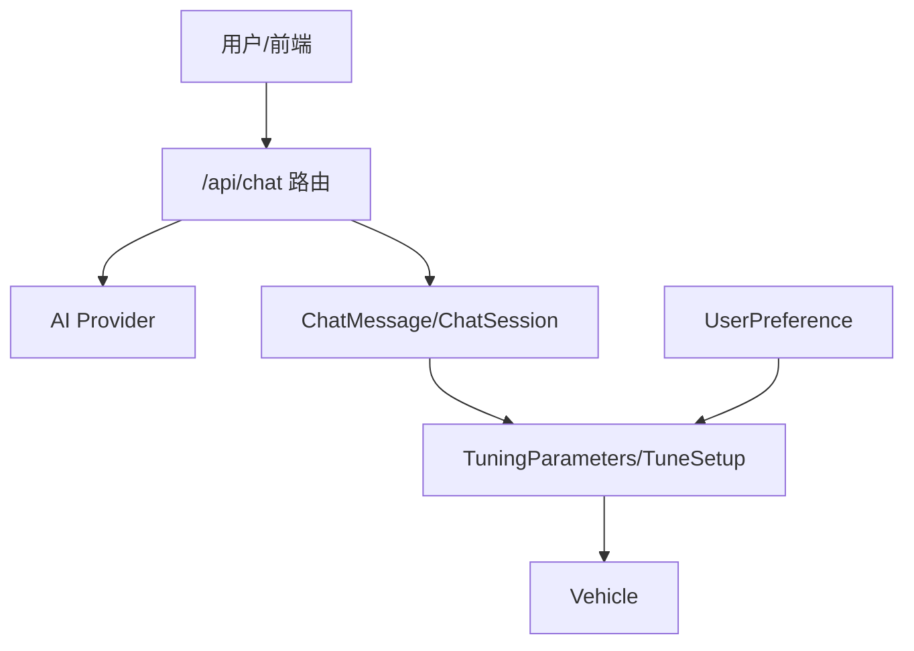
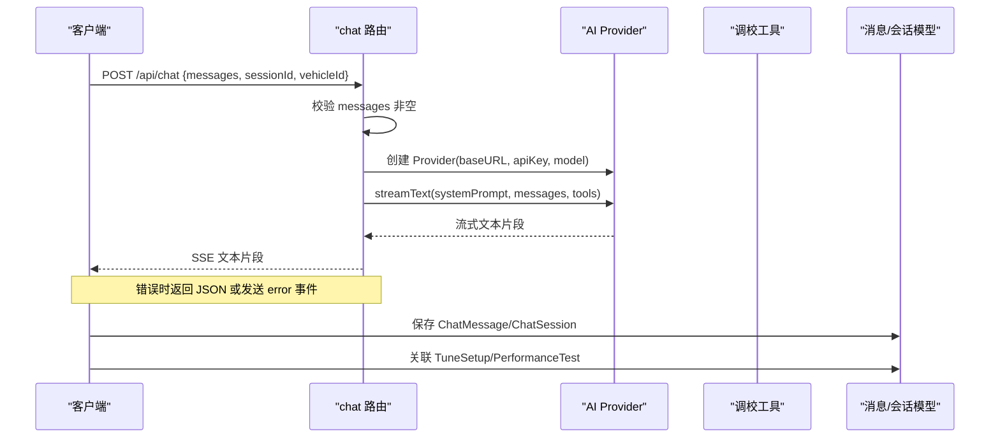
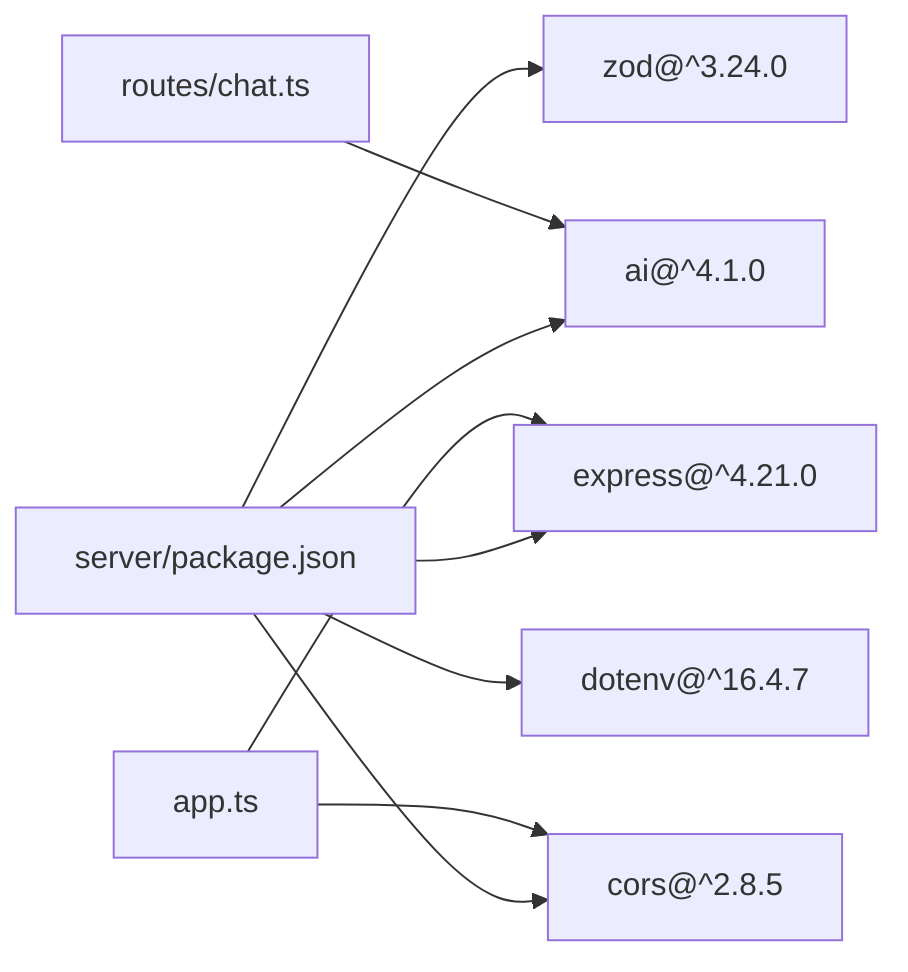

# 数据模型

<cite>
**本文引用的文件**
- [shared/types/vehicle.ts](file://shared/types/vehicle.ts)
- [shared/types/tuning.ts](file://shared/types/tuning.ts)
- [shared/types/preference.ts](file://shared/types/preference.ts)
- [shared/types/chat.ts](file://shared/types/chat.ts)
- [shared/types/index.ts](file://shared/types/index.ts)
- [server/src/routes/chat.ts](file://server/src/routes/chat.ts)
- [server/src/app.ts](file://server/src/app.ts)
- [server/src/utils/id.ts](file://server/src/utils/id.ts)
- [server/src/index.ts](file://server/src/index.ts)
- [server/package.json](file://server/package.json)
- [package.json](file://package.json)
</cite>

## 目录
1. [简介](#简介)
2. [项目结构](#项目结构)
3. [核心数据实体](#核心数据实体)
4. [架构总览](#架构总览)
5. [详细组件分析](#详细组件分析)
6. [依赖关系分析](#依赖关系分析)
7. [性能与一致性考虑](#性能与一致性考虑)
8. [故障排查指南](#故障排查指南)
9. [结论](#结论)
10. [附录：验证策略与演进管理](#附录验证策略与演进管理)

## 简介
本文件系统性梳理 FH6 汽车设置工具的数据模型设计，覆盖以下核心实体：
- Vehicle 车辆信息模型：描述车辆品牌、型号、年份、驱动形式、引擎布局、进气方式、性能评分与等级等基础属性。
- TuningParameters 调优参数模型：涵盖轮胎、定位、弹簧、阻尼、防倾杆、空气动力学、制动、差速器、变速箱等完整调校参数集，以及调校方案、修订记录与性能测试结果。
- UserPreference 用户偏好模型：描述默认驾驶风格、偏好用途类型、调校倾向、历史统计等。
- ChatMessage 聊天消息模型：支持多角色对话、工具调用与结果、附加调校方案等。

文档同时解释字段定义、数据类型、验证规则与业务约束，并给出实体关系图与外键约束说明；结合现有代码中的 Zod 使用现状，提出验证策略建议；最后提供典型数据流转场景与演进策略。

## 项目结构
共享类型位于 shared/types 下，按功能模块拆分；服务端位于 server/，通过 Express 提供 API，当前未直接在服务端实现 Zod 校验，但依赖 zod 包。



图表来源
- [shared/types/index.ts:1-5](file://shared/types/index.ts#L1-L5)
- [shared/types/vehicle.ts:1-30](file://shared/types/vehicle.ts#L1-L30)
- [shared/types/tuning.ts:1-126](file://shared/types/tuning.ts#L1-L126)
- [shared/types/preference.ts:1-60](file://shared/types/preference.ts#L1-L60)
- [shared/types/chat.ts:1-75](file://shared/types/chat.ts#L1-L75)
- [server/src/app.ts:1-40](file://server/src/app.ts#L1-L40)
- [server/src/routes/chat.ts:1-74](file://server/src/routes/chat.ts#L1-L74)
- [server/src/utils/id.ts:1-6](file://server/src/utils/id.ts#L1-L6)
- [server/src/index.ts:1-11](file://server/src/index.ts#L1-L11)

章节来源
- [shared/types/index.ts:1-5](file://shared/types/index.ts#L1-L5)
- [package.json:6-10](file://package.json#L6-L10)
- [server/package.json:10-16](file://server/package.json#L10-L16)

## 核心数据实体
本节对四大核心实体进行字段定义、数据类型、验证规则与业务约束的说明。

### Vehicle 车辆信息模型
- 字段与类型
  - id: string（唯一标识）
  - brand: string（品牌）
  - model: string（型号）
  - year: number（年份）
  - drivetrain: Drivetrain（驱动形式：FWD/RWD/AWD）
  - engineLayout: EngineLayout（引擎布局：前置/中置/后置）
  - aspiration: Aspiration（进气方式：自然吸气/涡轮增压/机械增压/双涡轮增压）
  - piScore: number（性能指数评分）
  - carClass: CarClass（车辆等级：D/C/B/A/S1/S2/X）
  - createdAt/updatedAt: string（ISO 时间戳字符串）
- 验证与约束
  - 枚举值限定：drivetrain/engineLayout/aspiration/carClass 均为受控枚举集合。
  - 年份与评分：year 为数值型；piScore 为数值型，建议在业务层限制合理范围。
  - 时间字段：createdAt/updatedAt 采用字符串表示，建议统一为 ISO 8601 格式。
- 业务意义
  - 描述车辆基础属性，作为调校方案与性能测试的载体。

章节来源
- [shared/types/vehicle.ts:1-30](file://shared/types/vehicle.ts#L1-L30)

### TuningParameters 调优参数模型
- 参数分组与字段
  - 轮胎参数：前/后轮胎气压（PSI），范围 16-40。
  - 定位参数：前后外倾角（-5~+5）、前后束角（-0.5~+0.5）、主销后倾角（0~7）。
  - 弹簧参数：前后弹簧刚度与前后车身高度。
  - 阻尼参数：前后回弹/压缩阻尼（1-20）。
  - 防倾杆参数：前后防倾杆（1-65）。
  - 空气动力学参数：前后下压力（可空）。
  - 制动参数：制动力百分比（50-150）、前部制动力分配百分比（0-100）。
  - 差速器参数：前后加速/减速（0-100），中央差速器仅 AWD（0-100），可空。
  - 变速箱参数：终传比与各挡齿比数组。
- 调校方案（TuneSetup）
  - 关联 vehicleId，usageType（UsageType），isAiGenerated，tags，ratings（操控/加速/极速/制动/稳定，0-10）。
  - createdAt/updatedAt。
- 修订记录（TuneRevision）
  - 关联 tuneId，revisionNumber，changedFields（字段变更明细），changeReason。
- 性能测试（PerformanceTest）
  - 关联 tuneId，lapTime（圈速秒）、trackName（赛道名）、zeroToHundred（0-100km/h 秒）、topSpeed（最高时速 km/h）、brakingDistance（制动距离 m）、notes、testedAt。
- 验证与约束
  - 数值范围严格限定于注释范围，超出范围需拒绝或转换。
  - 可空字段明确标注（如 AeroParams、DifferentialParams 的部分字段）。
  - ratings 与 usageType 为受控枚举与集合。
- 业务意义
  - 提供完整的调校参数集与评估体系，支撑 AI 辅助调校与性能对比。

章节来源
- [shared/types/tuning.ts:1-126](file://shared/types/tuning.ts#L1-L126)

### UserPreference 用户偏好模型
- 字段与类型
  - defaultDrivingStyle: DrivingStyle（激进/平衡/保守）
  - preferredUsageTypes: UsageType[]（偏好用途类型集合）
  - tuningStyleTendencies: 结构化倾向（悬挂刚度/差速器锁/下压力/刹车偏向）
  - commonProblemPatterns: string[]（常见问题模式）
  - tuneHistoryStats: 历史统计（总数、按用途类型计数、平均评分）
- 默认值
  - 提供 DEFAULT_USER_PREFERENCE，包含默认驾驶风格、偏好用途、倾向与统计初始化。
- 验证与约束
  - 枚举与集合受控；倾向与统计字段建议在写入时做边界检查与归一化。
- 业务意义
  - 为 AI 推荐调校方案提供个性化依据。

章节来源
- [shared/types/preference.ts:1-60](file://shared/types/preference.ts#L1-L60)

### ChatMessage 聊天消息模型
- 角色与配置
  - MessageRole: user/assistant/system/tool
  - AIProviderConfig: provider 类型、baseURL、apiKey、model、temperature、maxTokens
  - 默认 AI 配置 DEFAULT_AI_CONFIG。
- 消息与会话
  - ChatMessage: sessionId、role、content、toolCalls、toolResults、attachedTuneId、createdAt。
  - ChatSession: id、title、vehicleId、messages、createdAt/updatedAt。
- API 请求/响应
  - ApiResponse<T>: code、data、message。
  - ChatRequest: messages（role/content）、sessionId、vehicleId。
- 验证与约束
  - messages 必填且非空数组；AI API Key 必填；SSE 流式响应。
- 业务意义
  - 支持与 AI Provider 的流式交互，承载工具调用与调校方案关联。

章节来源
- [shared/types/chat.ts:1-75](file://shared/types/chat.ts#L1-L75)
- [server/src/routes/chat.ts:9-24](file://server/src/routes/chat.ts#L9-L24)

## 架构总览
FH6 数据模型通过共享类型在客户端与服务端复用，服务端通过 Express 提供聊天接口，当前未直接使用 Zod 校验，但依赖 zod 包。整体数据流围绕 Vehicle/Tuning/UserPreference/ChatMessage 四大实体展开。



图表来源
- [server/src/routes/chat.ts:9-38](file://server/src/routes/chat.ts#L9-L38)
- [shared/types/chat.ts:41-75](file://shared/types/chat.ts#L41-L75)
- [shared/types/tuning.ts:68-102](file://shared/types/tuning.ts#L68-L102)
- [shared/types/vehicle.ts:17-29](file://shared/types/vehicle.ts#L17-L29)
- [shared/types/preference.ts:7-28](file://shared/types/preference.ts#L7-L28)

## 详细组件分析

### Vehicle 实体类图
```mermaid
classDiagram
class Vehicle {
+string id
+string brand
+string model
+number year
+Drivetrain drivetrain
+EngineLayout engineLayout
+Aspiration aspiration
+number piScore
+CarClass carClass
+string createdAt
+string updatedAt
}
class Drivetrain {
<<enum>>
"FWD"
"RWD"
"AWD"
}
class EngineLayout {
<<enum>>
"前置"
"中置"
"后置"
}
class Aspiration {
<<enum>>
"自然吸气"
"涡轮增压"
"机械增压"
"双涡轮增压"
}
class CarClass {
<<enum>>
"D"
"C"
"B"
"A"
"S1"
"S2"
"X"
}
Vehicle --> Drivetrain : "使用"
Vehicle --> EngineLayout : "使用"
Vehicle --> Aspiration : "使用"
Vehicle --> CarClass : "使用"
```

图表来源
- [shared/types/vehicle.ts:1-30](file://shared/types/vehicle.ts#L1-L30)

章节来源
- [shared/types/vehicle.ts:1-30](file://shared/types/vehicle.ts#L1-L30)

### TuningParameters 实体类图
```mermaid
classDiagram
class TireParams {
+number frontPressure
+number rearPressure
}
class AlignmentParams {
+number frontCamber
+number rearCamber
+number frontToe
+number rearToe
+number caster
}
class SpringParams {
+number frontRate
+number rearRate
+number frontHeight
+number rearHeight
}
class DampingParams {
+number frontRebound
+number rearRebound
+number frontBump
+number rearBump
}
class AntirollBarParams {
+number front
+number rear
}
class AeroParams {
+number|null frontDownforce
+number|null rearDownforce
}
class BrakeParams {
+number brakeForce
+number brakeBalance
}
class DifferentialParams {
+number|null frontAccel
+number|null frontDecel
+number rearAccel
+number rearDecel
+number|null center
}
class GearingParams {
+number finalDrive
+number[]|undefined gears
}
class TuningParameters {
+TireParams tires
+AlignmentParams alignment
+SpringParams springs
+DampingParams damping
+AntirollBarParams antirollBars
+AeroParams aero
+BrakeParams brakes
+DifferentialParams differential
+GearingParams gearing
}
class TuneRatings {
+number handling
+number acceleration
+number topSpeed
+number braking
+number stability
}
class TuneSetup {
+string id
+string vehicleId
+string name
+UsageType usageType
+string description
+boolean isAiGenerated
+TuningParameters parameters
+string[] tags
+TuneRatings ratings
+string createdAt
+string updatedAt
}
class TuneRevision {
+string id
+string tuneId
+number revisionNumber
+Record changedFields
+string changeReason
+string createdAt
}
class PerformanceTest {
+string id
+string tuneId
+number|null lapTime
+string|null trackName
+number|null zeroToHundred
+number|null topSpeed
+number|null brakingDistance
+string notes
+string testedAt
}
TuningParameters --> TireParams
TuningParameters --> AlignmentParams
TuningParameters --> SpringParams
TuningParameters --> DampingParams
TuningParameters --> AntirollBarParams
TuningParameters --> AeroParams
TuningParameters --> BrakeParams
TuningParameters --> DifferentialParams
TuningParameters --> GearingParams
TuneSetup --> TuningParameters
TuneSetup --> TuneRatings
TuneSetup --> Vehicle : "外键 : vehicleId"
TuneRevision --> TuneSetup : "外键 : tuneId"
PerformanceTest --> TuneSetup : "外键 : tuneId"
```

图表来源
- [shared/types/tuning.ts:1-126](file://shared/types/tuning.ts#L1-L126)
- [shared/types/vehicle.ts:17-29](file://shared/types/vehicle.ts#L17-L29)

章节来源
- [shared/types/tuning.ts:1-126](file://shared/types/tuning.ts#L1-L126)

### UserPreference 实体类图
```mermaid
classDiagram
class DrivingStyle {
<<enum>>
"激进"
"平衡"
"保守"
}
class UserPreference {
+DrivingStyle defaultDrivingStyle
+UsageType[] preferredUsageTypes
+tuningStyleTendencies
+string[] commonProblemPatterns
+tuneHistoryStats
}
class DEFAULT_USER_PREFERENCE {
+DrivingStyle defaultDrivingStyle
+UsageType[] preferredUsageTypes
+tuningStyleTendencies
+string[] commonProblemPatterns
+tuneHistoryStats
}
UserPreference --> DrivingStyle : "使用"
DEFAULT_USER_PREFERENCE --> DrivingStyle : "使用"
```

图表来源
- [shared/types/preference.ts:1-60](file://shared/types/preference.ts#L1-L60)

章节来源
- [shared/types/preference.ts:1-60](file://shared/types/preference.ts#L1-L60)

### ChatMessage 实体类图
```mermaid
classDiagram
class AIProviderType {
<<enum>>
"deepseek"
"openai"
"ollama"
"custom"
}
class AIProviderConfig {
+AIProviderType type
+string baseURL
+string apiKey
+string model
+number temperature
+number maxTokens
}
class MessageRole {
<<enum>>
"user"
"assistant"
"system"
"tool"
}
class ToolCall {
+string id
+string name
+Record args
}
class ToolResult {
+string toolCallId
+unknown result
}
class ChatMessage {
+string id
+string sessionId
+MessageRole role
+string content
+ToolCall[]|undefined toolCalls
+ToolResult[]|undefined toolResults
+string|undefined attachedTuneId
+string createdAt
}
class ChatSession {
+string id
+string title
+string|undefined vehicleId
+ChatMessage[] messages
+string createdAt
+string updatedAt
}
class ApiResponse {
+number code
+unknown data
+string message
}
class ChatRequest {
+{role,content}[] messages
+string|undefined sessionId
+string|undefined vehicleId
}
class DEFAULT_AI_CONFIG {
+AIProviderType type
+string baseURL
+string apiKey
+string model
+number temperature
+number maxTokens
}
ChatMessage --> MessageRole : "使用"
ChatSession --> ChatMessage : "包含"
ChatRequest --> MessageRole : "使用"
DEFAULT_AI_CONFIG --> AIProviderType : "使用"
AIProviderConfig --> AIProviderType : "使用"
```

图表来源
- [shared/types/chat.ts:1-75](file://shared/types/chat.ts#L1-L75)

章节来源
- [shared/types/chat.ts:1-75](file://shared/types/chat.ts#L1-L75)

### 典型数据流转序列图（聊天与调校）


图表来源
- [server/src/routes/chat.ts:9-73](file://server/src/routes/chat.ts#L9-L73)
- [shared/types/chat.ts:41-75](file://shared/types/chat.ts#L41-L75)
- [shared/types/tuning.ts:68-102](file://shared/types/tuning.ts#L68-L102)

章节来源
- [server/src/routes/chat.ts:9-73](file://server/src/routes/chat.ts#L9-L73)

### 外键与关系说明
- 外键约束
  - TuneSetup.vehicleId → Vehicle.id
  - TuneRevision.tuneId → TuneSetup.id
  - PerformanceTest.tuneId → TuneSetup.id
  - ChatSession.vehicleId → Vehicle.id
  - ChatMessage.sessionId → ChatSession.id
  - ChatMessage.attachedTuneId → TuneSetup.id
- 关系图
```mermaid
erDiagram
VEHICLE {
string id PK
string brand
string model
number year
string drivetrain
string engineLayout
string aspiration
number piScore
string carClass
string createdAt
string updatedAt
}
TUNE_SETUP {
string id PK
string vehicleId FK
string name
string usageType
string description
boolean isAiGenerated
string createdAt
string updatedAt
}
TUNE_REVISION {
string id PK
string tuneId FK
number revisionNumber
string changeReason
string createdAt
}
PERFORMANCE_TEST {
string id PK
string tuneId FK
number|null lapTime
string|null trackName
number|null zeroToHundred
number|null topSpeed
number|null brakingDistance
string notes
string testedAt
}
CHAT_SESSION {
string id PK
string title
string|undefined vehicleId FK
string createdAt
string updatedAt
}
CHAT_MESSAGE {
string id PK
string sessionId FK
string role
string content
string|undefined attachedTuneId FK
string createdAt
}
VEHICLE ||--o{ TUNE_SETUP : "拥有"
TUNE_SETUP ||--o{ TUNE_REVISION : "修订"
TUNE_SETUP ||--o{ PERFORMANCE_TEST : "测试"
VEHICLE ||--o{ CHAT_SESSION : "关联"
CHAT_SESSION ||--o{ CHAT_MESSAGE : "包含"
TUNE_SETUP ||--o{ CHAT_MESSAGE : "关联"
```

图表来源
- [shared/types/vehicle.ts:17-29](file://shared/types/vehicle.ts#L17-L29)
- [shared/types/tuning.ts:68-126](file://shared/types/tuning.ts#L68-L126)
- [shared/types/chat.ts:41-60](file://shared/types/chat.ts#L41-L60)

章节来源
- [shared/types/vehicle.ts:17-29](file://shared/types/vehicle.ts#L17-L29)
- [shared/types/tuning.ts:68-126](file://shared/types/tuning.ts#L68-L126)
- [shared/types/chat.ts:41-60](file://shared/types/chat.ts#L41-L60)

## 依赖关系分析
- 依赖现状
  - 服务端依赖 zod（用于类型与校验），但当前聊天路由未显式使用 Zod 进行请求体校验。
  - 共享类型通过 index.ts 聚合导出，便于跨工作区复用。
- 潜在耦合
  - 聊天路由依赖环境变量（AI API Key、BaseURL、Model），若缺失将导致流式响应失败。
  - ID 生成依赖 crypto.randomUUID，确保全局唯一性。
- 外部集成
  - AI Provider 通过 createProvider 初始化，streamText 驱动流式输出。



图表来源
- [server/package.json:10-16](file://server/package.json#L10-L16)
- [server/src/routes/chat.ts:1-74](file://server/src/routes/chat.ts#L1-L74)
- [server/src/app.ts:1-40](file://server/src/app.ts#L1-L40)

章节来源
- [server/package.json:10-16](file://server/package.json#L10-L16)
- [server/src/routes/chat.ts:1-74](file://server/src/routes/chat.ts#L1-L74)
- [server/src/app.ts:1-40](file://server/src/app.ts#L1-L40)

## 性能与一致性考虑
- 性能
  - 流式响应（SSE）降低首字节延迟，适合长文本生成；建议控制 maxSteps 与 maxTokens，避免过长响应。
  - 工具调用（tools）可能触发外部查询，建议在服务端缓存常用数据或限制调用频率。
- 一致性
  - 时间字段统一为 ISO 字符串，建议在入库前转换为 Date 以提升排序与计算效率。
  - 调校参数范围严格，建议在写入前进行裁剪或报错，避免脏数据进入数据库。
  - ID 生成使用 UUID，保证分布式环境下唯一性。

[本节为通用指导，无需特定文件来源]

## 故障排查指南
- 常见问题
  - AI API Key 未配置：路由会在请求阶段返回 401，并提示在 .env 中设置。
  - messages 缺失或为空：返回 400，提示 messages 不能为空。
  - 流式响应异常：捕获错误后返回 JSON 或发送 SSE error 事件。
- 排查步骤
  - 检查 .env 是否包含 AI_API_KEY、AI_BASE_URL、AI_MODEL。
  - 确认请求体结构符合 ChatRequest。
  - 查看服务端日志中的错误堆栈与消息。
- 相关实现参考
  - 路由错误处理与 SSE 写入逻辑。
  - 健康检查接口返回 AI 配置状态。

章节来源
- [server/src/routes/chat.ts:17-24](file://server/src/routes/chat.ts#L17-L24)
- [server/src/routes/chat.ts:60-72](file://server/src/routes/chat.ts#L60-L72)
- [server/src/app.ts:14-26](file://server/src/app.ts#L14-L26)

## 结论
FH6 数据模型以共享类型为核心，清晰划分了车辆、调校、偏好与聊天四类实体，具备良好的扩展性与可维护性。当前服务端未直接使用 Zod 校验，但具备引入空间；建议在关键输入点（如聊天请求体、调校参数写入）增加 Zod Schema 校验，以提升健壮性与一致性。通过外键关系与流式数据处理，系统能够支撑 AI 辅助调校与性能评测的完整闭环。

[本节为总结，无需特定文件来源]

## 附录：验证策略与演进管理

### 当前验证现状与建议
- 现状
  - 服务端依赖 zod，但聊天路由未显式使用 Zod Schema 校验请求体。
- 建议
  - 在路由层引入 Zod Schema 对 ChatRequest 进行编译期与运行期双重校验。
  - 对 TuningParameters 的数值范围进行显式校验，必要时在入库前进行裁剪或拒绝。
  - 对时间字段统一转换为 Date，便于后续索引与查询优化。

章节来源
- [server/package.json](file://server/package.json#L16)
- [server/src/routes/chat.ts:9-15](file://server/src/routes/chat.ts#L9-L15)
- [shared/types/tuning.ts:4-65](file://shared/types/tuning.ts#L4-L65)

### 版本管理与演进策略
- 版本号
  - 项目版本为 1.0.0，建议遵循语义化版本控制（SemVer）。
- 演进策略
  - 新增字段采用可选或默认值，保持向后兼容。
  - 删除字段先标记弃用，保留过渡期再移除。
  - 调整枚举值需同步迁移存量数据与工具链。
  - 对外暴露的 API 通过路径版本号（/v1/...）隔离破坏性变更。
- 工作区管理
  - 使用 workspaces 管理 client/server/shared，构建脚本统一协调。

章节来源
- [package.json:3-4](file://package.json#L3-L4)
- [package.json:11-17](file://package.json#L11-L17)