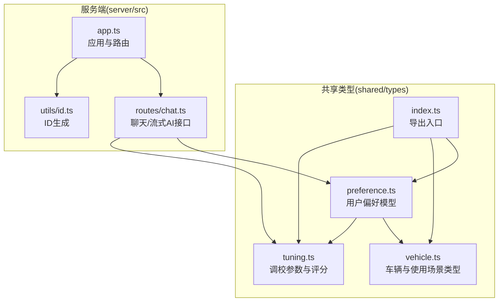
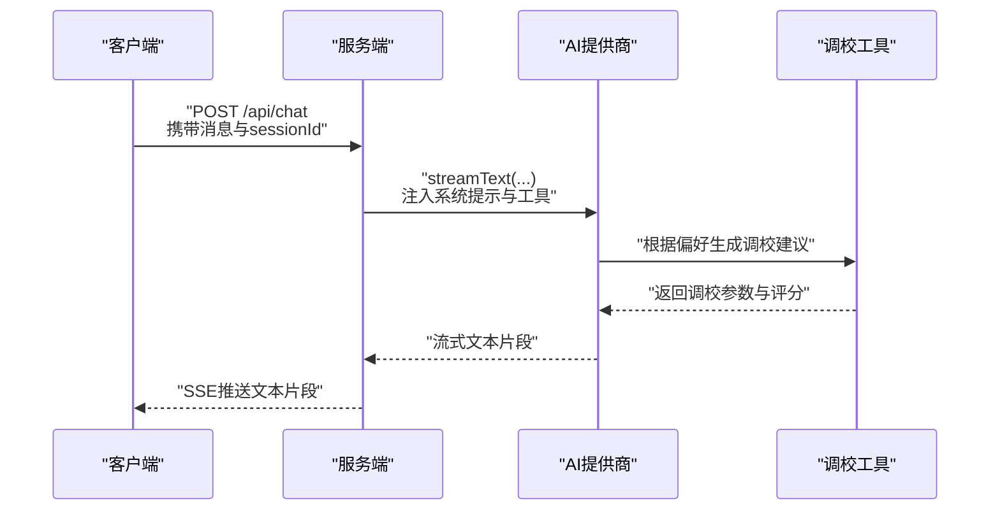
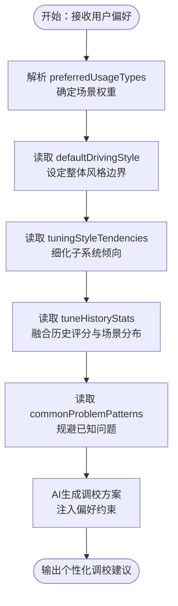
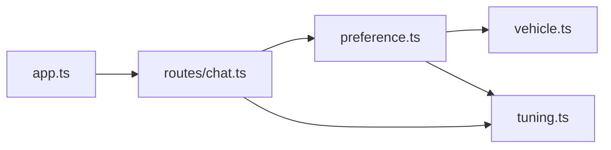

# 用户偏好模型

<cite>
**本文引用的文件**
- [preference.ts](file://shared/types/preference.ts)
- [vehicle.ts](file://shared/types/vehicle.ts)
- [index.ts](file://shared/types/index.ts)
- [tuning.ts](file://shared/types/tuning.ts)
- [chat.ts](file://server/src/routes/chat.ts)
- [app.ts](file://server/src/app.ts)
- [id.ts](file://server/src/utils/id.ts)
</cite>

## 目录
1. [简介](#简介)
2. [项目结构](#项目结构)
3. [核心组件](#核心组件)
4. [架构总览](#架构总览)
5. [详细组件分析](#详细组件分析)
6. [依赖分析](#依赖分析)
7. [性能考虑](#性能考虑)
8. [故障排查指南](#故障排查指南)
9. [结论](#结论)
10. [附录](#附录)

## 简介
本文件围绕用户偏好模型 UserPreference 展开，系统性阐述其数据结构、字段语义、取值范围与权重含义，并结合调校参数与使用场景，解释偏好如何驱动 AI 调优建议的个性化程度。同时给出偏好数据的存储与检索策略建议，帮助开发者在前后端实现中正确落地该模型。

## 项目结构
本项目采用前后端分离架构，共享类型定义位于 shared/types 下，服务端位于 server/src，客户端位于 client/（本仓库未包含前端源码，但存在 store 与 API 客户端文件）。用户偏好模型属于共享类型，供服务端与客户端共同使用。

图表来源
- [preference.ts:1-60](file://shared/types/preference.ts#L1-L60)
- [vehicle.ts:1-30](file://shared/types/vehicle.ts#L1-L30)
- [tuning.ts:1-126](file://shared/types/tuning.ts#L1-L126)
- [index.ts:1-5](file://shared/types/index.ts#L1-L5)
- [app.ts:1-40](file://server/src/app.ts#L1-L40)
- [chat.ts:1-74](file://server/src/routes/chat.ts#L1-L74)
- [id.ts:1-6](file://server/src/utils/id.ts#L1-L6)

章节来源
- [preference.ts:1-60](file://shared/types/preference.ts#L1-L60)
- [vehicle.ts:1-30](file://shared/types/vehicle.ts#L1-L30)
- [tuning.ts:1-126](file://shared/types/tuning.ts#L1-L126)
- [index.ts:1-5](file://shared/types/index.ts#L1-L5)
- [app.ts:1-40](file://server/src/app.ts#L1-L40)
- [chat.ts:1-74](file://server/src/routes/chat.ts#L1-L74)
- [id.ts:1-6](file://server/src/utils/id.ts#L1-L6)

## 核心组件
- 用户偏好模型 UserPreference：描述用户的驾驶风格、使用场景偏好、调校倾向、历史问题模式与调校统计等。
- 使用场景 UsageType：定义车辆使用的典型场景集合。
- 调校参数 TuningParameters：用于承载 AI 生成或推荐的调校方案。
- 默认偏好 DEFAULT_USER_PREFERENCE：提供初始偏好值，便于新用户或重置偏好时使用。

章节来源
- [preference.ts:6-28](file://shared/types/preference.ts#L6-L28)
- [preference.ts:30-59](file://shared/types/preference.ts#L30-L59)
- [vehicle.ts:1-30](file://shared/types/vehicle.ts#L1-L30)
- [tuning.ts:67-78](file://shared/types/tuning.ts#L67-L78)

## 架构总览
用户偏好模型贯穿于 AI 调优建议流程：前端收集/展示偏好，服务端通过流式 AI 接口将偏好注入系统提示词与工具调用上下文，最终输出符合用户偏好的调校方案。

图表来源
- [chat.ts:9-73](file://server/src/routes/chat.ts#L9-L73)
- [app.ts:28-29](file://server/src/app.ts#L28-L29)

章节来源
- [chat.ts:1-74](file://server/src/routes/chat.ts#L1-L74)
- [app.ts:1-40](file://server/src/app.ts#L1-L40)

## 详细组件分析

### 用户偏好模型 UserPreference 字段详解
- defaultDrivingStyle（默认驾驶风格）
  - 取值：激进 | 平衡 | 保守
  - 作用：决定调优建议的整体倾向（如循迹、极限或稳健）
- preferredUsageTypes（偏好使用场景）
  - 类型：UsageType[]
  - 作用：限定调优建议的适用场景权重，例如更偏向“竞速”或“漂移”
- tuningStyleTendencies（调校倾向）
  - suspensionStiffness（悬架刚度）：偏硬 | 适中 | 偏软
  - differentialLock（差速锁）：偏紧 | 适中 | 偏松
  - aeroPreference（空气动力学偏好）：高下压 | 适中 | 低下压
  - brakeBias（制动力分配）：偏前 | 适中 | 偏后
  - 作用：细化到具体子系统的调校偏好，提升个性化程度
- commonProblemPatterns（常见问题模式）
  - 类型：string[]
  - 作用：记录用户历史遇到的问题，辅助 AI 在建议中规避或针对性优化
- tuneHistoryStats（调校历史统计）
  - totalTunes（总调校次数）
  - byUsageType（按使用场景统计的调校次数）
  - averageRatings（平均评分）：handling、acceleration、topSpeed、braking、stability
  - 作用：反映用户对不同维度的满意度，作为后续建议的反馈依据

章节来源
- [preference.ts:6-28](file://shared/types/preference.ts#L6-L28)

### 默认偏好 DEFAULT_USER_PREFERENCE
- defaultDrivingStyle：平衡
- preferredUsageTypes：['竞速']
- tuningStyleTendencies：全部为“适中”，作为通用起点
- commonProblemPatterns：空数组
- tuneHistoryStats：totalTunes=0；byUsageType 各项为 0；averageRatings 各项为 0

章节来源
- [preference.ts:30-59](file://shared/types/preference.ts#L30-L59)

### 使用场景 UsageType
- 取值：竞速 | 越野 | 漂移 | 拉力赛 | 日常驾驶 | 直线加速
- 作用：与偏好中的 preferredUsageTypes 协同，决定调优建议的场景权重与方向

章节来源
- [vehicle.ts:1-30](file://shared/types/vehicle.ts#L1-L30)

### 调校参数 TuningParameters 与评分
- 包含轮胎、定位、弹簧、阻尼、防倾杆、空气动力学、制动、差速器、变速箱等完整参数集
- 评分维度：handling、acceleration、topSpeed、braking、stability
- 作用：作为 AI 输出的结构化调校方案载体，与用户偏好形成闭环

章节来源
- [tuning.ts:67-78](file://shared/types/tuning.ts#L67-L78)
- [tuning.ts:80-87](file://shared/types/tuning.ts#L80-L87)

### 偏好对 AI 调优建议个性化的影响
- 场景权重：preferredUsageTypes 决定不同场景下的调校优先级
- 风格约束：defaultDrivingStyle 影响整体调校的激进程度
- 子系统倾向：tuningStyleTendencies 提供更细粒度的调校方向
- 历史反馈：tuneHistoryStats 的 averageRatings 与 byUsageType 为 AI 提供用户偏好演化的证据
- 问题规避：commonProblemPatterns 使 AI 在建议中避免重复触发已知问题

图表来源
- [preference.ts:6-28](file://shared/types/preference.ts#L6-L28)
- [tuning.ts:67-78](file://shared/types/tuning.ts#L67-L78)

## 依赖分析
- shared/types/preference.ts 依赖 shared/types/vehicle.ts（UsageType）与 shared/types/tuning.ts（评分结构）
- 服务端 routes/chat.ts 依赖 AI 提供商与工具，间接消费 UserPreference 以影响调优建议
- 服务端 app.ts 注册 /api/chat 路由，统一处理健康检查与错误

图表来源
- [preference.ts:1-60](file://shared/types/preference.ts#L1-L60)
- [vehicle.ts:1-30](file://shared/types/vehicle.ts#L1-L30)
- [tuning.ts:1-126](file://shared/types/tuning.ts#L1-L126)
- [chat.ts:1-74](file://server/src/routes/chat.ts#L1-L74)
- [app.ts:1-40](file://server/src/app.ts#L1-L40)

章节来源
- [index.ts:1-5](file://shared/types/index.ts#L1-L5)
- [chat.ts:1-74](file://server/src/routes/chat.ts#L1-L74)
- [app.ts:1-40](file://server/src/app.ts#L1-L40)

## 性能考虑
- 偏好数据体量小、结构稳定，适合在内存中缓存，减少数据库访问
- 当偏好更新频率较低时，可在客户端本地持久化（如 IndexedDB 或 localStorage），服务端仅在需要跨设备同步时读写
- 对于高频查询，可按用户 ID 建立轻量索引，避免全表扫描
- 建议对常用字段（如 defaultDrivingStyle、preferredUsageTypes）建立二级索引，提升排序与过滤效率

## 故障排查指南
- AI 接口异常
  - 确认环境变量 AI_API_KEY 是否配置
  - 检查 /api/health 返回的 AI 模型与基础地址是否正确
  - 若 SSE 已开始，服务端会通过事件流发送错误；否则返回 JSON 错误
- 偏好数据不生效
  - 检查客户端是否正确序列化并随请求发送偏好
  - 确认服务端是否将偏好注入到系统提示词或工具调用上下文中
- 数据一致性
  - 使用 generateId 生成唯一标识，确保偏好与调校记录关联正确

章节来源
- [chat.ts:17-24](file://server/src/routes/chat.ts#L17-L24)
- [chat.ts:60-72](file://server/src/routes/chat.ts#L60-L72)
- [app.ts:14-26](file://server/src/app.ts#L14-L26)
- [id.ts:3-5](file://server/src/utils/id.ts#L3-L5)

## 结论
UserPreference 通过多维偏好表达，为 AI 调优建议提供了明确的个性化锚点。结合 UsageType 的场景权重、tuningStyleTendencies 的子系统倾向以及历史统计与问题模式，AI 能够输出更贴合用户习惯与目标的调校方案。建议在客户端进行本地持久化与增量更新，在服务端通过流式接口将偏好注入 AI 上下文，形成“偏好—建议—反馈”的闭环。

## 附录

### 不同用户类型的偏好配置示例（概念性说明）
- 新手玩家（追求稳定）
  - defaultDrivingStyle：保守
  - preferredUsageTypes：['日常驾驶', '竞速']
  - tuningStyleTendencies：悬架/差速/制动力分配均偏向“适中”
  - commonProblemPatterns：['起步打滑', '过弯侧滑']
- 竞速爱好者（追求极致）
  - defaultDrivingStyle：激进
  - preferredUsageTypes：['竞速', '漂移']
  - tuningStyleTendencies：悬架偏硬、差速偏紧、aero 偏高下压、brakeBias 偏前
  - tuneHistoryStats：各场景调校次数均衡，averageRatings 偏高
- 特殊场景玩家（越野/拉力）
  - defaultDrivingStyle：平衡
  - preferredUsageTypes：['越野', '拉力赛']
  - tuningStyleTendencies：悬架偏软、差速适中、aero 低下压、brakeBias 适中
  - commonProblemPatterns：['涉水熄火', '悬挂异响']

### 偏好数据的存储与检索策略
- 客户端
  - 本地持久化：IndexedDB 或 localStorage，键名为用户 ID
  - 更新策略：采用增量更新，仅提交变更字段，降低网络开销
- 服务端
  - 缓存层：Redis 或内存缓存，键为用户 ID，值为 UserPreference
  - 数据库：关系型或文档型均可，字段与 UserPreference 保持一致
  - 访问路径：登录后加载偏好，每次调用 AI 前合并最新偏好
- 关联与一致性
  - 为每个调校方案记录 associatedUserId 与 preferenceVersion，便于审计与回滚