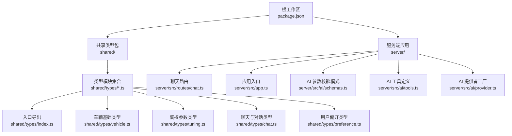
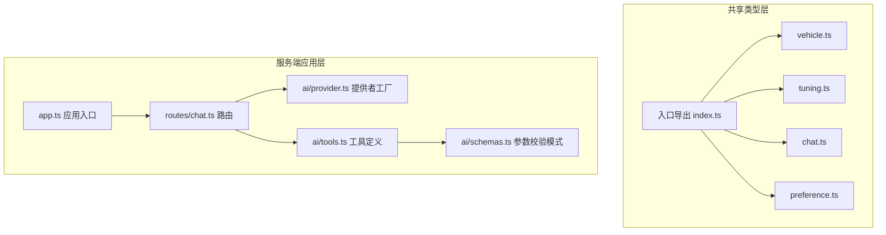
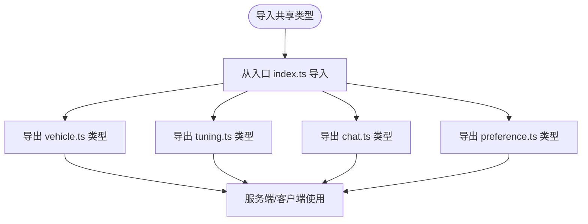
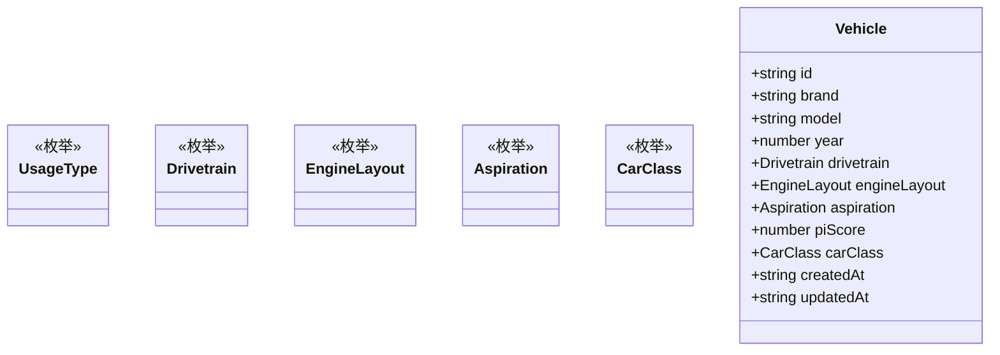
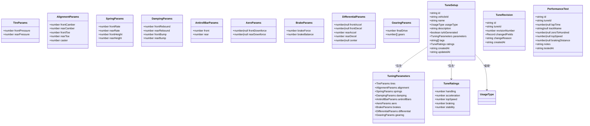
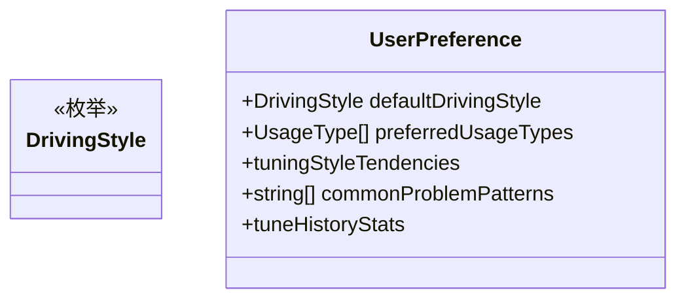
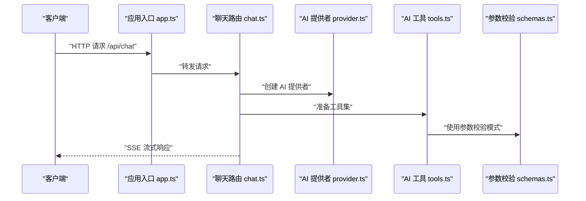
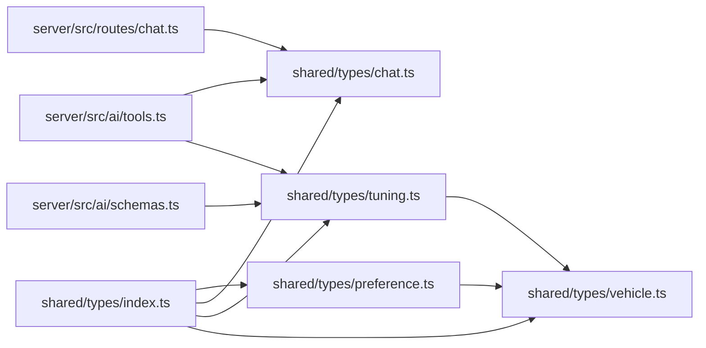

# 类型索引与导出

<cite>
**本文档引用的文件**
- [shared/types/index.ts](file://shared/types/index.ts)
- [shared/types/chat.ts](file://shared/types/chat.ts)
- [shared/types/preference.ts](file://shared/types/preference.ts)
- [shared/types/tuning.ts](file://shared/types/tuning.ts)
- [shared/types/vehicle.ts](file://shared/types/vehicle.ts)
- [shared/package.json](file://shared/package.json)
- [server/src/app.ts](file://server/src/app.ts)
- [server/src/routes/chat.ts](file://server/src/routes/chat.ts)
- [server/src/ai/schemas.ts](file://server/src/ai/schemas.ts)
- [server/src/ai/tools.ts](file://server/src/ai/tools.ts)
- [server/src/ai/provider.ts](file://server/src/ai/provider.ts)
- [package.json](file://package.json)
</cite>

## 目录
1. [简介](#简介)
2. [项目结构](#项目结构)
3. [核心组件](#核心组件)
4. [架构总览](#架构总览)
5. [详细组件分析](#详细组件分析)
6. [依赖分析](#依赖分析)
7. [性能考虑](#性能考虑)
8. [故障排除指南](#故障排除指南)
9. [结论](#结论)
10. [附录](#附录)

## 简介
本文件聚焦于共享类型模块的组织与导出策略，系统性阐述类型模型之间的依赖关系、导入导出机制，并结合 Monorepo 架构下的设计原则，给出使用示例、最佳实践、维护与版本管理建议。目标是帮助开发者在多包协作环境中高效复用与演进类型定义。

## 项目结构
本仓库采用 Monorepo 结构，包含服务端应用与共享类型包。共享类型包通过统一的入口导出聚合类型，供服务端与客户端按需消费。



图表来源
- [package.json:1-23](file://package.json#L1-L23)
- [shared/types/index.ts:1-5](file://shared/types/index.ts#L1-L5)
- [shared/types/vehicle.ts:1-30](file://shared/types/vehicle.ts#L1-L30)
- [shared/types/tuning.ts:1-126](file://shared/types/tuning.ts#L1-L126)
- [shared/types/chat.ts:1-75](file://shared/types/chat.ts#L1-L75)
- [shared/types/preference.ts:1-60](file://shared/types/preference.ts#L1-L60)
- [server/src/routes/chat.ts:1-74](file://server/src/routes/chat.ts#L1-L74)
- [server/src/app.ts:1-40](file://server/src/app.ts#L1-L40)
- [server/src/ai/schemas.ts:1-68](file://server/src/ai/schemas.ts#L1-L68)
- [server/src/ai/tools.ts:1-60](file://server/src/ai/tools.ts#L1-L60)
- [server/src/ai/provider.ts:1-16](file://server/src/ai/provider.ts#L1-L16)

章节来源
- [package.json:1-23](file://package.json#L1-L23)
- [shared/package.json:1-8](file://shared/package.json#L1-L8)

## 核心组件
- 入口导出：共享类型包通过入口文件聚合导出，形成统一的消费面，便于跨包引用与版本管理。
- 基础类型：车辆用途、驱动形式、引擎布局、进气方式、车辆等级等基础枚举与接口，作为上层类型的依赖基座。
- 调校类型：涵盖轮胎、定位、弹簧、阻尼、防倾杆、空气动力学、制动、差速器、变速箱等完整调校参数与评分体系。
- 聊天与对话类型：定义 AI 提供商类型、配置、消息角色、工具调用与结果、对话消息与会话、API 请求/响应等。
- 用户偏好类型：定义驾驶风格、偏好用途、调校倾向、问题模式与历史统计等结构化偏好数据。

章节来源
- [shared/types/index.ts:1-5](file://shared/types/index.ts#L1-L5)
- [shared/types/vehicle.ts:1-30](file://shared/types/vehicle.ts#L1-L30)
- [shared/types/tuning.ts:1-126](file://shared/types/tuning.ts#L1-L126)
- [shared/types/chat.ts:1-75](file://shared/types/chat.ts#L1-L75)
- [shared/types/preference.ts:1-60](file://shared/types/preference.ts#L1-L60)

## 架构总览
共享类型包在 Monorepo 中承担“契约层”职责，服务端应用通过路由与 AI 工具链消费这些类型，实现前后端一致的类型约束与可维护性。



图表来源
- [shared/types/index.ts:1-5](file://shared/types/index.ts#L1-L5)
- [shared/types/vehicle.ts:1-30](file://shared/types/vehicle.ts#L1-L30)
- [shared/types/tuning.ts:1-126](file://shared/types/tuning.ts#L1-L126)
- [shared/types/chat.ts:1-75](file://shared/types/chat.ts#L1-L75)
- [shared/types/preference.ts:1-60](file://shared/types/preference.ts#L1-L60)
- [server/src/app.ts:1-40](file://server/src/app.ts#L1-L40)
- [server/src/routes/chat.ts:1-74](file://server/src/routes/chat.ts#L1-L74)
- [server/src/ai/provider.ts:1-16](file://server/src/ai/provider.ts#L1-L16)
- [server/src/ai/tools.ts:1-60](file://server/src/ai/tools.ts#L1-L60)
- [server/src/ai/schemas.ts:1-68](file://server/src/ai/schemas.ts#L1-L68)

## 详细组件分析

### 入口导出与共享策略
- 统一聚合导出：入口文件以命名空间聚合的方式导出各模块类型，确保消费者只需引用一个入口即可获得全部类型。
- 包元数据：共享包的 main 与 types 指向入口文件，保证构建与类型推断的一致性。



图表来源
- [shared/types/index.ts:1-5](file://shared/types/index.ts#L1-L5)
- [shared/package.json:1-8](file://shared/package.json#L1-L8)

章节来源
- [shared/types/index.ts:1-5](file://shared/types/index.ts#L1-L5)
- [shared/package.json:1-8](file://shared/package.json#L1-L8)

### 车辆类型模型（vehicle.ts）
- 职责：定义车辆用途分类、驱动形式、引擎布局、进气方式、车辆等级等基础枚举与车辆信息接口。
- 依赖：被调校类型与用户偏好类型所依赖，形成上层模型的共同基座。



图表来源
- [shared/types/vehicle.ts:1-30](file://shared/types/vehicle.ts#L1-L30)

章节来源
- [shared/types/vehicle.ts:1-30](file://shared/types/vehicle.ts#L1-L30)

### 调校类型模型（tuning.ts）
- 职责：定义完整的调校参数集合，包括轮胎、定位、弹簧、阻尼、防倾杆、空气动力学、制动、差速器、变速箱等，并提供性能评分与调校方案结构。
- 依赖：依赖车辆用途类型，用于限定使用场景；支持独立演进与扩展。



图表来源
- [shared/types/tuning.ts:1-126](file://shared/types/tuning.ts#L1-L126)
- [shared/types/vehicle.ts:1-30](file://shared/types/vehicle.ts#L1-L30)

章节来源
- [shared/types/tuning.ts:1-126](file://shared/types/tuning.ts#L1-L126)
- [shared/types/vehicle.ts:1-30](file://shared/types/vehicle.ts#L1-L30)

### 聊天与对话类型模型（chat.ts）
- 职责：定义 AI 提供商类型与配置、消息角色、工具调用与结果、对话消息与会话、API 请求/响应等。
- 使用场景：服务端聊天路由与 AI 工具链交互时的数据契约。

```mermaid
classDiagram
class AIProviderType {
<<枚举>>
}
class AIProviderConfig {
+AIProviderType type
+string baseURL
+string apiKey
+string model
+number temperature
+number maxTokens
}
class MessageRole {
<<枚举>>
}
class ToolCall {
+string id
+string name
+Record args
}
class ToolResult {
+string toolCallId
+unknown result
}
class ChatMessage {
+string id
+string sessionId
+MessageRole role
+string content
+ToolCall[] toolCalls
+ToolResult[] toolResults
+string attachedTuneId
+string createdAt
}
class ChatSession {
+string id
+string title
+string vehicleId
+ChatMessage[] messages
+string createdAt
+string updatedAt
}
class ApiResponse {
+number code
+unknown data
+string message
}
class ChatRequest {
+{role : MessageRole; content : string}[] messages
+string sessionId
+string vehicleId
}
```

图表来源
- [shared/types/chat.ts:1-75](file://shared/types/chat.ts#L1-L75)

章节来源
- [shared/types/chat.ts:1-75](file://shared/types/chat.ts#L1-L75)

### 用户偏好类型模型（preference.ts）
- 职责：定义驾驶风格、偏好用途、调校倾向、问题模式与历史统计等结构化偏好数据。
- 依赖：依赖车辆用途类型，用于限制偏好用途集合。



图表来源
- [shared/types/preference.ts:1-60](file://shared/types/preference.ts#L1-L60)
- [shared/types/vehicle.ts:1-30](file://shared/types/vehicle.ts#L1-L30)

章节来源
- [shared/types/preference.ts:1-60](file://shared/types/preference.ts#L1-L60)
- [shared/types/vehicle.ts:1-30](file://shared/types/vehicle.ts#L1-L30)

### 服务端集成与类型消费
- 应用入口：服务端应用通过路由注册与中间件配置，承载聊天功能。
- 路由与工具：聊天路由消费聊天类型，AI 工具链消费调校与聊天类型，形成端到端的数据流。



图表来源
- [server/src/app.ts:1-40](file://server/src/app.ts#L1-L40)
- [server/src/routes/chat.ts:1-74](file://server/src/routes/chat.ts#L1-L74)
- [server/src/ai/provider.ts:1-16](file://server/src/ai/provider.ts#L1-L16)
- [server/src/ai/tools.ts:1-60](file://server/src/ai/tools.ts#L1-L60)
- [server/src/ai/schemas.ts:1-68](file://server/src/ai/schemas.ts#L1-L68)

章节来源
- [server/src/app.ts:1-40](file://server/src/app.ts#L1-L40)
- [server/src/routes/chat.ts:1-74](file://server/src/routes/chat.ts#L1-L74)
- [server/src/ai/provider.ts:1-16](file://server/src/ai/provider.ts#L1-L16)
- [server/src/ai/tools.ts:1-60](file://server/src/ai/tools.ts#L1-L60)
- [server/src/ai/schemas.ts:1-68](file://server/src/ai/schemas.ts#L1-L68)

## 依赖分析
- 内部依赖关系
  - tuning.ts 依赖 vehicle.ts 的 UsageType。
  - preference.ts 依赖 vehicle.ts 的 UsageType。
  - 入口 index.ts 聚合导出上述模块。
- 外部依赖关系
  - 服务端应用依赖 @ai-sdk/openai、ai、zod 等库，用于 AI 提供者与参数校验。
  - 共享类型包不引入运行时依赖，仅提供纯类型定义。



图表来源
- [shared/types/index.ts:1-5](file://shared/types/index.ts#L1-L5)
- [shared/types/vehicle.ts:1-30](file://shared/types/vehicle.ts#L1-L30)
- [shared/types/tuning.ts:1-126](file://shared/types/tuning.ts#L1-L126)
- [shared/types/chat.ts:1-75](file://shared/types/chat.ts#L1-L75)
- [shared/types/preference.ts:1-60](file://shared/types/preference.ts#L1-L60)
- [server/src/routes/chat.ts:1-74](file://server/src/routes/chat.ts#L1-L74)
- [server/src/ai/tools.ts:1-60](file://server/src/ai/tools.ts#L1-L60)
- [server/src/ai/schemas.ts:1-68](file://server/src/ai/schemas.ts#L1-L68)

章节来源
- [shared/types/index.ts:1-5](file://shared/types/index.ts#L1-L5)
- [shared/types/vehicle.ts:1-30](file://shared/types/vehicle.ts#L1-L30)
- [shared/types/tuning.ts:1-126](file://shared/types/tuning.ts#L1-L126)
- [shared/types/chat.ts:1-75](file://shared/types/chat.ts#L1-L75)
- [shared/types/preference.ts:1-60](file://shared/types/preference.ts#L1-L60)
- [server/src/routes/chat.ts:1-74](file://server/src/routes/chat.ts#L1-L74)
- [server/src/ai/tools.ts:1-60](file://server/src/ai/tools.ts#L1-L60)
- [server/src/ai/schemas.ts:1-68](file://server/src/ai/schemas.ts#L1-L68)

## 性能考虑
- 类型体积控制：保持类型定义简洁明确，避免冗余嵌套与重复字段，降低编译与类型检查成本。
- 导出粒度：通过入口聚合导出，减少消费者分散导入带来的重复依赖与缓存失效。
- 运行时解耦：共享类型包不引入运行时依赖，确保在服务端与客户端的类型消费零开销。
- 并发开发：在 Monorepo 中，类型变更应通过严格的变更控制与测试，避免破坏下游包的类型一致性。

## 故障排除指南
- 类型缺失或未导出
  - 症状：消费者无法解析某类型。
  - 排查：确认入口是否导出对应模块；检查模块内是否正确声明导出。
  - 参考路径：[shared/types/index.ts:1-5](file://shared/types/index.ts#L1-L5)
- 依赖类型未解析
  - 症状：使用依赖枚举或接口时报错。
  - 排查：确认被依赖模块已导出；检查消费者是否正确导入。
  - 参考路径：[shared/types/tuning.ts:1](file://shared/types/tuning.ts#L1-L1)、[shared/types/preference.ts:1](file://shared/types/preference.ts#L1-L1)
- 构建或类型元数据问题
  - 症状：IDE 或构建工具无法识别类型入口。
  - 排查：核对共享包的 main 与 types 指向同一入口文件。
  - 参考路径：[shared/package.json:1-8](file://shared/package.json#L1-L8)
- 服务端类型消费异常
  - 症状：路由或工具链消费类型时报错。
  - 排查：确认服务端包对共享类型的引用路径与版本一致；检查类型导入是否正确。
  - 参考路径：[server/src/routes/chat.ts:1-74](file://server/src/routes/chat.ts#L1-L74)、[server/src/ai/tools.ts:1-60](file://server/src/ai/tools.ts#L1-L60)

章节来源
- [shared/types/index.ts:1-5](file://shared/types/index.ts#L1-L5)
- [shared/types/tuning.ts:1](file://shared/types/tuning.ts#L1-L1)
- [shared/types/preference.ts:1](file://shared/types/preference.ts#L1-L1)
- [shared/package.json:1-8](file://shared/package.json#L1-L8)
- [server/src/routes/chat.ts:1-74](file://server/src/routes/chat.ts#L1-L74)
- [server/src/ai/tools.ts:1-60](file://server/src/ai/tools.ts#L1-L60)

## 结论
共享类型包通过清晰的入口导出与模块化组织，在 Monorepo 中实现了类型契约的集中管理与跨包复用。配合服务端路由与 AI 工具链的类型消费，形成了从前端到后端的一致性数据模型。建议在后续演进中持续优化类型体积、强化变更治理，并完善自动化测试与文档同步，以保障长期可维护性。

## 附录

### 使用示例与最佳实践
- 在服务端消费共享类型
  - 步骤：从入口导入所需类型；在路由与工具中直接使用；确保类型与运行时数据一致。
  - 参考路径：[server/src/routes/chat.ts:1-74](file://server/src/routes/chat.ts#L1-L74)、[server/src/ai/tools.ts:1-60](file://server/src/ai/tools.ts#L1-L60)
- 在客户端消费共享类型
  - 步骤：同服务端；注意仅消费类型，不引入运行时依赖。
  - 参考路径：[shared/types/index.ts:1-5](file://shared/types/index.ts#L1-L5)
- 版本与发布策略
  - 建议：采用语义化版本管理；在共享包升级时，先在本地验证服务端与客户端消费无误后再发布。
  - 参考路径：[shared/package.json:1-8](file://shared/package.json#L1-L8)、[package.json:1-23](file://package.json#L1-L23)

### 维护与版本管理策略
- 变更控制
  - 新增类型：优先在现有模块内扩展；避免频繁拆分导致入口复杂度上升。
  - 修改类型：保持向后兼容；必要时引入新字段并保留默认值。
- 文档同步
  - 类型注释与示例：在类型定义处补充必要的注释与使用说明。
- 自动化
  - 类型检查：在 CI 中加入类型检查步骤，防止类型回归。
  - 发布流程：通过工作区脚本统一构建与发布，确保版本一致性。