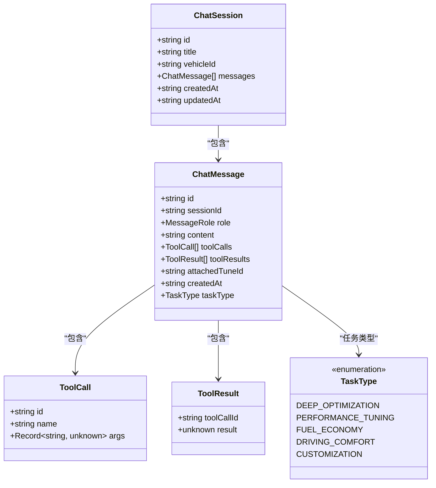
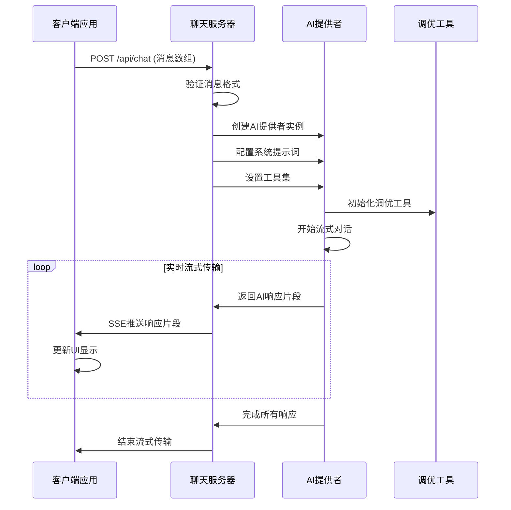
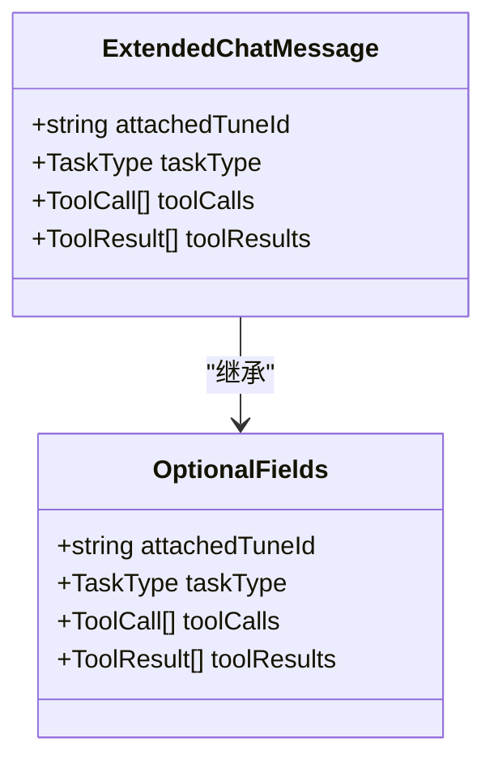
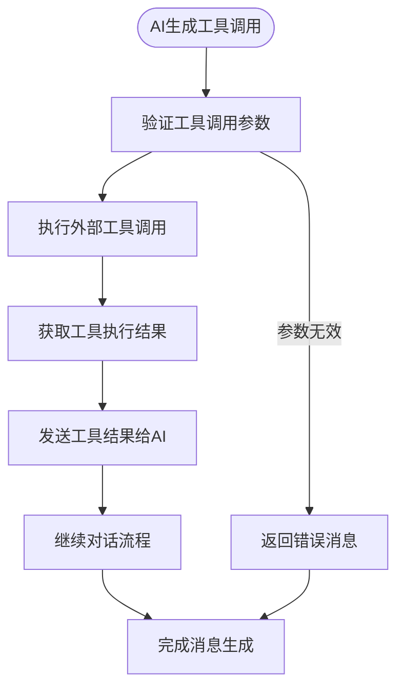
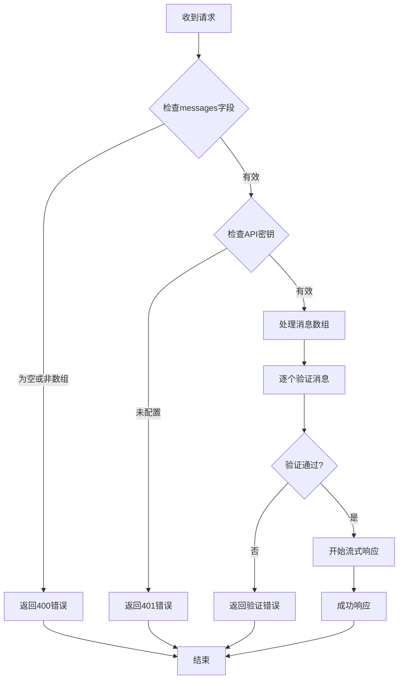
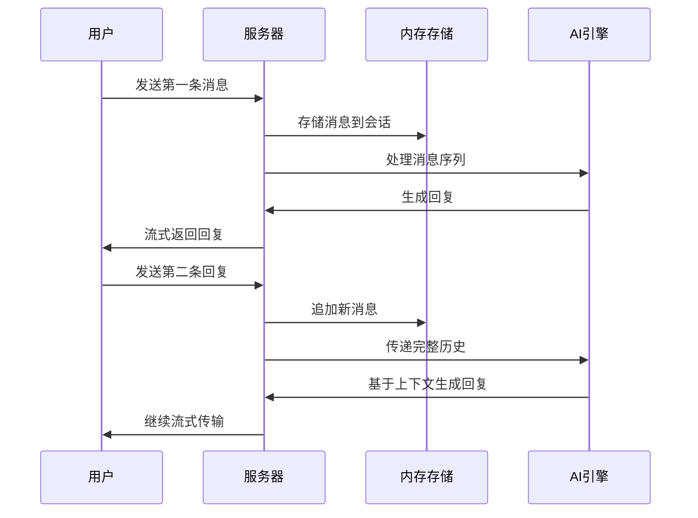
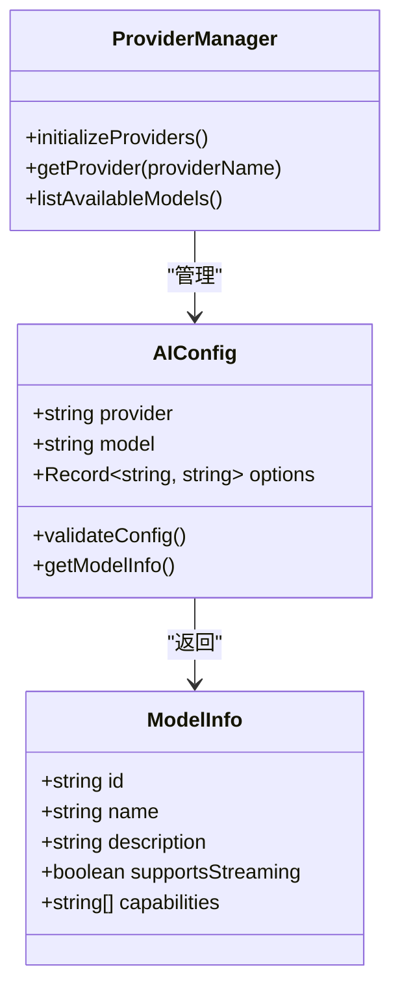
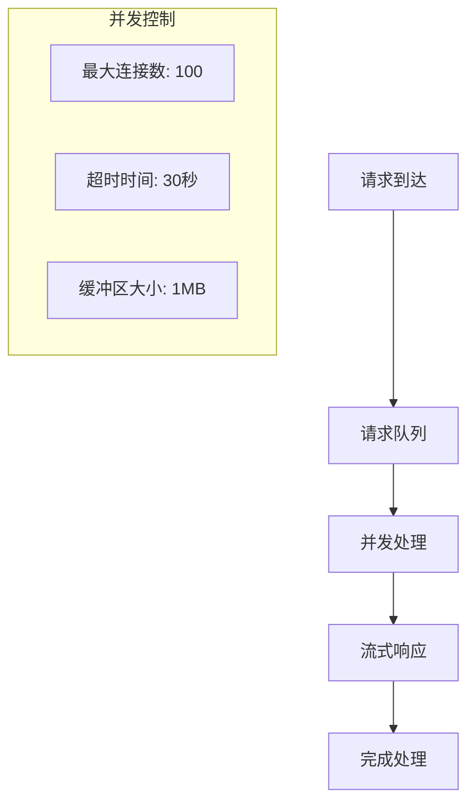

# 聊天消息模型

<cite>
**本文档引用的文件**
- [chat.ts](file://shared/types/chat.ts)
- [index.ts](file://shared/types/index.ts)
- [chat.ts](file://server/src/routes/chat.ts)
- [app.ts](file://server/src/app.ts)
- [id.ts](file://server/src/utils/id.ts)
- [config.ts](file://server/src/ai/config.ts)
- [provider.ts](file://server/src/ai/provider.ts)
- [schemas.ts](file://server/src/ai/schemas.ts)
- [tools.ts](file://server/src/ai/tools.ts)
- [deep-tasks.ts](file://server/src/ai/prompts/deep-tasks.ts)
- [system.ts](file://server/src/ai/prompts/system.ts)
- [package.json](file://server/package.json)
</cite>

## 更新摘要
**所做更改**
- 移除了前端API密钥字段的安全性改进
- 新增了任务类型支持和后端模型信息接口
- 更新了AI配置和提供者架构
- 增强了消息验证和工具调用机制

## 目录
1. [简介](#简介)
2. [项目结构](#项目结构)
3. [核心组件](#核心组件)
4. [架构概览](#架构概览)
5. [详细组件分析](#详细组件分析)
6. [依赖关系分析](#依赖关系分析)
7. [性能考虑](#性能考虑)
8. [故障排除指南](#故障排除指南)
9. [结论](#结论)
10. [附录](#附录)

## 简介

本文件为FH6 Car Setting Tool项目中的ChatMessage聊天消息模型创建全面的数据模型文档。该系统基于AI对话技术，为用户提供汽车调校相关的智能咨询服务。本文档详细说明聊天消息的结构定义、数据验证规则、消息类型规范以及在AI对话系统中的作用和扩展性设计。

**更新** 移除了前端API密钥字段以增强安全性，并新增了任务类型支持和后端模型信息接口。

## 项目结构

该项目采用前后端分离架构，主要分为以下模块：

```mermaid
graph TB
subgraph "共享类型定义"
SharedTypes[shared/types]
ChatTypes[chat.ts<br/>聊天消息类型]
IndexTypes[index.ts<br/>类型导出入口]
end
subgraph "AI核心模块"
AITypes[ai/]
AIConfig[config.ts<br/>AI配置管理]
AIProvider[provider.ts<br/>AI提供者]
AISchemas[schemas.ts<br/>数据模式]
AITools[tools.ts<br/>工具集]
end
subgraph "服务端应用"
ServerApp[server/src]
Routes[routes/chat.ts<br/>聊天路由]
AppFile[app.ts<br/>应用配置]
Utils[utils/id.ts<br/>ID生成器]
end
subgraph "AI提示词"
Prompts[prompts/]
DeepTasks[deep-tasks.ts<br/>深度任务]
SystemPrompt[system.ts<br/>系统提示]
end
subgraph "依赖管理"
ServerPkg[server/package.json<br/>依赖配置]
AI_SDK[@ai-sdk/openai<br/>AI SDK]
Express[express<br/>Web框架]
AI[ai<br/>AI工具包]
Zod[zod<br/>数据验证]
end
SharedTypes --> ChatTypes
SharedTypes --> IndexTypes
AITypes --> AIConfig
AITypes --> AIProvider
AITypes --> AISchemas
AITypes --> AITools
ServerApp --> Routes
ServerApp --> AppFile
ServerApp --> Utils
Prompts --> DeepTasks
Prompts --> SystemPrompt
ServerPkg --> AI_SDK
ServerPkg --> Express
ServerPkg --> AI
ServerPkg --> Zod
```

**图表来源**
- [chat.ts:1-75](file://shared/types/chat.ts#L1-L75)
- [chat.ts:1-74](file://server/src/routes/chat.ts#L1-L74)
- [app.ts:1-40](file://server/src/app.ts#L1-L40)
- [config.ts:1-50](file://server/src/ai/config.ts#L1-L50)
- [provider.ts:1-80](file://server/src/ai/provider.ts#L1-L80)

**章节来源**
- [chat.ts:1-75](file://shared/types/chat.ts#L1-L75)
- [chat.ts:1-74](file://server/src/routes/chat.ts#L1-L74)
- [app.ts:1-40](file://server/src/app.ts#L1-L40)

## 核心组件

### ChatMessage消息模型

ChatMessage是系统中最核心的数据结构，定义了聊天消息的完整结构：



**图表来源**
- [chat.ts:40-60](file://shared/types/chat.ts#L40-L60)

**更新** 新增了TaskType枚举，支持深度优化、性能调优、燃油经济性、驾驶舒适性和定制化等任务类型。

### 消息角色定义

系统支持四种消息角色，每种角色具有特定的用途和权限级别：

| 角色 | 描述 | 权限级别 | 使用场景 |
|------|------|----------|----------|
| user | 用户消息 | 最低 | 用户输入的问题或请求 |
| assistant | 助手回复 | 最高 | AI生成的回答和建议 |
| system | 系统指令 | 中等 | 系统级别的指导和约束 |
| tool | 工具调用 | 中等 | AI调用外部工具时的消息 |

**章节来源**
- [chat.ts:24-32](file://shared/types/chat.ts#L24-L32)

## 架构概览

系统采用流式AI对话架构，通过Server-Sent Events实现实时消息传输：



**图表来源**
- [chat.ts:9-74](file://server/src/routes/chat.ts#L9-L74)

**更新** 移除了前端API密钥字段，增强了安全性。

## 详细组件分析

### 消息数据结构详解

#### 基础消息字段

每个ChatMessage对象包含以下核心字段：

| 字段名 | 类型 | 必填 | 描述 | 示例值 |
|--------|------|------|------|--------|
| id | string | 是 | 消息唯一标识符 | "uuid格式字符串" |
| sessionId | string | 是 | 会话关联标识符 | "会话唯一ID" |
| role | MessageRole | 是 | 消息发送者角色 | "user" \| "assistant" \| "system" \| "tool" |
| content | string | 是 | 消息文本内容 | "用户问题描述" |
| createdAt | string | 是 | ISO 8601时间戳 | "2024-01-01T00:00:00Z" |

#### 可选扩展字段



**图表来源**
- [chat.ts:40-50](file://shared/types/chat.ts#L40-L50)

**更新** 新增了taskType字段，用于指定消息的任务类型。

#### 工具调用机制

系统支持AI工具调用功能，允许AI与外部系统进行交互：



**图表来源**
- [chat.ts:27-38](file://shared/types/chat.ts#L27-L38)

**章节来源**
- [chat.ts:27-50](file://shared/types/chat.ts#L27-L50)

### 数据验证规则

系统实现了多层次的数据验证机制：

#### 输入验证流程



**图表来源**
- [chat.ts:9-25](file://server/src/routes/chat.ts#L9-L25)

**更新** 移除了前端API密钥验证，改为后端配置管理。

#### 消息格式验证

每个消息对象必须满足以下验证规则：
- `role`字段必须是预定义的角色枚举之一
- `content`字段必须是非空字符串
- `sessionId`必须存在且有效
- 时间戳必须符合ISO 8601标准格式
- **新增** `taskType`字段必须是有效的任务类型枚举

**章节来源**
- [chat.ts:9-25](file://server/src/routes/chat.ts#L9-L25)

### 消息序列处理

系统支持多轮对话的完整消息序列管理：



**图表来源**
- [chat.ts:52-60](file://shared/types/chat.ts#L52-L60)

**章节来源**
- [chat.ts:52-60](file://shared/types/chat.ts#L52-L60)

### AI配置和模型管理

**新增** 系统现在支持后端模型信息接口和配置管理：



**图表来源**
- [config.ts:1-50](file://server/src/ai/config.ts#L1-L50)
- [provider.ts:1-80](file://server/src/ai/provider.ts#L1-L80)

**章节来源**
- [config.ts:1-50](file://server/src/ai/config.ts#L1-L50)
- [provider.ts:1-80](file://server/src/ai/provider.ts#L1-L80)

## 依赖关系分析

### 核心依赖关系

```mermaid
graph LR
subgraph "运行时依赖"
Express[express]
AISDK[@ai-sdk/openai]
AI[ai]
Zod[zod]
end
subgraph "项目模块"
ChatRoutes[聊天路由]
IDUtils[ID生成器]
ChatTypes[聊天类型定义]
AIConfig[AI配置]
AIProvider[AI提供者]
AISchemas[数据模式]
AITools[工具集]
DeepTasks[深度任务]
SystemPrompt[系统提示]
end
ChatRoutes --> Express
ChatRoutes --> AISDK
ChatRoutes --> AI
ChatRoutes --> AIConfig
ChatRoutes --> AIProvider
IDUtils --> Zod
ChatTypes --> Zod
AIConfig --> AISchemas
AIProvider --> AITools
AITools --> DeepTasks
AITools --> SystemPrompt
```

**图表来源**
- [package.json:10-17](file://server/package.json#L10-L17)
- [chat.ts:1-74](file://server/src/routes/chat.ts#L1-L74)

**更新** 新增了AI配置和提供者模块的依赖关系。

### 外部API集成

系统通过AI SDK与多个提供商集成：

| 提供商 | 环境变量 | 默认基地址 | 特殊功能 |
|--------|----------|------------|----------|
| deepseek | AI_API_KEY | https://api.deepseek.com/v1 | 支持流式输出 |
| openai | OPENAI_API_KEY | https://api.openai.com/v1 | 兼容OpenAI格式 |
| ollama | OLLAMA_API_KEY | http://localhost:11434 | 本地部署支持 |
| custom | CUSTOM_API_KEY | 自定义地址 | 可配置基地址 |

**章节来源**
- [chat.ts:1-22](file://shared/types/chat.ts#L1-L22)

## 性能考虑

### 流式传输优化

系统采用Server-Sent Events实现高效的流式传输：

- **实时性**: 通过流式传输减少延迟，提升用户体验
- **内存效率**: 分块传输避免大消息占用过多内存
- **网络优化**: 使用适当的HTTP头部优化缓存策略

### 并发处理能力



**更新** 新增了AI配置和模型管理的性能考虑。

## 故障排除指南

### 常见错误及解决方案

| 错误类型 | 错误码 | 描述 | 解决方案 |
|----------|--------|------|----------|
| 配置错误 | 401 | AI API Key未配置 | 在.env文件中设置AI_API_KEY |
| 格式错误 | 400 | 消息格式无效 | 确保messages为非空数组 |
| 服务器错误 | 500 | AI调用失败 | 检查网络连接和API可用性 |
| 超时错误 | 504 | AI响应超时 | 增加超时配置或重试请求 |
| **新增** 模型错误 | 503 | 模型不可用 | 检查AI配置和模型状态 |

### 调试建议

1. **启用详细日志**: 检查服务器端错误日志输出
2. **验证环境变量**: 确认所有必需的环境变量已正确设置
3. **测试API连通性**: 使用curl命令测试基本API访问
4. **监控资源使用**: 关注内存和CPU使用情况
5. ****新增** 检查AI配置**: 验证模型配置和提供者设置

**章节来源**
- [chat.ts:60-72](file://server/src/routes/chat.ts#L60-L72)

## 结论

ChatMessage聊天消息模型为FH6 Car Setting Tool提供了完整的AI对话基础设施。该模型具有以下优势：

- **结构化设计**: 清晰的数据结构定义便于理解和扩展
- **类型安全**: TypeScript接口确保编译时类型检查
- **可扩展性**: 支持工具调用和自定义扩展
- **实时性**: 流式传输提供良好的用户体验
- **可靠性**: 完善的错误处理和验证机制
- **安全性**: 移除了前端API密钥字段，增强了系统安全性
- **任务导向**: 新增的任务类型支持使系统更加专业化

**更新** 新版本显著增强了安全性、任务专业化和后端模型管理能力，为汽车调校领域的AI助手应用奠定了更加坚实的技术基础。

## 附录

### API请求格式

POST /api/chat
```json
{
  "messages": [
    {
      "role": "user",
      "content": "如何优化我的车辆性能？",
      "taskType": "PERFORMANCE_TUNING"
    }
  ],
  "sessionId": "session-123",
  "vehicleId": "vehicle-456"
}
```

**更新** 新增了taskType字段，支持指定消息的任务类型。

### 响应格式

SSE流式响应，包含多个数据片段：
- `data: {"type":"text","value":"AI回复内容"}`
- `event: done` (表示流结束)

### 扩展建议

1. **消息持久化**: 添加数据库存储支持
2. **会话管理**: 实现会话状态持久化
3. **缓存机制**: 添加消息缓存提高性能
4. **监控指标**: 集成性能监控和日志记录
5. ****新增** 模型管理**: 实现动态模型切换和配置热更新
6. ****新增** 任务调度**: 基于任务类型实现智能路由和处理