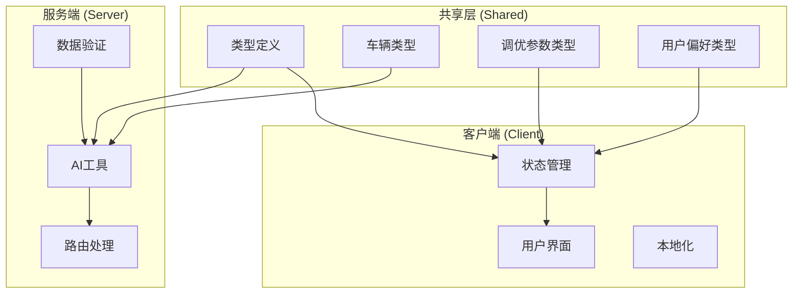
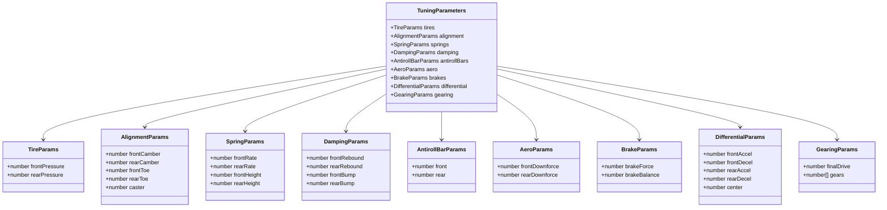
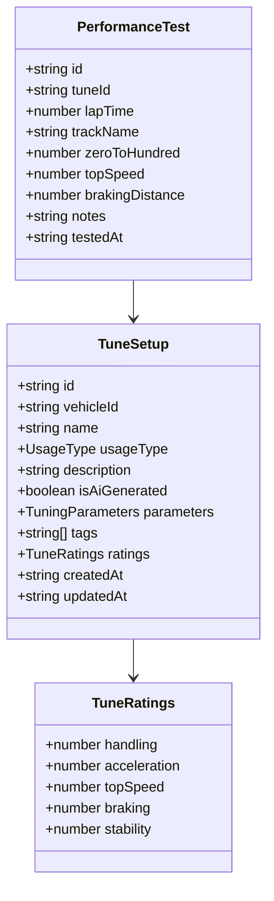
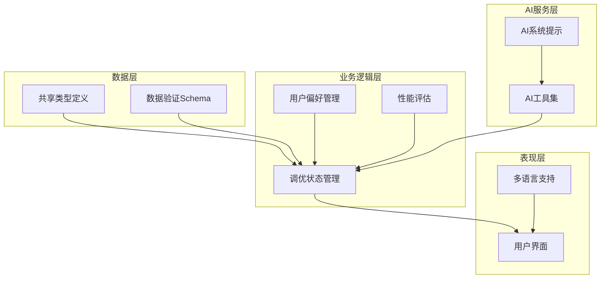
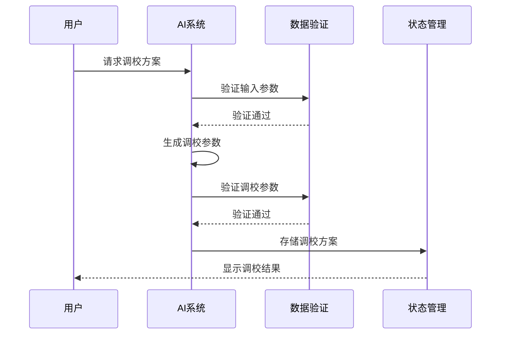
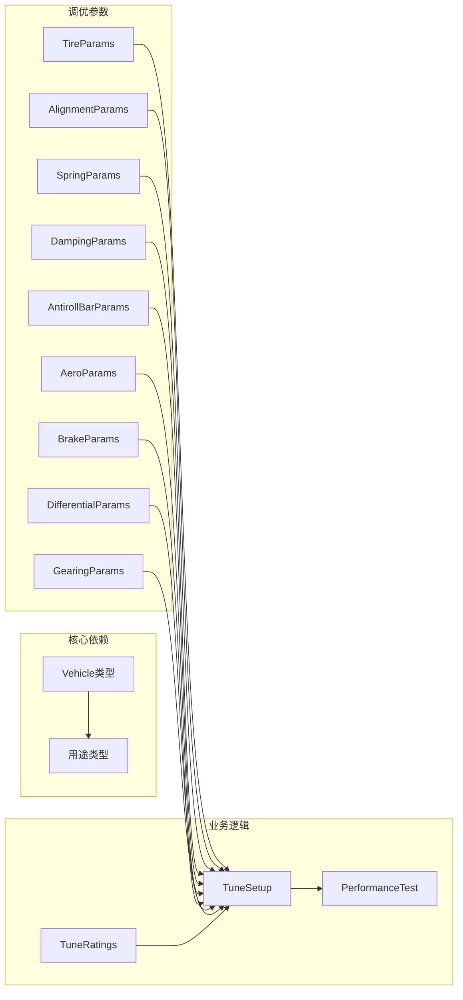

# 调优参数模型

<cite>
**本文档引用的文件**
- [tuning.ts](file://shared/types/tuning.ts)
- [vehicle.ts](file://shared/types/vehicle.ts)
- [schemas.ts](file://server/src/ai/schemas.ts)
- [system.ts](file://server/src/ai/prompts/system.ts)
- [preference.ts](file://shared/types/preference.ts)
- [tune-store.ts](file://client/src/lib/store/tune-store.ts)
- [zh-CN.json](file://client/public/locales/zh-CN.json)
</cite>

## 目录
1. [简介](#简介)
2. [项目结构](#项目结构)
3. [核心组件](#核心组件)
4. [架构概览](#架构概览)
5. [详细组件分析](#详细组件分析)
6. [依赖关系分析](#依赖关系分析)
7. [性能考虑](#性能考虑)
8. [故障排除指南](#故障排除指南)
9. [结论](#结论)

## 简介

本文件为FH6 Car Setting Tool项目中的TuningParameters调优参数模型创建了全面的数据模型文档。该系统专注于《极限竞速：地平线6》(Forza Horizon 6)的车辆调校参数管理，提供了从轮胎、定位、弹簧、阻尼到空气动力学、制动、差速器和变速箱的完整调校参数体系。

系统采用前后端分离架构，前端使用React + TypeScript，后端使用Node.js + TypeScript，通过AI工具实现智能调校方案生成。调优参数模型不仅定义了技术参数，还包含了性能评估、用户偏好和历史统计等业务逻辑。

## 项目结构

FH6 Car Setting Tool项目采用模块化设计，主要分为以下层次：

**图表来源**
- [tuning.ts:1-126](file://shared/types/tuning.ts#L1-L126)
- [vehicle.ts:1-30](file://shared/types/vehicle.ts#L1-L30)
- [schemas.ts:1-67](file://server/src/ai/schemas.ts#L1-L67)

**章节来源**
- [tuning.ts:1-126](file://shared/types/tuning.ts#L1-L126)
- [vehicle.ts:1-30](file://shared/types/vehicle.ts#L1-L30)

## 核心组件

调优参数模型由多个相互关联的组件构成，每个组件都有其特定的功能和约束条件：

### 主要数据结构

**图表来源**
- [tuning.ts:4-78](file://shared/types/tuning.ts#L4-L78)

### 性能评估体系

调优参数模型还包括完整的性能评估系统，用于量化调校效果：

**图表来源**
- [tuning.ts:80-125](file://shared/types/tuning.ts#L80-L125)

**章节来源**
- [tuning.ts:1-126](file://shared/types/tuning.ts#L1-L126)

## 架构概览

系统采用分层架构设计，确保调优参数的完整性、一致性和可扩展性：

**图表来源**
- [schemas.ts:1-67](file://server/src/ai/schemas.ts#L1-L67)
- [tune-store.ts:1-38](file://client/src/lib/store/tune-store.ts#L1-L38)
- [system.ts:1-94](file://server/src/ai/prompts/system.ts#L1-L94)

## 详细组件分析

### 轮胎参数 (TireParams)

轮胎参数是影响车辆抓地力和操控性的关键因素：

| 参数 | 数据类型 | 取值范围 | 默认值 | 描述 |
|------|----------|----------|--------|------|
| frontPressure | number | 16-40 PSI | 32 PSI | 前轮胎气压 |
| rearPressure | number | 16-40 PSI | 32 PSI | 后轮胎气压 |

**参数验证规则**：
- 必须为数值类型
- 前后轮胎气压必须在16-40 PSI范围内
- 前后轮胎气压必须相等（默认设置）

**章节来源**
- [tuning.ts:4-7](file://shared/types/tuning.ts#L4-L7)
- [schemas.ts:5-8](file://server/src/ai/schemas.ts#L5-L8)

### 定位参数 (AlignmentParams)

定位参数控制车轮的角度设置，直接影响操控特性：

| 参数 | 数据类型 | 取值范围 | 默认值 | 描述 |
|------|----------|----------|--------|------|
| frontCamber | number | -5.0° ~ +5.0° | 0.0° | 前轮外倾角 |
| rearCamber | number | -5.0° ~ +5.0° | 0.0° | 后轮外倾角 |
| frontToe | number | -0.5° ~ +0.5° | 0.0° | 前束角 |
| rearToe | number | -0.5° ~ +0.5° | 0.0° | 后束角 |
| caster | number | 0° ~ 7° | 3.5° | 主销后倾角 |

**参数验证规则**：
- 外倾角必须在-5.0°到+5.0°之间
- 束角必须在-0.5°到+0.5°之间
- 主销后倾角必须在0°到7°之间

**章节来源**
- [tuning.ts:10-16](file://shared/types/tuning.ts#L10-L16)
- [schemas.ts:9-15](file://server/src/ai/schemas.ts#L9-L15)

### 弹簧参数 (SpringParams)

弹簧参数决定悬架的刚度和车身高度：

| 参数 | 数据类型 | 取值范围 | 默认值 | 描述 |
|------|----------|----------|--------|------|
| frontRate | number | 变量 | 250 N/mm | 前弹簧刚度 |
| rearRate | number | 变量 | 250 N/mm | 后弹簧刚度 |
| frontHeight | number | 变量 | 150 mm | 前车身高度 |
| rearHeight | number | 变量 | 150 mm | 后车身高度 |

**参数验证规则**：
- 弹簧刚度为无限制数值
- 车身高度为无限制数值

**章节来源**
- [tuning.ts:19-24](file://shared/types/tuning.ts#L19-L24)
- [schemas.ts:16-21](file://server/src/ai/schemas.ts#L16-L21)

### 阻尼参数 (DampingParams)

阻尼参数控制悬架的压缩和回弹速度：

| 参数 | 数据类型 | 取值范围 | 默认值 | 描述 |
|------|----------|----------|--------|------|
| frontRebound | number | 1.0 ~ 20.0 | 10.0 | 前回弹阻尼 |
| rearRebound | number | 1.0 ~ 20.0 | 10.0 | 后回弹阻尼 |
| frontBump | number | 1.0 ~ 20.0 | 10.0 | 前压缩阻尼 |
| rearBump | number | 1.0 ~ 20.0 | 10.0 | 后压缩阻尼 |

**参数验证规则**：
- 回弹阻尼必须在1.0-20.0范围内
- 压缩阻尼必须在1.0-20.0范围内

**章节来源**
- [tuning.ts:27-32](file://shared/types/tuning.ts#L27-L32)
- [schemas.ts:22-27](file://server/src/ai/schemas.ts#L22-L27)

### 防倾杆参数 (AntirollBarParams)

防倾杆控制车辆的侧倾程度和转向特性：

| 参数 | 数据类型 | 取值范围 | 默认值 | 描述 |
|------|----------|----------|--------|------|
| front | number | 1-65 | 33 | 前防倾杆 |
| rear | number | 1-65 | 33 | 后防倾杆 |

**参数验证规则**：
- 防倾杆刚度必须在1-65范围内

**章节来源**
- [tuning.ts:35-38](file://shared/types/tuning.ts#L35-L38)
- [schemas.ts:28-31](file://server/src/ai/schemas.ts#L28-L31)

### 空气动力学参数 (AeroParams)

空气动力学参数影响车辆的下压力和稳定性：

| 参数 | 数据类型 | 取值范围 | 默认值 | 描述 |
|------|----------|----------|--------|------|
| frontDownforce | number | 变量 | 50 | 前下压力 |
| rearDownforce | number | 变量 | 50 | 后下压力 |

**参数验证规则**：
- 下压力为可空数值，无固定范围限制

**章节来源**
- [tuning.ts:41-44](file://shared/types/tuning.ts#L41-L44)
- [schemas.ts:32-35](file://server/src/ai/schemas.ts#L32-L35)

### 制动参数 (BrakeParams)

制动系统参数控制制动力和分配：

| 参数 | 数据类型 | 取值范围 | 默认值 | 描述 |
|------|----------|----------|--------|------|
| brakeForce | number | 50% ~ 150% | 100% | 制动力 |
| brakeBalance | number | 0% ~ 100% | 50% | 制动力分配(前轮) |

**参数验证规则**：
- 制动力必须在50%-150%范围内
- 制动力分配必须在0%-100%范围内

**章节来源**
- [tuning.ts:47-50](file://shared/types/tuning.ts#L47-L50)
- [schemas.ts:36-39](file://server/src/ai/schemas.ts#L36-L39)

### 差速器参数 (DifferentialParams)

差速器参数控制驱动系统的扭矩分配：

| 参数 | 数据类型 | 取值范围 | 默认值 | 描述 |
|------|----------|----------|--------|------|
| frontAccel | number | 0-100 | 50 | 前差速器加速 |
| frontDecel | number | 0-100 | 50 | 前差速器减速 |
| rearAccel | number | 0-100 | 50 | 后差速器加速 |
| rearDecel | number | 0-100 | 50 | 后差速器减速 |
| center | number | 0-100 | 50 | 中央差速器 |

**参数验证规则**：
- 所有差速器参数必须在0-100范围内
- FWD/AWD模式下的前差速器参数可为空

**章节来源**
- [tuning.ts:53-59](file://shared/types/tuning.ts#L53-L59)
- [schemas.ts:40-46](file://server/src/ai/schemas.ts#L40-L46)

### 变速箱参数 (GearingParams)

变速箱参数控制传动比设置：

| 参数 | 数据类型 | 取值范围 | 默认值 | 描述 |
|------|----------|----------|--------|------|
| finalDrive | number | 变量 | 3.5 | 终传比 |
| gears | number[] | 变量 | [3.5, 2.1, 1.5, 1.2, 1.0, 0.8] | 各挡齿比 |

**参数验证规则**：
- 终传比为无限制数值
- 各挡齿比为可选数组

**章节来源**
- [tuning.ts:62-65](file://shared/types/tuning.ts#L62-L65)
- [schemas.ts:47-50](file://server/src/ai/schemas.ts#L47-L50)

### 调校方案 (TuneSetup)

完整的调校方案包含所有参数和元数据：

**图表来源**
- [schemas.ts:54-67](file://server/src/ai/schemas.ts#L54-L67)
- [tune-store.ts:18-38](file://client/src/lib/store/tune-store.ts#L18-L38)

**章节来源**
- [tuning.ts:90-102](file://shared/types/tuning.ts#L90-L102)

### 性能评分 (TuneRatings)

性能评分系统提供客观的调校效果评估：

| 评分维度 | 取值范围 | 描述 |
|----------|----------|------|
| handling | 0-10 | 操控性能 |
| acceleration | 0-10 | 加速性能 |
| topSpeed | 0-10 | 极速性能 |
| braking | 0-10 | 制动性能 |
| stability | 0-10 | 稳定性能 |

**评分规则**：
- 所有评分必须在0-10范围内
- 评分用于指导调校优化方向

**章节来源**
- [tuning.ts:81-87](file://shared/types/tuning.ts#L81-L87)

## 依赖关系分析

调优参数模型的依赖关系体现了系统的模块化设计：

**图表来源**
- [tuning.ts:1-126](file://shared/types/tuning.ts#L1-L126)
- [vehicle.ts:1-30](file://shared/types/vehicle.ts#L1-L30)

**章节来源**
- [tuning.ts:1-126](file://shared/types/tuning.ts#L1-L126)
- [vehicle.ts:1-30](file://shared/types/vehicle.ts#L1-L30)

## 性能考虑

调优参数模型在设计时充分考虑了性能优化：

### 数据验证性能
- 使用Zod进行运行时类型检查，确保数据完整性
- 验证规则在编译时确定，减少运行时开销
- 可空字段支持null值，避免不必要的类型转换

### 内存优化
- 所有数值参数使用number类型，减少内存占用
- 可选数组参数支持undefined，节省存储空间
- 字符串参数使用最小必要长度

### 计算复杂度
- 参数验证时间复杂度为O(1)，不影响用户体验
- 调校方案存储使用数组操作，平均时间复杂度为O(n)
- 性能测试结果存储支持快速检索

## 故障排除指南

### 常见参数错误

**轮胎气压异常**
- 症状：轮胎气压超出16-40 PSI范围
- 解决方案：调整至有效范围或使用默认值32 PSI

**定位参数超限**
- 症状：外倾角超过±5.0°，束角超过±0.5°
- 解决方案：调整至安全范围内，建议使用0.0°作为默认值

**阻尼参数无效**
- 症状：阻尼值不在1.0-20.0范围内
- 解决方案：调整至有效范围，建议使用10.0作为默认值

### 调校方案验证失败

**AI生成参数验证**
- 症状：AI生成的参数不符合验证规则
- 解决方案：检查AI提示词，确保参数在有效范围内

**用户手动输入错误**
- 症状：用户输入的参数超出范围
- 解决方案：使用表单验证和实时反馈

### 性能评估问题

**评分异常**
- 症状：性能评分为null或超出0-10范围
- 解决方案：检查评分计算逻辑，确保数据完整性

**测试结果缺失**
- 症状：性能测试结果为空
- 解决方案：验证测试执行流程，确保数据正确存储

**章节来源**
- [schemas.ts:1-67](file://server/src/ai/schemas.ts#L1-L67)
- [tune-store.ts:1-38](file://client/src/lib/store/tune-store.ts#L1-L38)

## 结论

FH6 Car Setting Tool的调优参数模型是一个设计精良、功能完整的系统，具有以下特点：

### 技术优势
- **完整性**：覆盖了《地平线6》的所有可调参数
- **一致性**：统一的数据类型和验证规则
- **可扩展性**：模块化设计支持新参数的添加
- **可靠性**：完善的错误处理和验证机制

### 业务价值
- **智能化**：AI辅助生成调校方案
- **个性化**：支持用户偏好和历史记录
- **可视化**：直观的参数调整界面
- **可追溯性**：完整的调校历史和版本控制

### 改进建议
- 增加参数间的依赖关系验证
- 实现参数自动优化算法
- 添加调校效果预测功能
- 扩展更多车辆类型的专用参数

该调优参数模型为《地平线6》玩家提供了专业级的车辆调校工具，既保证了技术准确性，又确保了使用的便捷性。