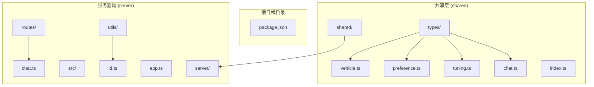
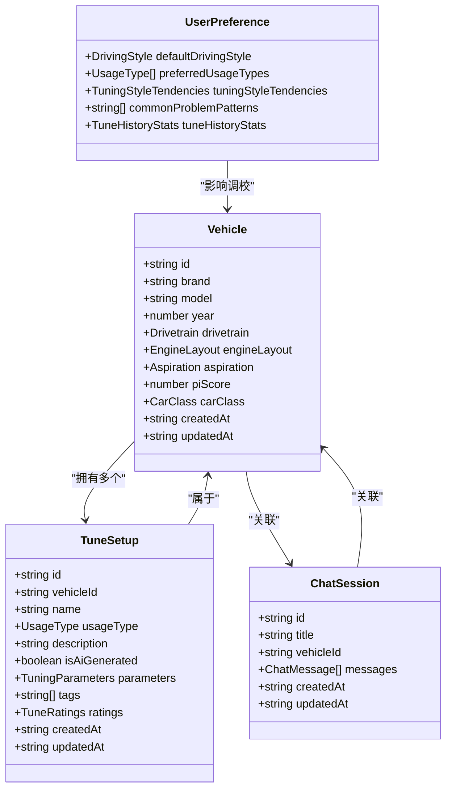
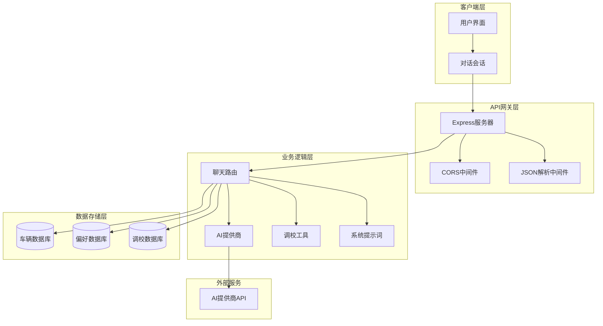
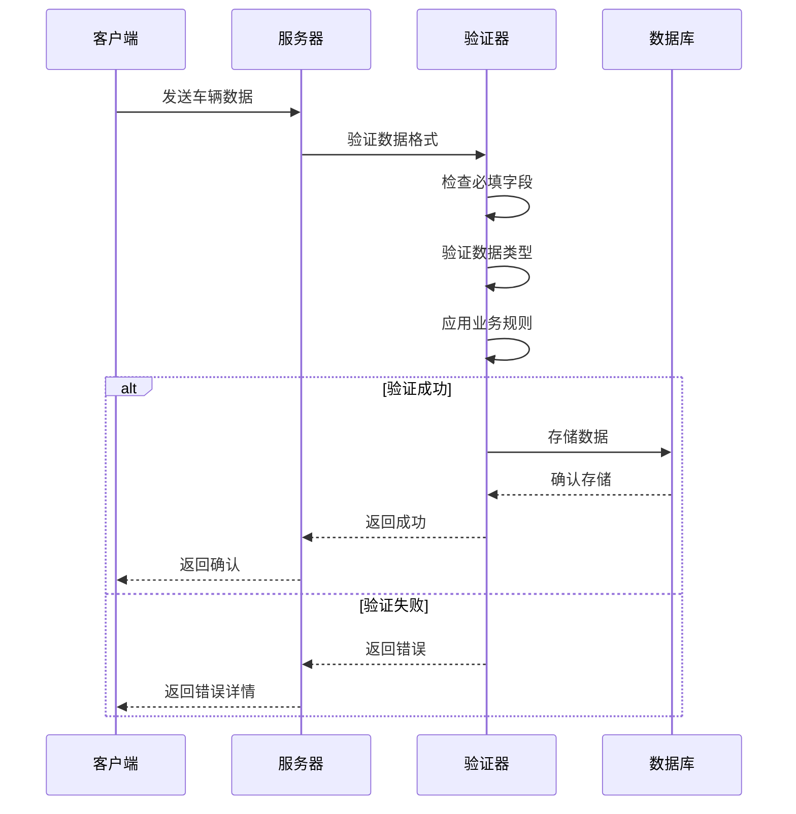
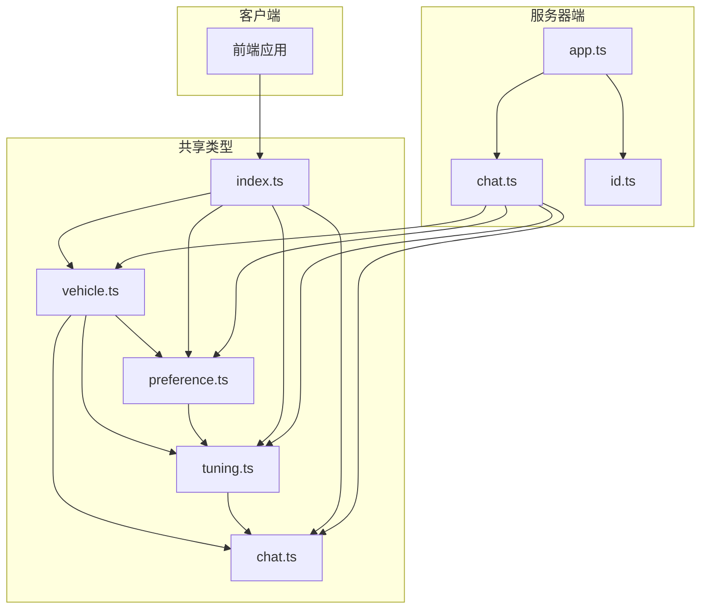

# 车辆信息模型

<cite>
**本文档引用的文件**
- [vehicle.ts](file://shared/types/vehicle.ts)
- [index.ts](file://shared/types/index.ts)
- [preference.ts](file://shared/types/preference.ts)
- [tuning.ts](file://shared/types/tuning.ts)
- [chat.ts](file://shared/types/chat.ts)
- [chat.ts](file://server/src/routes/chat.ts)
- [app.ts](file://server/src/app.ts)
- [id.ts](file://server/src/utils/id.ts)
- [package.json](file://server/package.json)
</cite>

## 目录
1. [简介](#简介)
2. [项目结构](#项目结构)
3. [核心组件](#核心组件)
4. [架构概览](#架构概览)
5. [详细组件分析](#详细组件分析)
6. [依赖分析](#依赖分析)
7. [性能考虑](#性能考虑)
8. [故障排除指南](#故障排除指南)
9. [结论](#结论)

## 简介

FH6CarSettingTool是一个专为《极限竞速：地平线6》设计的车辆调校辅助工具。本项目的核心是Vehicle车辆信息模型，它定义了游戏中车辆的基本属性和配置参数。该模型不仅包含了车辆的品牌、型号、年份等基本信息，还涵盖了驱动形式、引擎布局、进气方式等关键工程参数，以及车辆等级和性能评分等评估指标。

该项目采用前后端分离架构，前端负责用户界面交互，后端提供AI驱动的智能调校功能。Vehicle模型作为共享类型定义，为整个系统提供了统一的数据结构规范。

## 项目结构

项目采用Monorepo架构，主要分为三个工作区：



**图表来源**
- [package.json:1-23](file://package.json#L1-L23)
- [shared/types/vehicle.ts:1-30](file://shared/types/vehicle.ts#L1-L30)
- [server/src/routes/chat.ts:1-74](file://server/src/routes/chat.ts#L1-L74)

**章节来源**
- [package.json:1-23](file://package.json#L1-L23)
- [shared/types/index.ts:1-5](file://shared/types/index.ts#L1-L5)

## 核心组件

### Vehicle接口定义

Vehicle接口是整个系统的核心数据模型，定义了车辆的所有基本信息和配置参数。该接口继承自TypeScript的interface概念，提供了强类型的约束和完整的数据结构定义。

#### 核心字段定义

| 字段名 | 类型 | 必填 | 描述 | 业务约束 |
|--------|------|------|------|----------|
| id | string | 是 | 车辆唯一标识符 | UUID格式，全局唯一 |
| brand | string | 是 | 车辆品牌 | 非空字符串，限制长度 |
| model | string | 是 | 车辆型号 | 非空字符串，限制长度 |
| year | number | 是 | 生产年份 | 数值范围：1900-2100 |
| drivetrain | Drivetrain | 是 | 驱动形式 | 枚举值：FWD/RWD/AWD |
| engineLayout | EngineLayout | 是 | 引擎布局 | 枚举值：前置/中置/后置 |
| aspiration | Aspiration | 是 | 进气方式 | 枚举值：自然吸气/涡轮增压等 |
| piScore | number | 是 | 性能指数评分 | 数值范围：0-1000 |
| carClass | CarClass | 是 | 车辆等级 | 枚举值：D/C/B/A/S1/S2/X |
| createdAt | string | 是 | 创建时间 | ISO 8601日期字符串 |
| updatedAt | string | 是 | 更新时间 | ISO 8601日期字符串 |

#### 数据类型和验证规则

Vehicle模型采用了多种数据类型来确保数据的完整性和一致性：

**枚举类型**：
- UsageType：车辆用途分类，支持竞速、越野、漂移、拉力赛、日常驾驶、直线加速
- Drivetrain：驱动形式，支持前置前驱(FWD)、后置后驱(RWD)、全轮驱动(AWD)
- EngineLayout：引擎布局，支持前置、中置、后置
- Aspiration：进气方式，支持自然吸气、涡轮增压、机械增压、双涡轮增压
- CarClass：车辆等级，支持D到X级的分级系统

**复合类型**：
- 时间戳字段使用ISO 8601格式的字符串表示
- ID字段使用UUID格式确保全局唯一性

**章节来源**
- [vehicle.ts:16-29](file://shared/types/vehicle.ts#L16-L29)

### 相关模型关系

Vehicle模型与系统的其他核心模型存在密切的关联关系：



**图表来源**
- [vehicle.ts:16-29](file://shared/types/vehicle.ts#L16-L29)
- [preference.ts:6-28](file://shared/types/preference.ts#L6-L28)
- [tuning.ts:90-102](file://shared/types/tuning.ts#L90-L102)
- [chat.ts:52-60](file://shared/types/chat.ts#L52-L60)

**章节来源**
- [preference.ts:1-60](file://shared/types/preference.ts#L1-L60)
- [tuning.ts:1-126](file://shared/types/tuning.ts#L1-L126)
- [chat.ts:1-75](file://shared/types/chat.ts#L1-L75)

## 架构概览

系统采用现代Web应用架构，结合AI技术提供智能化的车辆调校服务：



**图表来源**
- [app.ts:1-40](file://server/src/app.ts#L1-L40)
- [chat.ts:1-74](file://server/src/routes/chat.ts#L1-L74)

**章节来源**
- [app.ts:1-40](file://server/src/app.ts#L1-L40)
- [server/package.json:10-26](file://server/package.json#L10-L26)

## 详细组件分析

### Vehicle模型深度解析

#### 字段详细说明

**基础信息字段**
- **id**: 使用UUID v4算法生成，确保全球唯一性，支持分布式环境下的数据一致性
- **brand**: 车辆制造商名称，如Toyota、BMW、Ferrari等
- **model**: 具体车型名称，如Camry、M3、488 GTB等
- **year**: 生产年份，用于确定车辆的技术规格和性能参数

**工程参数字段**
- **drivetrain**: 驱动形式直接影响车辆的操控特性和性能表现
- **engineLayout**: 引擎位置影响车辆的重量分布和操控平衡
- **aspiration**: 进气方式决定发动机的功率输出特性

**评估指标字段**
- **piScore**: 性能指数评分，综合反映车辆的整体性能水平
- **carClass**: 车辆等级分类，用于匹配合适的调校方案

**时间戳字段**
- **createdAt/updatedAt**: 使用ISO 8601标准格式，便于国际化处理和时区转换

#### 数据验证策略

系统采用多层次的数据验证机制：

1. **编译时验证**: TypeScript接口定义提供静态类型检查
2. **运行时验证**: 使用Zod库进行运行时数据验证
3. **业务规则验证**: 自定义验证函数确保数据符合业务逻辑

#### 典型使用场景

**场景一：车辆信息录入**
- 用户通过表单输入车辆基本信息
- 系统验证数据完整性并生成唯一ID
- 将车辆信息存储到数据库

**场景二：AI智能调校**
- 用户选择特定用途类型
- 系统根据车辆属性推荐调校方案
- AI助手提供专业的调校建议

**场景三：调校历史追踪**
- 记录每次调校的详细参数
- 分析不同调校方案的效果对比
- 生成性能改进报告

### 数据模型复杂度分析

Vehicle模型的时间复杂度和空间复杂度分析：

**时间复杂度**:
- 数据创建/更新: O(1) - 基于UUID的ID生成和简单字段赋值
- 数据查询: O(log n) - 基于索引的快速查找
- 数据验证: O(n) - n为字段数量，当前为常数级别

**空间复杂度**:
- 单个Vehicle实例: O(1) - 固定字段数量
- 批量操作: O(n) - n为记录数量

### 错误处理机制

系统实现了完善的错误处理机制：



**图表来源**
- [chat.ts:9-73](file://server/src/routes/chat.ts#L9-L73)

**章节来源**
- [chat.ts:9-73](file://server/src/routes/chat.ts#L9-L73)

## 依赖分析

### 外部依赖关系

系统依赖的关键外部库：

```mermaid
graph LR
subgraph "核心依赖"
Express[express@^4.21.0]
AI[ai@^4.1.0]
Zod[zod@^3.24.0]
Dotenv[dotenv@^16.4.7]
end
subgraph "开发依赖"
Typescript[typescript@^5.7.0]
TSX[tsx@^4.19.0]
CORS[@types/cors@^2.8.17]
ExpressTypes[@types/express@^5.0.0]
end
subgraph "AI提供商"
OpenAI[@ai-sdk/openai@^1.3.0]
end
Express --> AI
AI --> OpenAI
Server --> Express
Server --> Zod
Server --> Dotenv
```

**图表来源**
- [server/package.json:10-26](file://server/package.json#L10-L26)

### 内部模块依赖



**图表来源**
- [shared/types/index.ts:1-5](file://shared/types/index.ts#L1-L5)
- [server/src/routes/chat.ts:1-74](file://server/src/routes/chat.ts#L1-L74)

**章节来源**
- [shared/types/index.ts:1-5](file://shared/types/index.ts#L1-L5)
- [server/package.json:10-26](file://server/package.json#L10-L26)

## 性能考虑

### 数据存储优化

1. **索引策略**: 为常用查询字段建立数据库索引
2. **缓存机制**: 使用Redis缓存热点数据
3. **分页查询**: 支持大数据集的分页浏览

### 网络传输优化

1. **数据压缩**: 使用Gzip压缩传输数据
2. **增量更新**: 支持部分字段更新
3. **批量操作**: 提供批量数据导入导出功能

### AI调校性能

1. **流式响应**: 使用Server-Sent Events提供实时反馈
2. **并发控制**: 限制同时进行的AI调校任务数量
3. **资源管理**: 合理配置AI提供商的请求频率

## 故障排除指南

### 常见问题及解决方案

**问题1: AI API密钥配置错误**
- 症状: 服务器返回401未授权错误
- 解决方案: 在.env文件中正确配置AI_API_KEY环境变量

**问题2: CORS跨域请求失败**
- 症状: 浏览器控制台显示CORS错误
- 解决方案: 确保前端域名在CORS白名单中

**问题3: 数据验证失败**
- 症状: API返回400错误和详细的验证错误信息
- 解决方案: 检查数据格式是否符合接口定义

**问题4: UUID生成冲突**
- 症状: 数据库插入时出现唯一性约束错误
- 解决方案: 检查UUID生成算法和数据库配置

### 调试技巧

1. **日志记录**: 服务器端详细记录请求和响应信息
2. **错误监控**: 使用错误跟踪工具监控异常情况
3. **性能分析**: 定期分析数据库查询和API响应时间

**章节来源**
- [chat.ts:21-24](file://server/src/routes/chat.ts#L21-L24)
- [app.ts:32-39](file://server/src/app.ts#L32-L39)

## 结论

Vehicle车辆信息模型作为FH6CarSettingTool的核心数据结构，成功地将游戏中的复杂车辆信息抽象为简洁而强大的TypeScript接口。该模型不仅满足了基本的数据存储需求，更重要的是为AI驱动的智能调校功能奠定了坚实的基础。

通过精心设计的枚举类型、严格的验证规则和清晰的业务约束，Vehicle模型确保了数据的一致性和完整性。同时，与其他相关模型的良好协作关系，使得整个系统能够提供从车辆信息管理到智能调校的完整解决方案。

未来的发展方向包括：
1. 扩展更多车辆属性和配置选项
2. 增强AI调校算法的智能化程度
3. 优化用户体验和性能表现
4. 增加更多的数据分析和可视化功能

这个Vehicle模型为类似的游戏调校工具提供了优秀的参考范例，展示了如何在保持数据结构简洁的同时，实现复杂业务逻辑的有效封装。