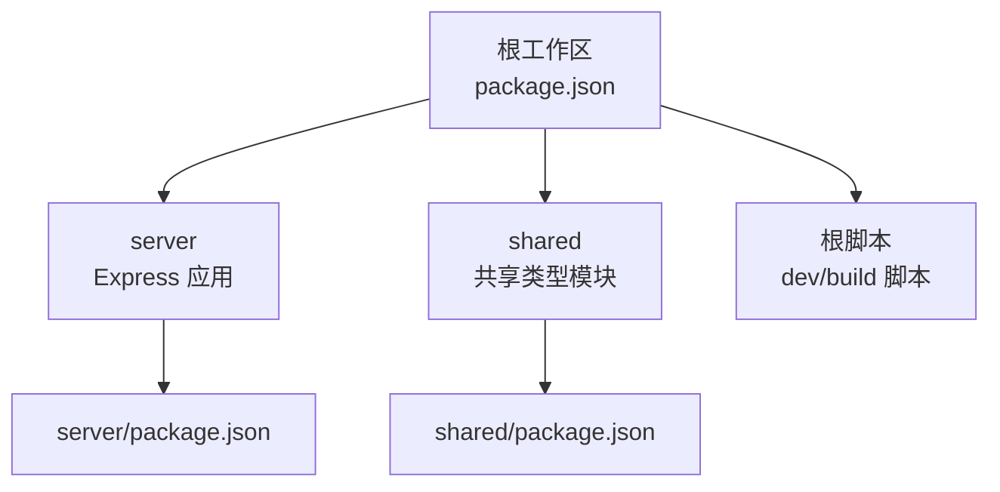
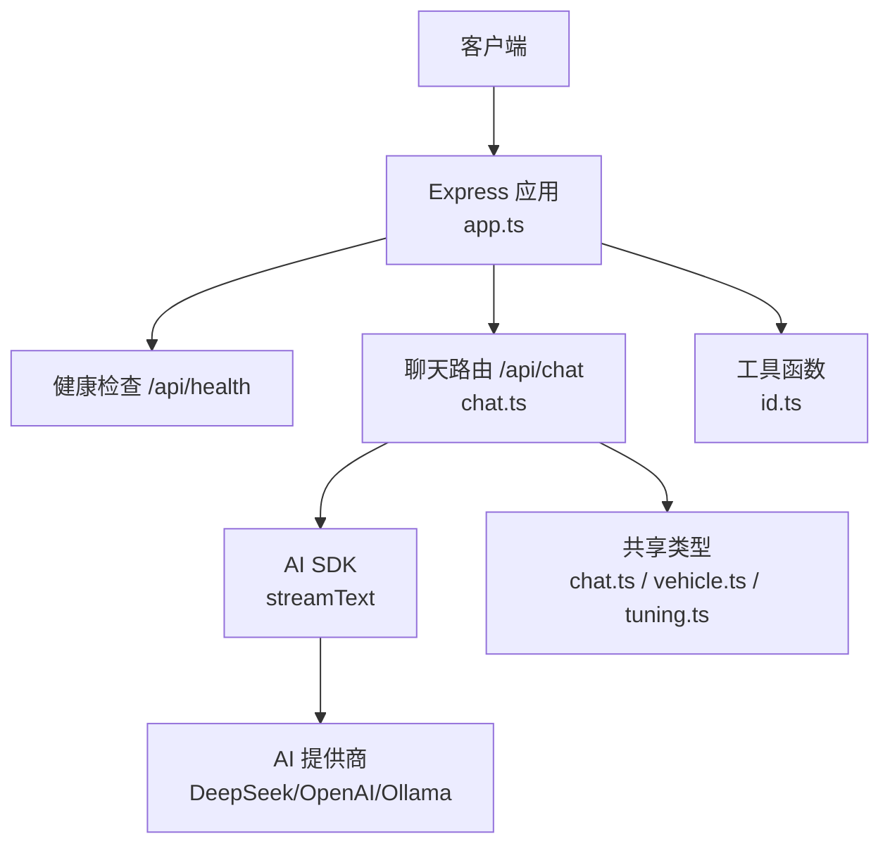
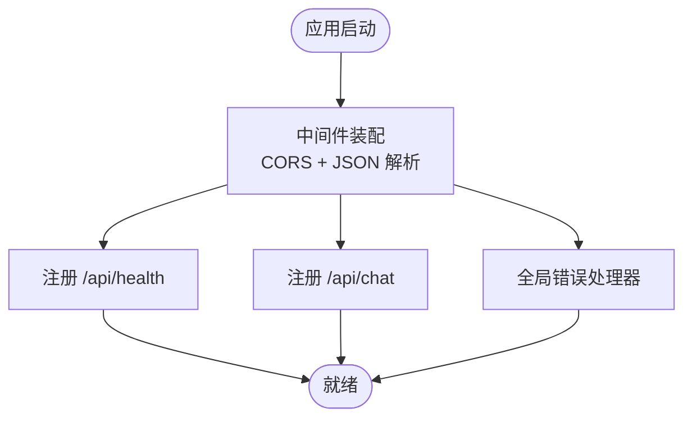
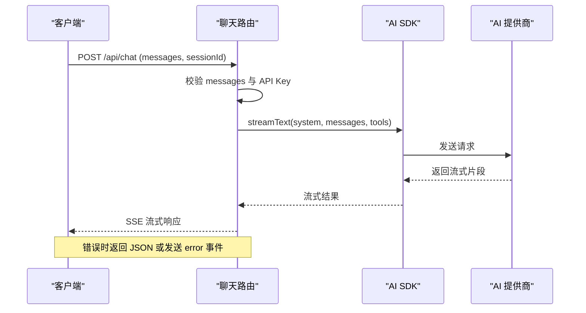
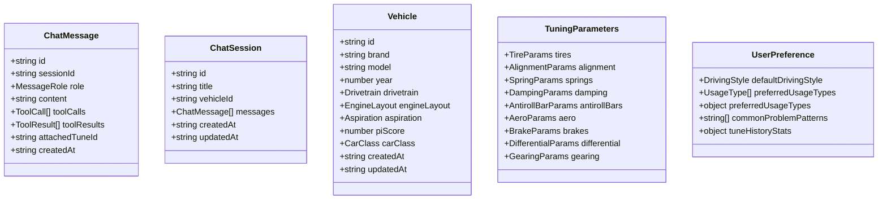
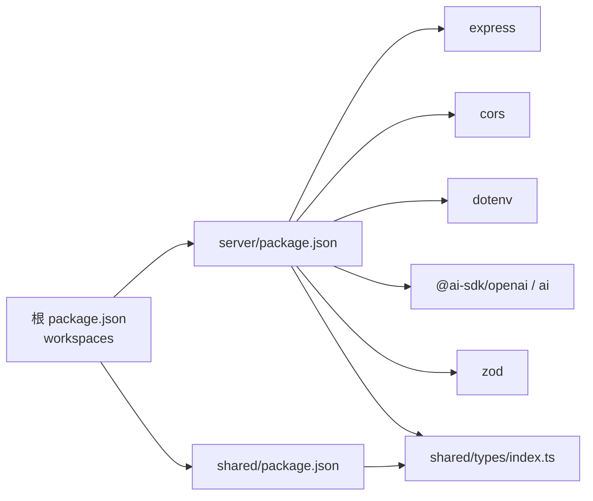

# 系统架构

<cite>
**本文档引用的文件**
- [server/src/index.ts](file://server/src/index.ts)
- [server/src/app.ts](file://server/src/app.ts)
- [server/src/routes/chat.ts](file://server/src/routes/chat.ts)
- [server/src/utils/id.ts](file://server/src/utils/id.ts)
- [server/package.json](file://server/package.json)
- [shared/types/index.ts](file://shared/types/index.ts)
- [shared/types/chat.ts](file://shared/types/chat.ts)
- [shared/types/vehicle.ts](file://shared/types/vehicle.ts)
- [shared/types/tuning.ts](file://shared/types/tuning.ts)
- [shared/types/preference.ts](file://shared/types/preference.ts)
- [shared/package.json](file://shared/package.json)
- [package.json](file://package.json)
</cite>

## 目录
1. [引言](#引言)
2. [项目结构](#项目结构)
3. [核心组件](#核心组件)
4. [架构总览](#架构总览)
5. [详细组件分析](#详细组件分析)
6. [依赖关系分析](#依赖关系分析)
7. [性能考量](#性能考量)
8. [故障排除指南](#故障排除指南)
9. [结论](#结论)

## 引言
本项目为 FH6 汽车设置工具，采用 Monorepo 架构组织，包含 Express.js 应用服务器、共享类型模块与 AI 集成模块。系统通过统一的共享类型模块实现前后端一致的数据契约，通过 Express 路由层提供 RESTful 接口，并以流式 SSE 方式与 AI 提供商进行实时通信，支持基于工具函数的智能调校建议。

## 项目结构
项目采用工作区（workspaces）组织，根目录通过脚本统一管理开发与构建流程；server 作为后端服务，shared 作为共享类型定义，二者通过类型契约解耦，便于独立演进与复用。

图表来源
- [package.json:1-23](file://package.json#L1-L23)
- [server/package.json:1-26](file://server/package.json#L1-L26)
- [shared/package.json:1-8](file://shared/package.json#L1-L8)

章节来源
- [package.json:6-18](file://package.json#L6-L18)
- [server/package.json:5-9](file://server/package.json#L5-L9)
- [shared/package.json:4-7](file://shared/package.json#L4-L7)

## 核心组件
- Express 应用服务器：负责中间件装配、健康检查、路由注册与全局错误处理。
- 聊天路由：提供对话接口，集成 AI SDK 实现流式对话与工具调用。
- 共享类型模块：集中定义车辆、调校、聊天、偏好等类型，确保前后端一致性。
- ID 工具：提供通用 UUID 生成能力，用于会话与消息标识。

章节来源
- [server/src/app.ts:1-40](file://server/src/app.ts#L1-L40)
- [server/src/routes/chat.ts:1-74](file://server/src/routes/chat.ts#L1-L74)
- [shared/types/index.ts:1-5](file://shared/types/index.ts#L1-L5)
- [server/src/utils/id.ts:1-6](file://server/src/utils/id.ts#L1-L6)

## 架构总览
系统采用三层职责分离：
- 路由层：接收 HTTP 请求，解析参数，触发业务逻辑。
- 业务逻辑层：封装 AI 调用、工具执行与数据流控制。
- 数据访问层：通过环境变量与外部 AI 提供商交互，不直接持久化数据（当前版本）。

图表来源
- [server/src/app.ts:14-29](file://server/src/app.ts#L14-L29)
- [server/src/routes/chat.ts:9-38](file://server/src/routes/chat.ts#L9-L38)
- [shared/types/chat.ts:1-75](file://shared/types/chat.ts#L1-L75)
- [shared/types/vehicle.ts:1-30](file://shared/types/vehicle.ts#L1-L30)
- [shared/types/tuning.ts:1-126](file://shared/types/tuning.ts#L1-L126)
- [server/src/utils/id.ts:3-5](file://server/src/utils/id.ts#L3-L5)

## 详细组件分析

### Express 应用与中间件
- 中间件：启用 CORS 限制来源，允许凭据；解析 JSON 请求体。
- 健康检查：返回服务状态、AI 模型与密钥可用性。
- 路由：挂载聊天路由。
- 错误处理：捕获未处理异常，返回统一错误格式。

图表来源
- [server/src/app.ts:7-39](file://server/src/app.ts#L7-L39)

章节来源
- [server/src/app.ts:1-40](file://server/src/app.ts#L1-L40)

### 聊天路由与 AI 集成
- 请求校验：校验 messages 参数有效性。
- 凭证校验：要求配置 AI API Key。
- AI 调用：使用 AI SDK 的 streamText，配置系统提示与工具集。
- 流式响应：通过 SSE 头部与流读取器推送增量内容。
- 错误处理：根据响应头是否发送决定返回 JSON 或发送错误事件。

图表来源
- [server/src/routes/chat.ts:9-73](file://server/src/routes/chat.ts#L9-L73)

章节来源
- [server/src/routes/chat.ts:1-74](file://server/src/routes/chat.ts#L1-L74)

### 共享类型模块
- 聊天类型：定义消息角色、工具调用/结果、会话与 API 响应格式。
- 车辆类型：定义用途、驱动形式、引擎布局、进气方式、等级等。
- 调校类型：涵盖轮胎、定位、弹簧、阻尼、防倾杆、空气动力学、制动、差速器、变速箱等完整参数集合。
- 偏好类型：定义驾驶风格、偏好用途、倾向与历史统计等。

图表来源
- [shared/types/chat.ts:41-74](file://shared/types/chat.ts#L41-L74)
- [shared/types/vehicle.ts:17-29](file://shared/types/vehicle.ts#L17-L29)
- [shared/types/tuning.ts:68-102](file://shared/types/tuning.ts#L68-L102)
- [shared/types/preference.ts:7-28](file://shared/types/preference.ts#L7-L28)

章节来源
- [shared/types/index.ts:1-5](file://shared/types/index.ts#L1-L5)
- [shared/types/chat.ts:1-75](file://shared/types/chat.ts#L1-L75)
- [shared/types/vehicle.ts:1-30](file://shared/types/vehicle.ts#L1-L30)
- [shared/types/tuning.ts:1-126](file://shared/types/tuning.ts#L1-L126)
- [shared/types/preference.ts:1-60](file://shared/types/preference.ts#L1-L60)

### ID 工具
- 提供 UUID 生成，用于会话与消息标识，保证分布式唯一性。

章节来源
- [server/src/utils/id.ts:1-6](file://server/src/utils/id.ts#L1-L6)

## 依赖关系分析
- 根工作区通过 workspaces 管理 server 与 shared，统一开发与构建脚本。
- server 依赖 express、cors、dotenv、ai、@ai-sdk/openai、zod 等运行时与类型依赖。
- shared 通过 types/index.ts 暴露聚合导出，供 server 使用。
- server 与 shared 之间仅通过共享类型耦合，无运行时代码依赖，降低耦合度。

图表来源
- [package.json:6-10](file://package.json#L6-L10)
- [server/package.json:10-16](file://server/package.json#L10-L16)
- [shared/package.json:4-7](file://shared/package.json#L4-L7)

章节来源
- [package.json:1-23](file://package.json#L1-L23)
- [server/package.json:1-26](file://server/package.json#L1-L26)
- [shared/package.json:1-8](file://shared/package.json#L1-L8)

## 性能考量
- 流式传输：使用 SSE 将 AI 响应以流式方式推送，降低首字节延迟，提升交互体验。
- 资源释放：在流式读取完成后释放锁并结束响应，避免资源泄漏。
- 缓存与连接：设置合适的缓存与连接头部，兼容不同代理与浏览器行为。
- 并发与构建：根脚本通过并发启动前后端开发服务，缩短迭代周期。

章节来源
- [server/src/routes/chat.ts:40-59](file://server/src/routes/chat.ts#L40-L59)
- [package.json:11-17](file://package.json#L11-L17)

## 故障排除指南
- 健康检查：通过 /api/health 快速确认服务状态与 AI 配置可用性。
- API Key 未配置：聊天路由会在缺少密钥时返回明确错误提示。
- 流式错误：若响应头尚未发送，返回 JSON 错误；若已开始 SSE，则发送 error 事件。
- 全局错误：未捕获异常统一返回 500 与错误信息。

章节来源
- [server/src/app.ts:14-26](file://server/src/app.ts#L14-L26)
- [server/src/routes/chat.ts:21-24](file://server/src/routes/chat.ts#L21-L24)
- [server/src/routes/chat.ts:64-71](file://server/src/routes/chat.ts#L64-L71)
- [server/src/app.ts:31-39](file://server/src/app.ts#L31-L39)

## 结论
本系统通过 Monorepo 与分层架构实现了清晰的职责划分与低耦合设计。Express 应用提供稳定的服务入口，共享类型模块保障数据契约一致性，AI 集成模块以流式方式提供高性能交互体验。未来可在数据访问层引入持久化与缓存策略，在路由层增加鉴权与限流机制，进一步增强可扩展性与安全性。