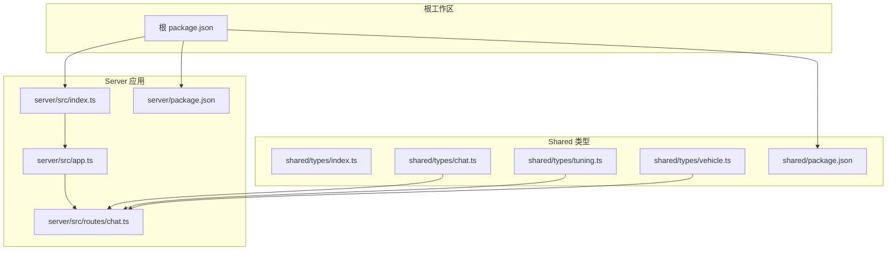
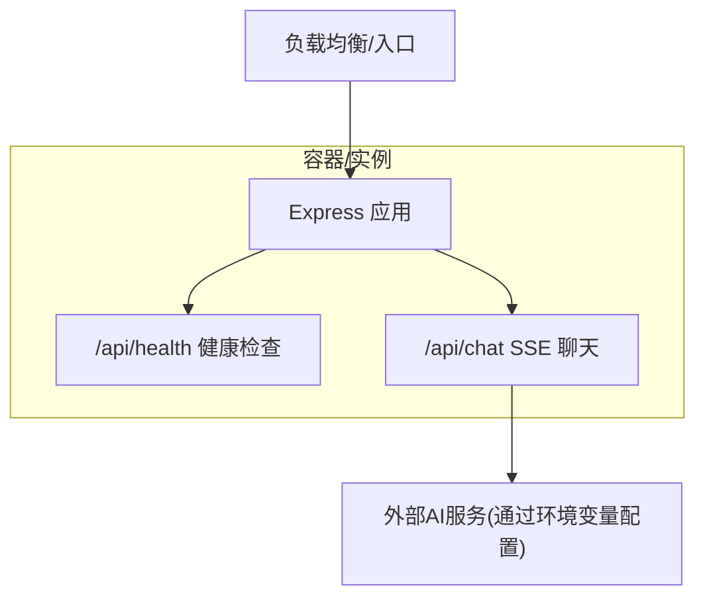
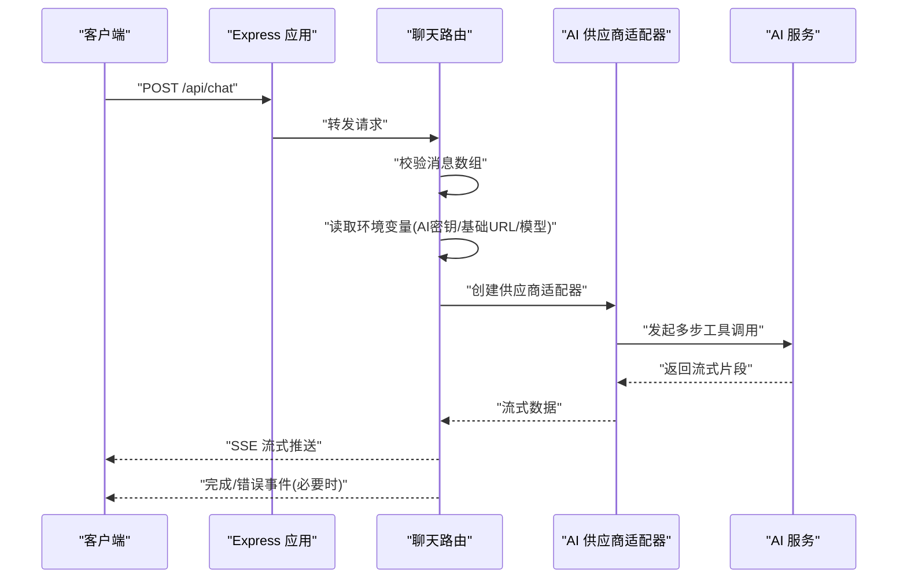
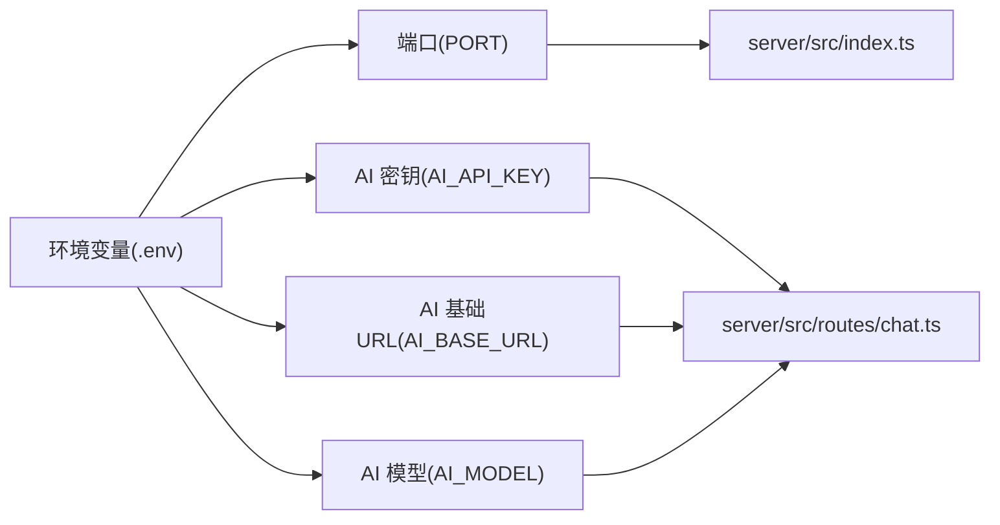

# 云平台部署

<cite>
**本文引用的文件**
- [server/src/index.ts](file://server/src/index.ts)
- [server/src/app.ts](file://server/src/app.ts)
- [server/src/routes/chat.ts](file://server/src/routes/chat.ts)
- [server/package.json](file://server/package.json)
- [shared/types/chat.ts](file://shared/types/chat.ts)
- [shared/types/tuning.ts](file://shared/types/tuning.ts)
- [shared/types/vehicle.ts](file://shared/types/vehicle.ts)
- [package.json](file://package.json)
</cite>

## 目录
1. [简介](#简介)
2. [项目结构](#项目结构)
3. [核心组件](#核心组件)
4. [架构总览](#架构总览)
5. [详细组件分析](#详细组件分析)
6. [依赖关系分析](#依赖关系分析)
7. [性能与可扩展性](#性能与可扩展性)
8. [故障排查指南](#故障排查指南)
9. [结论](#结论)
10. [附录：云平台部署指南](#附录云平台部署指南)

## 简介
本指南面向FH6汽车设置工具的云平台部署，覆盖AWS、Azure、Google Cloud Platform三大平台的部署路径与最佳实践。系统采用Node.js + Express后端，提供健康检查与流式SSE对话接口，并通过环境变量接入外部AI模型服务。部署目标是实现高可用、可观测、可扩展的云原生服务。

## 项目结构
- 根工作区使用npm workspaces组织，包含server、shared、client三个子项目。
- server为Express应用，提供REST API与SSE流式对话能力。
- shared定义前后端共享的类型定义，确保数据契约一致。
- package.json集中管理开发与构建脚本，支持并行开发与分包构建。

**图表来源**
- [package.json:1-23](file://package.json#L1-L23)
- [server/src/index.ts:1-11](file://server/src/index.ts#L1-L11)
- [server/src/app.ts:1-40](file://server/src/app.ts#L1-L40)
- [server/src/routes/chat.ts:1-74](file://server/src/routes/chat.ts#L1-L74)
- [shared/types/index.ts:1-5](file://shared/types/index.ts#L1-L5)

**章节来源**
- [package.json:1-23](file://package.json#L1-L23)
- [server/src/index.ts:1-11](file://server/src/index.ts#L1-L11)
- [server/src/app.ts:1-40](file://server/src/app.ts#L1-L40)
- [server/src/routes/chat.ts:1-74](file://server/src/routes/chat.ts#L1-L74)
- [shared/types/index.ts:1-5](file://shared/types/index.ts#L1-L5)

## 核心组件
- 应用入口与监听
  - 读取端口环境变量，启动Express应用；同时输出AI模型与端点信息用于诊断。
- 应用主体
  - 注册CORS中间件，限制来源为本地开发端口；注册JSON解析中间件。
  - 提供健康检查接口，返回服务状态、AI配置与密钥存在性。
  - 注册聊天路由，处理SSE流式响应。
  - 全局错误处理器，统一返回500错误。
- 聊天路由
  - 校验请求体消息数组；从环境变量读取AI密钥、基础URL与模型名。
  - 使用AI SDK创建供应商适配器，执行多步工具调用，以SSE流式输出结果。
  - 在SSE开始前发生错误时返回JSON错误；否则发送SSE错误事件并结束连接。
- 类型定义
  - 统一定义AI提供商类型、默认配置、消息角色、工具调用/结果、会话与消息结构、车辆与调校参数等。

**章节来源**
- [server/src/index.ts:1-11](file://server/src/index.ts#L1-L11)
- [server/src/app.ts:1-40](file://server/src/app.ts#L1-L40)
- [server/src/routes/chat.ts:1-74](file://server/src/routes/chat.ts#L1-L74)
- [shared/types/chat.ts:1-75](file://shared/types/chat.ts#L1-L75)
- [shared/types/tuning.ts:1-126](file://shared/types/tuning.ts#L1-L126)
- [shared/types/vehicle.ts:1-30](file://shared/types/vehicle.ts#L1-L30)

## 架构总览
后端服务通过单一进程运行，使用SSE向客户端推送AI生成内容。健康检查接口便于负载均衡探活与编排系统观测。整体架构简洁，适合容器化与云原生存储。

[此图为概念性架构示意，不直接映射具体源码文件]

## 详细组件分析

### 组件A：应用入口与监听
- 功能要点
  - 从环境变量读取端口，默认3001。
  - 启动后打印服务地址与AI配置摘要，便于运维观察。
- 关键路径
  - [server/src/index.ts:1-11](file://server/src/index.ts#L1-L11)

**章节来源**
- [server/src/index.ts:1-11](file://server/src/index.ts#L1-L11)

### 组件B：应用主体与中间件
- 功能要点
  - CORS允许本地开发域访问，支持凭证。
  - JSON解析中间件启用。
  - 健康检查返回AI模型、基础URL与密钥存在性。
  - 全局错误处理器统一返回500。
- 关键路径
  - [server/src/app.ts:1-40](file://server/src/app.ts#L1-L40)

**章节来源**
- [server/src/app.ts:1-40](file://server/src/app.ts#L1-L40)

### 组件C：聊天路由与SSE流
- 功能要点
  - 校验消息数组有效性。
  - 从环境变量读取AI密钥、基础URL与模型名。
  - 创建AI供应商适配器，执行多步工具调用。
  - 设置SSE响应头，以流式方式推送数据。
  - 错误处理：若尚未发送响应头则返回JSON；否则发送SSE错误事件并结束。
- 关键路径
  - [server/src/routes/chat.ts:1-74](file://server/src/routes/chat.ts#L1-L74)

**图表来源**
- [server/src/routes/chat.ts:1-74](file://server/src/routes/chat.ts#L1-L74)

**章节来源**
- [server/src/routes/chat.ts:1-74](file://server/src/routes/chat.ts#L1-L74)

### 组件D：类型定义与数据契约
- 功能要点
  - 定义AI提供商类型与默认配置。
  - 定义消息角色、工具调用/结果、会话与消息结构。
  - 定义车辆属性与调校参数集合，含范围约束。
- 关键路径
  - [shared/types/chat.ts:1-75](file://shared/types/chat.ts#L1-L75)
  - [shared/types/tuning.ts:1-126](file://shared/types/tuning.ts#L1-L126)
  - [shared/types/vehicle.ts:1-30](file://shared/types/vehicle.ts#L1-L30)

**章节来源**
- [shared/types/chat.ts:1-75](file://shared/types/chat.ts#L1-L75)
- [shared/types/tuning.ts:1-126](file://shared/types/tuning.ts#L1-L126)
- [shared/types/vehicle.ts:1-30](file://shared/types/vehicle.ts#L1-L30)

## 依赖关系分析
- 语言与框架
  - Node.js + Express作为Web框架；SSE用于实时流式输出。
- 外部依赖
  - AI SDK与供应商适配器用于调用外部模型服务；CORS用于跨域控制。
- 环境变量
  - 端口、AI密钥、基础URL、模型名等通过环境变量注入，便于不同环境差异化配置。
- 类型共享
  - shared/types确保前后端数据结构一致，降低联调成本。

**图表来源**
- [server/src/index.ts:1-11](file://server/src/index.ts#L1-L11)
- [server/src/routes/chat.ts:1-74](file://server/src/routes/chat.ts#L1-L74)

**章节来源**
- [server/package.json:1-26](file://server/package.json#L1-L26)
- [server/src/index.ts:1-11](file://server/src/index.ts#L1-L11)
- [server/src/routes/chat.ts:1-74](file://server/src/routes/chat.ts#L1-L74)

## 性能与可扩展性
- 单实例性能
  - 应用为无状态单进程，适合水平扩展；SSE长连接需注意连接数与内存占用。
- 扩展策略
  - 通过容器编排实现副本扩缩容；结合健康检查与就绪探针保障流量切换。
- 负载均衡
  - 建议使用平台提供的LB或Ingress，开启健康检查与会话亲和（如需要）。
- 缓存与限流
  - 对频繁查询的静态资源与AI调用结果进行缓存；对聊天接口实施速率限制。
- 监控与日志
  - 集成平台内置监控（CloudWatch、Application Insights、Stackdriver），采集指标与日志，设置告警阈值。

[本节为通用建议，不直接分析具体源码文件]

## 故障排查指南
- 健康检查失败
  - 确认端口与环境变量是否正确；检查CORS白名单是否包含前端域名。
- SSE连接异常
  - 检查SSE响应头设置；确认上游AI服务可用且密钥有效。
- 500错误
  - 查看全局错误处理器输出的日志；定位具体中间件或路由异常。
- 环境变量问题
  - 确保AI_API_KEY、AI_BASE_URL、AI_MODEL等变量在部署环境中生效。

**章节来源**
- [server/src/app.ts:31-39](file://server/src/app.ts#L31-L39)
- [server/src/routes/chat.ts:60-73](file://server/src/routes/chat.ts#L60-L73)

## 结论
FH6汽车设置工具具备清晰的后端架构与明确的云原生特性，适合在三大主流云平台上进行容器化部署。通过合理的负载均衡、SSL证书、自动扩展与监控体系，可实现稳定、可观测、可扩展的生产级服务。

[本节为总结性内容，不直接分析具体源码文件]

## 附录：云平台部署指南

### AWS 部署步骤（概要）
- EC2 实例配置
  - 选择最小Linux实例规格，安装Docker或Container Runtime。
  - 开放端口（如80/443与应用端口），配置安全组与入站规则。
  - 使用用户数据或启动模板部署容器镜像。
- ECS 容器服务
  - 在ECS集群中创建任务定义，指定镜像、端口映射与环境变量。
  - 创建服务，设置期望容量与自动扩展策略（基于CPU/内存或自定义指标）。
  - 将服务置于ALB之下，启用健康检查与会话亲和（如需要）。
- Route 53 域名设置
  - 在Route 53中创建托管区域，添加A记录指向ALB或Elastic IP。
  - 申请并绑定ACM证书，确保HTTPS生效。
- 负载均衡与SSL
  - ALB监听443，重定向80至443；启用TLS加密与安全策略。
- 自动扩展
  - 基于CPU利用率或自定义指标（如请求延迟、队列长度）触发扩缩容。
- 监控与日志
  - 集成CloudWatch Logs与指标，配置告警；使用X-Ray追踪请求链路。

[本节为AWS平台部署步骤概述，不直接分析具体源码文件]

### Azure 部署步骤（概要）
- App Service
  - 选择计划类型与区域，配置应用设置（端口、AI相关环境变量）。
  - 启用HTTPS与自定义域名，绑定证书。
- Container Instances
  - 使用Docker镜像创建容器实例，设置环境变量与端口暴露。
  - 通过Azure Load Balancer或Application Gateway对外暴露。
- Azure DNS
  - 在Azure DNS中创建区域，添加A/AAAA记录指向LB或CI。
- 负载均衡与SSL
  - Application Gateway或Load Balancer监听443，启用WAF与TLS终止。
- 自动扩展
  - 基于CPU/请求量或自定义指标触发自动扩缩容。
- 监控与日志
  - 使用Application Insights收集遥测；Log Analytics聚合日志并设置告警。

[本节为Azure平台部署步骤概述，不直接分析具体源码文件]

### Google Cloud Platform 部署步骤（概要）
- Compute Engine
  - 创建防火墙规则开放端口；安装容器运行时并部署镜像。
- Cloud Run
  - 使用服务网格与无服务器特性，按请求扩缩容。
  - 配置环境变量与身份认证；启用HTTPS与自定义域名。
- Cloud DNS
  - 在Cloud DNS中创建区域，添加记录指向Run服务或LB。
- 负载均衡与SSL
  - 使用Global Load Balancing，启用CDN与WAF；自动管理证书。
- 自动扩展
  - 基于CPU、QPS或自定义指标触发扩缩容。
- 监控与日志
  - 使用Cloud Monitoring与Cloud Logging；集成Stackdriver Profiler与Trace。

[本节为GCP平台部署步骤概述，不直接分析具体源码文件]

### 通用运维最佳实践
- 成本优化
  - 使用预留实例或节省计划；启用自动扩缩容避免资源浪费。
  - 选择合适实例规格与存储类型；清理未使用镜像与快照。
- 安全加固
  - 仅暴露必要端口；启用网络ACL与WAF；定期轮换密钥。
  - 使用平台提供的Secret Manager或Key Vault管理敏感信息。
- 可靠性
  - 多可用区部署；健康检查与就绪探针；蓝绿/金丝雀发布。
- 观察性
  - 统一日志格式与标签；设置关键指标阈值与告警；定期审查SLA。

[本节为通用运维建议，不直接分析具体源码文件]