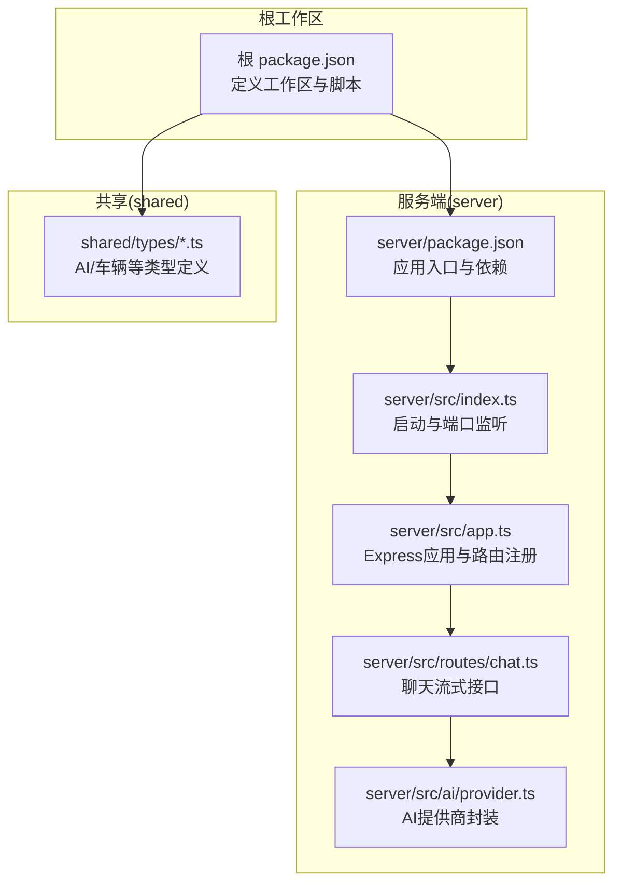
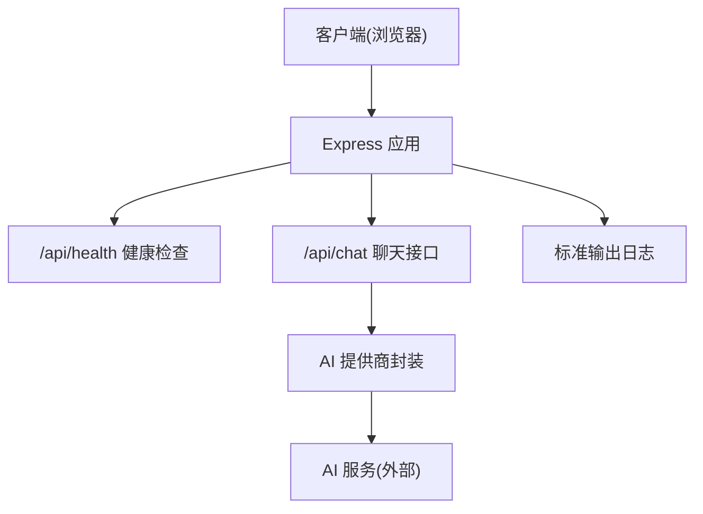
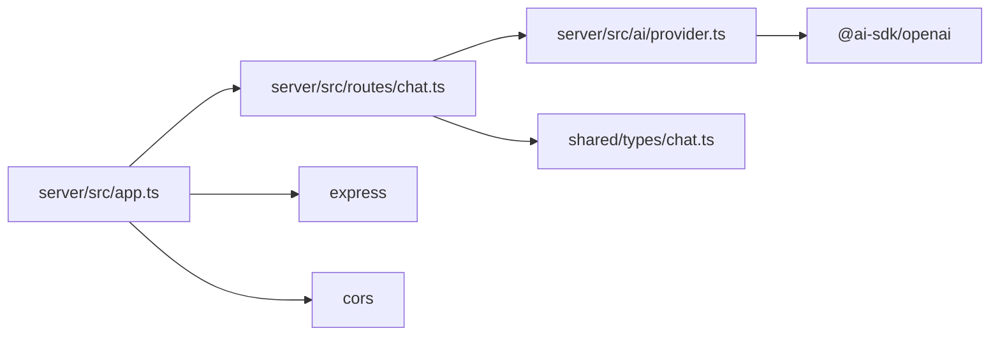

# 容器化部署

<cite>
**本文引用的文件**
- [server/package.json](file://server/package.json)
- [server/src/index.ts](file://server/src/index.ts)
- [server/src/app.ts](file://server/src/app.ts)
- [server/src/routes/chat.ts](file://server/src/routes/chat.ts)
- [server/src/ai/provider.ts](file://server/src/ai/provider.ts)
- [shared/types/chat.ts](file://shared/types/chat.ts)
- [shared/types/vehicle.ts](file://shared/types/vehicle.ts)
- [shared/types/index.ts](file://shared/types/index.ts)
- [package.json](file://package.json)
</cite>

## 目录
1. [简介](#简介)
2. [项目结构](#项目结构)
3. [核心组件](#核心组件)
4. [架构总览](#架构总览)
5. [详细组件分析](#详细组件分析)
6. [依赖关系分析](#依赖关系分析)
7. [性能与资源考虑](#性能与资源考虑)
8. [故障排查指南](#故障排查指南)
9. [结论](#结论)
10. [附录](#附录)

## 简介
本指南面向FH6汽车设置工具的Docker容器化与生产级部署，覆盖以下主题：
- Dockerfile多阶段构建与镜像分层优化
- docker-compose服务编排、网络与卷挂载
- 环境变量与启动参数传递（含AI服务与可选数据库）
- 健康检查、重启策略与日志采集
- Kubernetes生产级部署要点与最佳实践

## 项目结构
FH6项目采用monorepo工作区组织，核心后端位于server目录，共享类型定义位于shared目录。前端客户端位于client目录（当前仓库未包含其源码，但脚本与工作区配置可见）。

**图表来源**
- [package.json:1-23](file://package.json#L1-L23)
- [server/package.json:1-26](file://server/package.json#L1-L26)
- [server/src/index.ts:1-11](file://server/src/index.ts#L1-L11)
- [server/src/app.ts:1-40](file://server/src/app.ts#L1-L40)
- [server/src/routes/chat.ts:1-74](file://server/src/routes/chat.ts#L1-L74)
- [server/src/ai/provider.ts:1-16](file://server/src/ai/provider.ts#L1-L16)
- [shared/types/chat.ts:1-75](file://shared/types/chat.ts#L1-L75)
- [shared/types/vehicle.ts:1-30](file://shared/types/vehicle.ts#L1-L30)
- [shared/types/index.ts:1-5](file://shared/types/index.ts#L1-L5)

**章节来源**
- [package.json:1-23](file://package.json#L1-L23)
- [server/package.json:1-26](file://server/package.json#L1-L26)

## 核心组件
- 应用入口与启动
  - 通过dotenv加载环境变量，监听端口并输出AI配置摘要。
  - 参考路径：[server/src/index.ts:1-11](file://server/src/index.ts#L1-L11)
- Express应用与中间件
  - 注册CORS、JSON解析；提供健康检查接口；统一错误处理。
  - 参考路径：[server/src/app.ts:1-40](file://server/src/app.ts#L1-L40)
- 聊天流式接口
  - 接收消息数组，校验参数；从环境变量读取AI密钥、端点与模型；使用AI SDK进行流式对话；支持SSE。
  - 参考路径：[server/src/routes/chat.ts:1-74](file://server/src/routes/chat.ts#L1-L74)
- AI提供商封装
  - 基于@ai-sdk/openai创建OpenAI兼容客户端，支持自定义baseURL与模型。
  - 参考路径：[server/src/ai/provider.ts:1-16](file://server/src/ai/provider.ts#L1-L16)
- 共享类型定义
  - 包含AI提供商类型、默认配置、消息与会话结构、API响应格式等。
  - 参考路径：[shared/types/chat.ts:1-75](file://shared/types/chat.ts#L1-L75)，[shared/types/vehicle.ts:1-30](file://shared/types/vehicle.ts#L1-L30)，[shared/types/index.ts:1-5](file://shared/types/index.ts#L1-L5)

**章节来源**
- [server/src/index.ts:1-11](file://server/src/index.ts#L1-L11)
- [server/src/app.ts:1-40](file://server/src/app.ts#L1-L40)
- [server/src/routes/chat.ts:1-74](file://server/src/routes/chat.ts#L1-L74)
- [server/src/ai/provider.ts:1-16](file://server/src/ai/provider.ts#L1-L16)
- [shared/types/chat.ts:1-75](file://shared/types/chat.ts#L1-L75)
- [shared/types/vehicle.ts:1-30](file://shared/types/vehicle.ts#L1-L30)
- [shared/types/index.ts:1-5](file://shared/types/index.ts#L1-L5)

## 架构总览
下图展示容器内服务的运行时交互：客户端通过HTTP访问后端，后端根据环境变量选择AI提供商，发起AI请求并以SSE流式返回结果。

**图表来源**
- [server/src/app.ts:14-29](file://server/src/app.ts#L14-L29)
- [server/src/routes/chat.ts:9-38](file://server/src/routes/chat.ts#L9-L38)
- [server/src/ai/provider.ts:9-15](file://server/src/ai/provider.ts#L9-L15)

## 详细组件分析

### 组件一：Dockerfile 多阶段构建与镜像优化
目标
- 最小化镜像体积与攻击面
- 优化构建缓存命中率
- 明确运行用户与权限

建议分层策略
- 第一阶段：安装构建依赖，执行编译，生成dist产物
- 第二阶段：仅复制必要运行时文件，设置非root用户，暴露端口，设置健康检查
- 使用.dockerignore排除node_modules、.git、开发依赖与构建中间文件

镜像层缓存优化
- 将固定不变的依赖安装步骤放在靠前层
- 将变更频繁的源码复制放在靠后层
- 使用多阶段构建避免将开发工具带入最终镜像

安全最佳实践
- 运行时使用非root用户
- 限制文件系统写入能力
- 仅暴露必要端口
- 不在镜像中硬编码敏感信息，通过环境变量注入

参考实现位置
- 构建脚本与依赖定义：[server/package.json:1-26](file://server/package.json#L1-L26)
- 应用入口与端口监听：[server/src/index.ts:1-11](file://server/src/index.ts#L1-L11)

**章节来源**
- [server/package.json:1-26](file://server/package.json#L1-L26)
- [server/src/index.ts:1-11](file://server/src/index.ts#L1-L11)

### 组件二：docker-compose.yml 服务编排
目标
- 定义服务、网络、卷与环境变量
- 支持开发与预发布环境快速启动

建议配置要点
- 服务名称：fh6-server
- 端口映射：将容器端口映射到宿主端口
- 环境变量：通过env_file或environment传入AI相关变量
- 卷挂载：挂载共享类型目录或配置文件（如需）
- 网络：使用自定义桥接网络，便于服务发现
- 健康检查：基于/api/health端点
- 重启策略：unless-stopped 或 on-failure

参考实现位置
- 健康检查端点：[server/src/app.ts:14-26](file://server/src/app.ts#L14-L26)
- 端口监听逻辑：[server/src/index.ts:4](file://server/src/index.ts#L4)

**章节来源**
- [server/src/app.ts:14-26](file://server/src/app.ts#L14-L26)
- [server/src/index.ts:4](file://server/src/index.ts#L4)

### 组件三：容器启动参数与环境变量传递
关键环境变量
- PORT：服务监听端口，默认值见应用入口
- AI_API_KEY：AI服务密钥（必需）
- AI_BASE_URL：AI服务基础URL（可选，默认值见应用）
- AI_MODEL：模型名称（可选，默认值见应用）

传递方式
- docker run -e 或 docker-compose environment
- 使用env_file加载
- 在CI/CD中通过Secrets管理敏感变量

参考实现位置
- 端口与AI配置输出：[server/src/index.ts:4-10](file://server/src/index.ts#L4-L10)
- 健康检查返回的AI配置字段：[server/src/app.ts:18-22](file://server/src/app.ts#L18-L22)
- 聊天接口读取AI配置与鉴权：[server/src/routes/chat.ts:17-24](file://server/src/routes/chat.ts#L17-L24)

**章节来源**
- [server/src/index.ts:4-10](file://server/src/index.ts#L4-L10)
- [server/src/app.ts:18-22](file://server/src/app.ts#L18-L22)
- [server/src/routes/chat.ts:17-24](file://server/src/routes/chat.ts#L17-L24)

### 组件四：AI服务与数据库连接配置
AI服务配置
- 支持多种提供商（DeepSeek、OpenAI、Ollama等），通过环境变量切换
- 前端可预设提供商与默认模型，后端优先使用.env中的配置
- 参考类型定义：[shared/types/chat.ts:1-22](file://shared/types/chat.ts#L1-L22)

数据库连接
- 当前后端未直接依赖数据库驱动；如需持久化，可在compose中添加数据库服务，并通过环境变量配置连接字符串
- 建议使用独立数据库容器（如PostgreSQL或MySQL），并在应用中引入ORM/驱动

参考实现位置
- AI提供商封装：[server/src/ai/provider.ts:1-16](file://server/src/ai/provider.ts#L1-L16)
- 聊天接口工具与系统提示：[server/src/routes/chat.ts:1-74](file://server/src/routes/chat.ts#L1-L74)
- 类型定义（AI配置与消息结构）：[shared/types/chat.ts:1-75](file://shared/types/chat.ts#L1-L75)

**章节来源**
- [server/src/ai/provider.ts:1-16](file://server/src/ai/provider.ts#L1-L16)
- [server/src/routes/chat.ts:1-74](file://server/src/routes/chat.ts#L1-L74)
- [shared/types/chat.ts:1-75](file://shared/types/chat.ts#L1-L75)

### 组件五：容器监控与日志收集
健康检查
- 使用HTTP GET /api/health，检查服务状态与AI配置可用性
- 参考实现：[server/src/app.ts:14-26](file://server/src/app.ts#L14-L26)

重启策略
- 生产环境建议使用unless-stopped或on-failure
- 结合探针与自动恢复机制

日志收集
- 容器标准输出即为应用日志，可通过Docker日志驱动或集中式日志系统采集
- 建议在compose中配置日志驱动（如json-file或syslog），并设置滚动策略

**章节来源**
- [server/src/app.ts:14-26](file://server/src/app.ts#L14-L26)

### 组件六：Kubernetes 生产级部署
目标
- 实现高可用、弹性扩缩容与滚动更新
- 管理敏感配置与存储

建议清单
- Deployment：定义副本数、滚动更新策略、就绪/存活探针
- Service：ClusterIP或LoadBalancer暴露服务
- ConfigMap：存放非敏感配置（如端口、日志级别）
- Secret：存放AI_API_KEY等敏感信息
- PersistentVolumeClaim：如需持久化数据（数据库或缓存）
- HPA：基于CPU/内存或自定义指标自动扩缩容
- Ingress/NLB：对外暴露服务

参考实现位置
- 健康检查端点：[server/src/app.ts:14-26](file://server/src/app.ts#L14-L26)
- 端口监听：[server/src/index.ts:4](file://server/src/index.ts#L4)

**章节来源**
- [server/src/app.ts:14-26](file://server/src/app.ts#L14-L26)
- [server/src/index.ts:4](file://server/src/index.ts#L4)

## 依赖关系分析
后端服务对AI SDK与Express的依赖关系如下：

**图表来源**
- [server/src/app.ts:1-40](file://server/src/app.ts#L1-L40)
- [server/src/routes/chat.ts:1-74](file://server/src/routes/chat.ts#L1-L74)
- [server/src/ai/provider.ts:1-16](file://server/src/ai/provider.ts#L1-L16)
- [shared/types/chat.ts:1-75](file://shared/types/chat.ts#L1-L75)
- [server/package.json:10-17](file://server/package.json#L10-L17)

**章节来源**
- [server/src/app.ts:1-40](file://server/src/app.ts#L1-L40)
- [server/src/routes/chat.ts:1-74](file://server/src/routes/chat.ts#L1-L74)
- [server/src/ai/provider.ts:1-16](file://server/src/ai/provider.ts#L1-L16)
- [shared/types/chat.ts:1-75](file://shared/types/chat.ts#L1-L75)
- [server/package.json:10-17](file://server/package.json#L10-L17)

## 性能与资源考虑
- CPU/内存限制：在容器编排中设置requests/limits，避免资源争抢
- 网络延迟：AI服务端点应尽量靠近容器网络，减少跨地域请求
- 流式传输：SSE已启用，确保反向代理（如Nginx/Ingress）正确转发长连接
- 缓存与会话：可结合Redis缓存会话与工具调用结果（如需）

[本节为通用建议，无需特定文件引用]

## 故障排查指南
常见问题与定位
- 401 未授权：确认AI_API_KEY是否正确注入且未被前端覆盖
  - 参考：[server/src/routes/chat.ts:21-24](file://server/src/routes/chat.ts#L21-L24)
- 400 参数错误：messages为空或格式不正确
  - 参考：[server/src/routes/chat.ts:12-15](file://server/src/routes/chat.ts#L12-L15)
- 健康检查失败：检查端口映射与/或健康检查端点
  - 参考：[server/src/app.ts:14-26](file://server/src/app.ts#L14-L26)
- 日志无输出：确认容器日志驱动与滚动策略配置
  - 参考：[server/src/index.ts:6-10](file://server/src/index.ts#L6-L10)

**章节来源**
- [server/src/routes/chat.ts:12-24](file://server/src/routes/chat.ts#L12-L24)
- [server/src/app.ts:14-26](file://server/src/app.ts#L14-L26)
- [server/src/index.ts:6-10](file://server/src/index.ts#L6-L10)

## 结论
通过多阶段Docker构建、合理的compose编排与Kubernetes部署，FH6汽车设置工具可以实现高效、安全与可观测的容器化交付。建议优先保障AI密钥的安全注入、完善健康检查与日志体系，并在生产环境中结合HPA与Ingress实现弹性与高可用。

[本节为总结，无需特定文件引用]

## 附录
- 关键实现路径索引
  - 应用入口与端口：[server/src/index.ts:1-11](file://server/src/index.ts#L1-L11)
  - 健康检查接口：[server/src/app.ts:14-26](file://server/src/app.ts#L14-L26)
  - 聊天流式接口：[server/src/routes/chat.ts:1-74](file://server/src/routes/chat.ts#L1-L74)
  - AI提供商封装：[server/src/ai/provider.ts:1-16](file://server/src/ai/provider.ts#L1-L16)
  - 共享类型定义：[shared/types/chat.ts:1-75](file://shared/types/chat.ts#L1-L75)，[shared/types/vehicle.ts:1-30](file://shared/types/vehicle.ts#L1-L30)，[shared/types/index.ts:1-5](file://shared/types/index.ts#L1-L5)
  - 根工作区与脚本：[package.json:1-23](file://package.json#L1-L23)
  - 服务端依赖与脚本：[server/package.json:1-26](file://server/package.json#L1-L26)