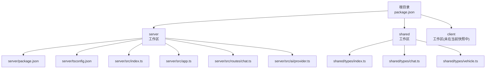
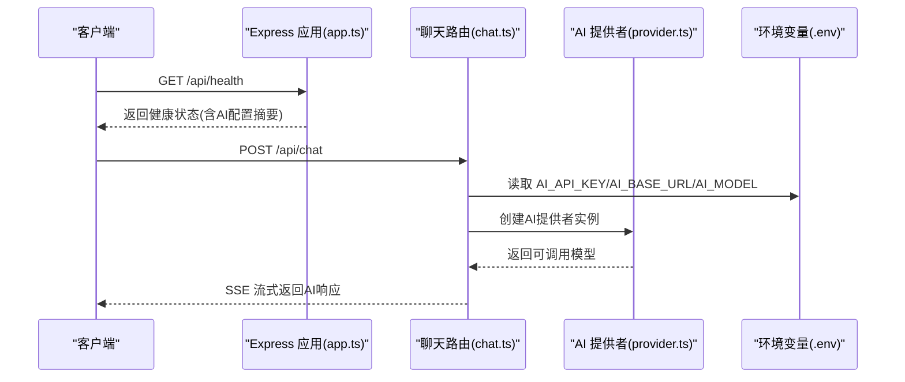
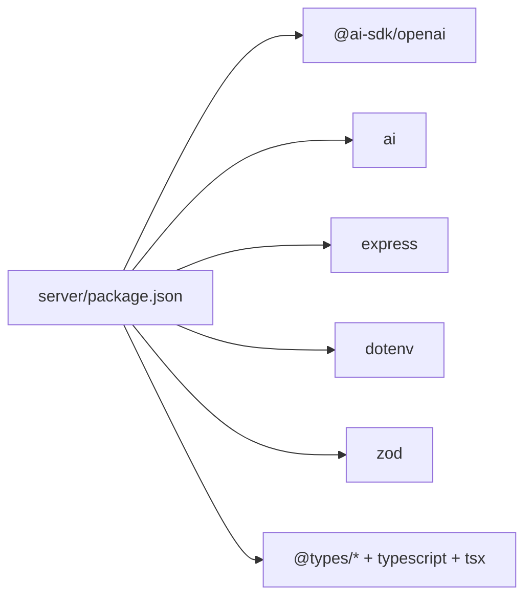

# 环境准备

<cite>
**本文引用的文件**
- [根目录 package.json](file://package.json)
- [server/package.json](file://server/package.json)
- [server/tsconfig.json](file://server/tsconfig.json)
- [server/src/index.ts](file://server/src/index.ts)
- [server/src/app.ts](file://server/src/app.ts)
- [server/src/routes/chat.ts](file://server/src/routes/chat.ts)
- [server/src/ai/provider.ts](file://server/src/ai/provider.ts)
- [shared/types/chat.ts](file://shared/types/chat.ts)
- [shared/types/index.ts](file://shared/types/index.ts)
- [shared/types/vehicle.ts](file://shared/types/vehicle.ts)
- [客户端设置状态 store（示例）](file://client/src/lib/store/settings-store.ts)
</cite>

## 目录
1. [简介](#简介)
2. [项目结构](#项目结构)
3. [核心组件](#核心组件)
4. [架构总览](#架构总览)
5. [详细组件分析](#详细组件分析)
6. [依赖分析](#依赖分析)
7. [性能考虑](#性能考虑)
8. [故障排除指南](#故障排除指南)
9. [结论](#结论)
10. [附录](#附录)

## 简介
本指南面向FH6汽车设置工具的开发者与运维人员，提供从零开始的环境准备与配置说明，涵盖以下主题：
- Node.js运行时环境要求与安装步骤
- TypeScript编译环境配置（tsconfig.json）
- 开发与生产环境差异及依赖安装策略
- 环境变量安全配置（AI服务密钥、模型端点等）
- 系统资源与硬件建议（内存、CPU、存储）

## 项目结构
该仓库采用多工作区（workspaces）组织，包含服务端、共享类型与客户端三部分。根目录通过npm脚本统一管理开发与构建流程。

图表来源
- [根目录 package.json:1-23](file://package.json#L1-L23)
- [server/package.json:1-26](file://server/package.json#L1-L26)
- [server/tsconfig.json:1-23](file://server/tsconfig.json#L1-L23)
- [server/src/index.ts:1-11](file://server/src/index.ts#L1-L11)
- [server/src/app.ts:1-40](file://server/src/app.ts#L1-L40)
- [server/src/routes/chat.ts:1-74](file://server/src/routes/chat.ts#L1-L74)
- [server/src/ai/provider.ts:1-15](file://server/src/ai/provider.ts#L1-L15)
- [shared/types/index.ts:1-5](file://shared/types/index.ts#L1-L5)
- [shared/types/chat.ts:1-75](file://shared/types/chat.ts#L1-L75)
- [shared/types/vehicle.ts:1-30](file://shared/types/vehicle.ts#L1-L30)

章节来源
- [根目录 package.json:1-23](file://package.json#L1-L23)

## 核心组件
- 服务端应用：基于Express，提供健康检查与聊天流式接口；使用AI SDK对接第三方大模型服务。
- 共享类型：集中定义AI配置、对话消息、车辆信息等跨模块数据结构。
- 构建与运行脚本：根目录统一管理开发与构建命令，server工作区提供开发热更新与生产构建。

章节来源
- [server/src/app.ts:1-40](file://server/src/app.ts#L1-L40)
- [server/src/routes/chat.ts:1-74](file://server/src/routes/chat.ts#L1-L74)
- [shared/types/chat.ts:1-75](file://shared/types/chat.ts#L1-L75)
- [shared/types/vehicle.ts:1-30](file://shared/types/vehicle.ts#L1-L30)
- [根目录 package.json:11-18](file://package.json#L11-L18)

## 架构总览
下图展示服务端启动、路由处理与AI调用的关键流程。

图表来源
- [server/src/app.ts:14-29](file://server/src/app.ts#L14-L29)
- [server/src/routes/chat.ts:9-73](file://server/src/routes/chat.ts#L9-L73)
- [server/src/ai/provider.ts:9-15](file://server/src/ai/provider.ts#L9-L15)
- [server/src/index.ts:1-11](file://server/src/index.ts#L1-L11)

## 详细组件分析

### Node.js 运行时与版本要求
- 服务端依赖的AI SDK与相关包声明了最低Node版本为18。
- 推荐使用LTS版本的Node.js以获得更稳定的性能与长期支持。
- 安装完成后，确保全局可用的npm与Node版本满足上述要求。

章节来源
- [server/package.json:18-24](file://server/package.json#L18-L24)
- [package-lock.json 引用:55-87](file://package-lock.json#L55-L87)

### TypeScript 编译环境配置
- 目标与模块：目标版本为ES2022，模块系统为CommonJS，便于Node.js运行时执行。
- 严格模式与辅助选项：启用严格模式、解析JSON模块、生成声明与SourceMap，便于调试与类型推导。
- 路径映射：通过路径别名将@shared指向shared工作区，便于跨模块导入。
- 包含与排除：默认包含src下所有文件，并排除node_modules与dist输出目录。

章节来源
- [server/tsconfig.json:2-22](file://server/tsconfig.json#L2-L22)

### 开发与生产环境差异
- 开发模式
  - 使用热重载工具进行开发，自动监听源码变更并重启服务。
  - 通过根目录脚本同时启动前端与后端开发服务器。
- 生产模式
  - 先完成共享类型与服务端的编译，再进行客户端构建。
  - 启动脚本加载编译后的dist产物。

章节来源
- [server/package.json:5-8](file://server/package.json#L5-L8)
- [根目录 package.json:11-18](file://package.json#L11-L18)

### 环境变量与安全配置
- 必需变量
  - AI_API_KEY：用于访问第三方AI服务的密钥。
  - AI_BASE_URL：AI服务端点地址，默认DeepSeek端点。
  - AI_MODEL：使用的模型名称，默认deepseek-chat。
  - PORT：服务监听端口，默认3001。
- 健康检查与日志
  - 健康接口会返回当前配置摘要与密钥存在性，便于快速验证。
  - 启动日志会打印当前AI模型与端点，便于确认配置生效。
- 安全建议
  - 将敏感变量保存在本地安全的.env文件中，避免提交到版本控制。
  - 在CI/CD环境中使用受控的密钥管理服务注入变量。
  - 限制密钥权限范围，仅授予必要服务所需的最小权限。

章节来源
- [server/src/index.ts:1-11](file://server/src/index.ts#L1-L11)
- [server/src/app.ts:14-26](file://server/src/app.ts#L14-L26)
- [server/src/routes/chat.ts:16-24](file://server/src/routes/chat.ts#L16-L24)

### 共享类型与配置
- AI Provider配置
  - 支持多种提供者类型与默认配置项，便于在不同环境切换。
- 对话消息与会话
  - 统一的消息结构与会话结构，便于前后端一致的数据交换。
- 车辆信息
  - 定义了车辆用途、驱动形式、引擎布局、进气方式与等级等枚举与结构体。

章节来源
- [shared/types/chat.ts:1-75](file://shared/types/chat.ts#L1-L75)
- [shared/types/index.ts:1-5](file://shared/types/index.ts#L1-L5)
- [shared/types/vehicle.ts:1-30](file://shared/types/vehicle.ts#L1-L30)

### 客户端设置状态（参考）
- 客户端可通过状态管理维护AI配置预设与当前设置，便于用户在界面中切换提供者与模型。
- 示例中包含提供者预设（如DeepSeek、OpenAI、Ollama等），并持久化到本地存储。

章节来源
- [客户端设置状态 store（示例）:1-48](file://client/src/lib/store/settings-store.ts#L1-L48)

## 依赖分析
- 外部依赖
  - @ai-sdk/openai：AI SDK适配器，负责与第三方模型服务通信。
  - ai：通用AI工具库，提供流式文本生成能力。
  - express：Web框架，提供REST接口与中间件。
  - dotenv：加载环境变量至进程。
  - zod：类型校验（在服务端类型定义中使用）。
- 开发依赖
  - @types/*：Node.js与Express等类型声明。
  - tsx：TypeScript开发时热重载执行器。
  - typescript：编译器与类型系统。

图表来源
- [server/package.json:10-24](file://server/package.json#L10-L24)

章节来源
- [server/package.json:10-24](file://server/package.json#L10-L24)

## 性能考虑
- Node.js版本选择
  - 建议使用LTS版本，以获得更好的稳定性与长期支持。
- 并发与并发工具
  - 根目录使用并发工具同时启动前端与后端开发服务器，提升开发效率。
- 编译与打包
  - 启用SourceMap与声明文件，便于调试与二次开发。
  - 在生产构建中注意排除不必要的开发依赖，减小镜像体积。
- 硬件与资源建议
  - 内存：至少8GB RAM，推荐16GB以上以支持多进程与大型模型推理。
  - CPU：至少4核，推荐6核以上以获得更快的编译与运行速度。
  - 存储：SSD固态硬盘优先，预留至少20GB可用空间（包含依赖与缓存）。

章节来源
- [根目录 package.json:11-21](file://package.json#L11-L21)

## 故障排除指南
- 端口占用
  - 若默认端口被占用，可在环境变量中调整端口值后重启服务。
- AI密钥缺失
  - 当未配置AI_API_KEY时，健康检查与聊天接口会返回相应提示，需补充密钥。
- 模型端点不可达
  - 确认AI_BASE_URL与网络连通性；若使用自定义或本地模型，确保端点正确。
- CORS问题
  - 服务端已限定允许的来源列表，若前端不在白名单内，需调整或在开发阶段使用默认来源。
- 错误处理
  - 服务端对未捕获异常进行统一处理并返回标准错误格式，便于前端展示与定位。

章节来源
- [server/src/index.ts:4-10](file://server/src/index.ts#L4-L10)
- [server/src/app.ts:31-39](file://server/src/app.ts#L31-L39)
- [server/src/routes/chat.ts:20-24](file://server/src/routes/chat.ts#L20-L24)

## 结论
通过遵循本指南，您可以完成FH6汽车设置工具的环境准备与配置。建议优先满足Node.js 18+与LTS版本要求，正确设置环境变量并使用共享类型保持前后端一致性。在开发阶段利用热重载与并发脚本，在生产阶段关注编译优化与资源规划。

## 附录
- 快速检查清单
  - 已安装Node.js（≥18，推荐LTS）
  - 已在server工作区安装依赖并完成一次编译
  - 已在.env中配置AI_API_KEY、AI_BASE_URL、AI_MODEL与PORT
  - 已通过健康接口验证配置生效
  - 已根据硬件条件预留足够内存/CPU/存储