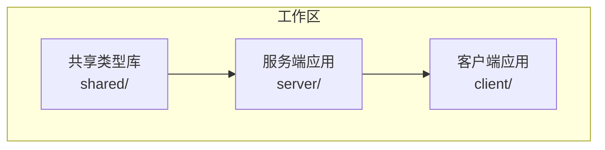
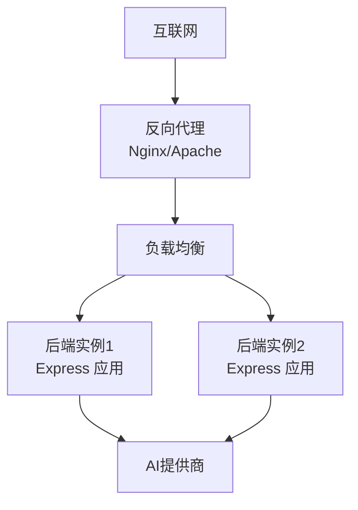
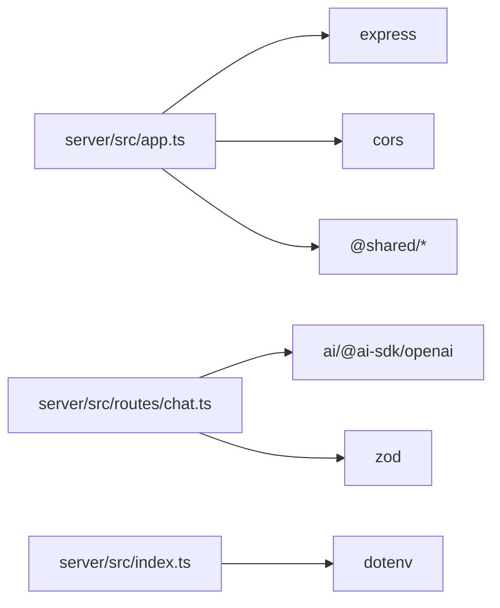

# 生产环境配置

<cite>
**本文档引用的文件**
- [server/package.json](file://server/package.json)
- [package.json](file://package.json)
- [server/src/index.ts](file://server/src/index.ts)
- [server/src/app.ts](file://server/src/app.ts)
- [server/src/routes/chat.ts](file://server/src/routes/chat.ts)
- [server/tsconfig.json](file://server/tsconfig.json)
- [shared/package.json](file://shared/package.json)
</cite>

## 目录
1. [简介](#简介)
2. [项目结构](#项目结构)
3. [核心组件](#核心组件)
4. [架构概览](#架构概览)
5. [详细组件分析](#详细组件分析)
6. [依赖关系分析](#依赖关系分析)
7. [性能考虑](#性能考虑)
8. [故障排除指南](#故障排除指南)
9. [结论](#结论)
10. [附录](#附录)

## 简介
本指南面向FH6汽车设置工具的生产环境部署，基于现有代码库分析，提供服务器配置、反向代理、进程管理、数据库与缓存、监控告警以及日志管理的实施建议。由于当前仓库未包含客户端构建产物、数据库连接池实现或专门的日志记录模块，本指南将重点围绕现有后端服务（Express + AI流式对话）进行配置说明，并给出可扩展到完整生产环境的实践路径。

## 项目结构
项目采用多工作区（monorepo）布局，包含共享类型库、服务端应用和客户端应用。服务端应用基于Express框架，通过环境变量配置AI模型、端点和密钥，提供健康检查和聊天流式接口。

**图表来源**
- [package.json:6-10](file://package.json#L6-L10)
- [shared/package.json:1-8](file://shared/package.json#L1-L8)

**章节来源**
- [package.json:1-23](file://package.json#L1-L23)
- [server/package.json:1-26](file://server/package.json#L1-L26)
- [shared/package.json:1-8](file://shared/package.json#L1-L8)

## 核心组件
- 应用入口：监听环境变量端口，启动Express应用并输出启动信息。
- 应用实例：配置CORS、JSON解析、健康检查端点、路由挂载和全局错误处理。
- 聊天路由：接收消息数组，验证参数，读取AI相关环境变量，调用AI提供商，以Server-Sent Events方式流式返回结果。

**章节来源**
- [server/src/index.ts:1-11](file://server/src/index.ts#L1-L11)
- [server/src/app.ts:1-40](file://server/src/app.ts#L1-L40)
- [server/src/routes/chat.ts:1-74](file://server/src/routes/chat.ts#L1-L74)

## 架构概览
下图展示了生产环境中的典型部署拓扑：反向代理（Nginx/Apache）位于边缘，负责SSL终止、静态资源分发和请求转发；后端服务通过进程管理器运行；AI提供商作为外部依赖。

[此图为概念性架构示意，不直接映射具体源文件，因此无需图表来源]

## 详细组件分析

### 服务器配置
- 操作系统：推荐使用长期支持版本的Linux发行版（如Ubuntu LTS或CentOS Stream），确保内核和包管理器更新及时。
- 系统要求：根据并发请求数量和AI调用延迟，评估CPU、内存和网络带宽；为AI调用预留充足的超时时间。
- 安全基线：启用防火墙（iptables/nftables 或云厂商安全组），仅开放反向代理端口；定期扫描漏洞并应用补丁。
- 进程与资源：限制单实例内存上限，避免内存泄漏导致的OOM；为AI调用设置合理的超时和重试策略。

[本节为通用实践说明，不直接分析具体文件，故无章节来源]

### 反向代理配置
- Nginx/Apache职责：SSL终止、静态资源缓存、压缩、跨域处理、请求限速与健康检查探活。
- 负载均衡：在反向代理层配置多实例后端，结合健康检查实现自动故障转移。
- SSL终止：使用Let's Encrypt或企业CA签发证书，禁用弱加密套件，启用HTTP/2。
- 配置要点：设置合适的超时（代理、读取、发送）、缓冲区大小；对SSE流保持长连接并禁用代理缓存。

[本节为通用实践说明，不直接分析具体文件，故无章节来源]

### 进程管理工具配置
- PM2：用于应用守护、自动重启、日志聚合和集群模式；建议启用ECOSYSTEM.JSON管理多实例与环境变量。
- systemd：适合追求最小依赖的场景；通过.service文件定义ExecStart、RestartPolicy、Environment等。
- Supervisor：适用于需要统一管理多种类型进程的环境；通过配置文件定义进程组与重启策略。
- 部署流程：构建完成后，将dist目录作为运行时；通过进程管理器加载环境变量文件，确保AI密钥与端口正确注入。

[本节为通用实践说明，不直接分析具体文件，故无章节来源]

### 数据库连接池与缓存配置
- 连接池最佳实践：根据并发请求数设置最大连接数，启用空闲回收与超时检测；对慢查询进行监控与告警。
- 缓存策略：对热点数据（如用户偏好、车辆配置模板）使用Redis/Memcached；设置合理的TTL与失效策略。
- 本项目当前未包含数据库或缓存实现，建议在后续迭代中引入连接池库（如pg、mysql2、ioredis）并配合进程管理器统一配置。

[本节为通用实践说明，不直接分析具体文件，故无章节来源]

### 监控与告警系统
- Prometheus指标：暴露应用指标（HTTP请求数、响应时间、错误率、AI调用耗时）；使用客户端库注册Gauge/Histogram。
- Grafana仪表盘：展示关键指标趋势、实例健康状态、AI调用成功率；设置阈值告警规则。
- Sentry错误追踪：在应用中集成SDK，捕获未处理异常与AI调用错误；区分严重级别并配置通知渠道。
- 日志聚合：将应用日志标准化输出至stdout/stderr，由容器平台或进程管理器收集；使用ELK/EFK进行检索与可视化。

[本节为通用实践说明，不直接分析具体文件，故无章节来源]

### 日志轮转与集中化管理
- 日志轮转：使用logrotate或进程管理器内置功能，按大小或时间滚动；保留必要历史以便审计。
- 集中化：将日志发送至集中式存储（如S3、HDFS）或日志平台（如Fluentd/Fluent Bit + Elasticsearch）；添加结构化字段便于查询。
- 本项目当前未包含专用日志库，建议在应用中引入日志库并配置输出格式与级别，同时在反向代理层保留访问日志。

[本节为通用实践说明，不直接分析具体文件，故无章节来源]

## 依赖关系分析
服务端应用依赖Express、CORS、AI SDK与Zod校验库；共享类型库通过路径别名在编译时被解析。

**图表来源**
- [server/src/app.ts:1-40](file://server/src/app.ts#L1-L40)
- [server/src/routes/chat.ts:1-74](file://server/src/routes/chat.ts#L1-L74)
- [server/src/index.ts:1-11](file://server/src/index.ts#L1-L11)
- [server/package.json:10-24](file://server/package.json#L10-L24)
- [server/tsconfig.json:16-18](file://server/tsconfig.json#L16-L18)

**章节来源**
- [server/package.json:1-26](file://server/package.json#L1-L26)
- [server/tsconfig.json:1-23](file://server/tsconfig.json#L1-L23)
- [shared/package.json:1-8](file://shared/package.json#L1-L8)

## 性能考虑
- 端口与环境变量：通过环境变量控制监听端口，避免硬编码；在生产中固定端口并配合反向代理。
- CORS与安全：生产环境建议限制允许的源列表，启用凭据传递时需谨慎配置；对AI密钥进行严格保护。
- SSE流式传输：确保代理层正确处理长连接与缓冲；为SSE设置合适的Keep-Alive与无缓存头。
- 构建与运行时：使用TypeScript编译生成dist目录，运行时仅部署编译产物；在CI/CD中缓存依赖以加速构建。

**章节来源**
- [server/src/index.ts:4-10](file://server/src/index.ts#L4-L10)
- [server/src/app.ts:8-12](file://server/src/app.ts#L8-L12)
- [server/src/routes/chat.ts:40-44](file://server/src/routes/chat.ts#L40-L44)
- [server/tsconfig.json:1-23](file://server/tsconfig.json#L1-L23)

## 故障排除指南
- 健康检查：通过/api/health端点确认服务可用性与AI配置状态；检查响应中的AI模型、基础URL与密钥存在性。
- 错误处理：应用提供统一的500错误响应；对于SSE场景，若响应头已发送则通过事件流发送错误事件。
- 环境变量：确认AI_API_KEY、AI_BASE_URL、AI_MODEL等变量正确设置；在进程管理器中验证环境文件加载。
- 网络连通性：检查反向代理到后端实例的连通性；验证安全组与防火墙规则允许必要的入站/出站流量。

**章节来源**
- [server/src/app.ts:14-26](file://server/src/app.ts#L14-L26)
- [server/src/app.ts:31-39](file://server/src/app.ts#L31-L39)
- [server/src/routes/chat.ts:21-24](file://server/src/routes/chat.ts#L21-L24)
- [server/src/routes/chat.ts:60-72](file://server/src/routes/chat.ts#L60-L72)

## 结论
本指南基于现有代码库提供了生产环境的关键配置要点。建议在实际部署中补充数据库与缓存、监控告警与日志管理，并结合反向代理与进程管理器实现高可用与可观测性。随着业务演进，可在共享类型库与服务端路由中逐步引入更完善的基础设施能力。

## 附录
- 开发与构建脚本：根工作区提供开发与构建命令，分别启动前后端或构建共享与服务端产物。
- TypeScript配置：启用严格模式与源码映射，配置路径别名以引用共享类型库。

**章节来源**
- [package.json:11-18](file://package.json#L11-L18)
- [server/tsconfig.json:2-18](file://server/tsconfig.json#L2-L18)