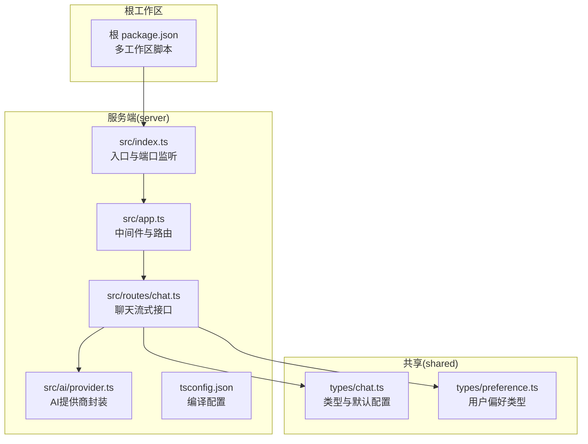
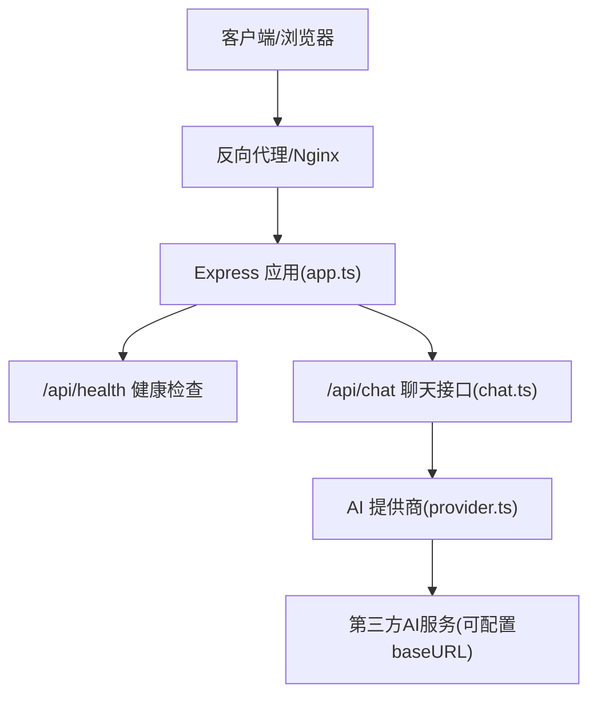
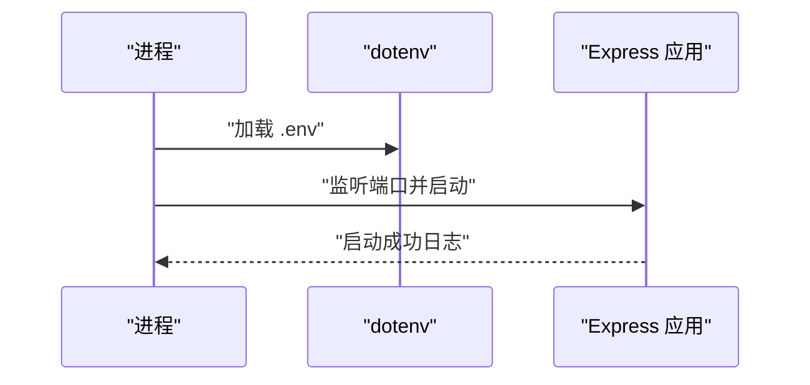
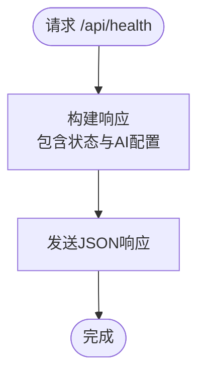
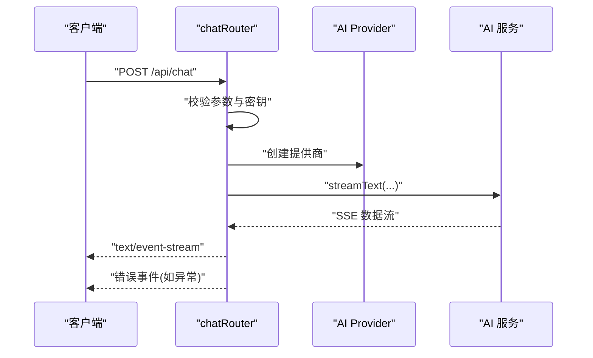
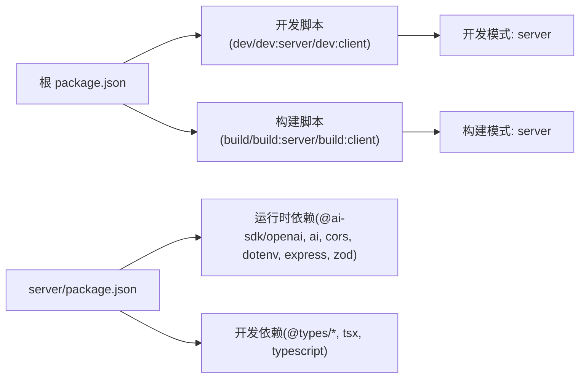

# 部署指南

<cite>
**本文档引用的文件**
- [server/package.json](file://server/package.json)
- [package.json](file://package.json)
- [server/src/index.ts](file://server/src/index.ts)
- [server/src/app.ts](file://server/src/app.ts)
- [server/src/routes/chat.ts](file://server/src/routes/chat.ts)
- [server/src/utils/id.ts](file://server/src/utils/id.ts)
- [server/tsconfig.json](file://server/tsconfig.json)
- [.gitignore](file://.gitignore)
- [shared/types/chat.ts](file://shared/types/chat.ts)
- [shared/types/preference.ts](file://shared/types/preference.ts)
- [server/src/ai/provider.ts](file://server/src/ai/provider.ts)
</cite>

## 目录
1. [简介](#简介)
2. [项目结构](#项目结构)
3. [核心组件](#核心组件)
4. [架构总览](#架构总览)
5. [详细组件分析](#详细组件分析)
6. [依赖分析](#依赖分析)
7. [性能考虑](#性能考虑)
8. [故障排除指南](#故障排除指南)
9. [结论](#结论)
10. [附录](#附录)

## 简介
本指南面向FH6汽车设置工具的生产环境部署，覆盖从环境准备、依赖安装与配置，到Docker容器化与云平台部署（AWS/Azure/GCP）的完整流程。同时提供环境变量管理、安全配置、负载均衡与反向代理、SSL证书、监控与日志、健康检查与性能监控、故障恢复与备份、以及版本升级的最佳实践。

## 项目结构
项目采用多工作区（monorepo）组织方式，包含共享类型定义与服务端逻辑：
- 根工作区：统一脚本与工作区编排
- server：基于Express的后端服务，提供健康检查与聊天流式接口
- shared：跨包共享的类型定义
- 客户端（client）：当前仓库未包含前端实现，部署时需按实际产物进行反向代理或静态托管

**图表来源**
- [package.json:11-18](file://package.json#L11-L18)
- [server/src/index.ts:1-11](file://server/src/index.ts#L1-L11)
- [server/src/app.ts:1-40](file://server/src/app.ts#L1-L40)
- [server/src/routes/chat.ts:1-74](file://server/src/routes/chat.ts#L1-L74)
- [server/src/ai/provider.ts:1-15](file://server/src/ai/provider.ts#L1-L15)
- [server/tsconfig.json:1-23](file://server/tsconfig.json#L1-L23)
- [shared/types/chat.ts:1-75](file://shared/types/chat.ts#L1-L75)
- [shared/types/preference.ts:1-60](file://shared/types/preference.ts#L1-L60)

**章节来源**
- [package.json:1-23](file://package.json#L1-L23)
- [server/package.json:1-26](file://server/package.json#L1-L26)
- [server/tsconfig.json:1-23](file://server/tsconfig.json#L1-L23)

## 核心组件
- 应用入口与监听
  - 通过环境变量控制端口，默认端口为3001；启动时打印AI模型与端点信息
  - 参考路径：[server/src/index.ts:4-10](file://server/src/index.ts#L4-L10)
- 应用实例与中间件
  - CORS限制为本地开发地址，启用JSON解析
  - 健康检查接口返回状态、AI配置与密钥可用性
  - 统一错误处理返回标准响应格式
  - 参考路径：[server/src/app.ts:8-26](file://server/src/app.ts#L8-L26)、[server/src/app.ts:31-39](file://server/src/app.ts#L31-L39)
- 聊天流式接口
  - 接收消息数组与会话ID，校验必填参数
  - 读取AI密钥、基础URL与模型名，若缺失则返回401
  - 使用AI SDK创建流式响应，设置SSE响应头，分块推送数据
  - 若异常发生在SSE之前返回JSON错误，否则发送SSE错误事件
  - 参考路径：[server/src/routes/chat.ts:9-24](file://server/src/routes/chat.ts#L9-L24)、[server/src/routes/chat.ts:26-38](file://server/src/routes/chat.ts#L26-L38)、[server/src/routes/chat.ts:40-59](file://server/src/routes/chat.ts#L40-L59)、[server/src/routes/chat.ts:60-73](file://server/src/routes/chat.ts#L60-L73)
- AI提供商封装
  - 基于@ai-sdk/openai创建OpenAI兼容客户端，支持自定义baseURL与模型
  - 参考路径：[server/src/ai/provider.ts:9-15](file://server/src/ai/provider.ts#L9-L15)
- 共享类型与默认配置
  - 定义AI提供商类型、默认配置、消息角色、工具调用与结果、对话消息与会话、API响应格式与请求体
  - 参考路径：[shared/types/chat.ts:1-75](file://shared/types/chat.ts#L1-L75)
- ID生成工具
  - 提供UUID生成用于会话与消息标识
  - 参考路径：[server/src/utils/id.ts:1-6](file://server/src/utils/id.ts#L1-L6)

**章节来源**
- [server/src/index.ts:1-11](file://server/src/index.ts#L1-L11)
- [server/src/app.ts:1-40](file://server/src/app.ts#L1-L40)
- [server/src/routes/chat.ts:1-74](file://server/src/routes/chat.ts#L1-L74)
- [server/src/ai/provider.ts:1-15](file://server/src/ai/provider.ts#L1-L15)
- [shared/types/chat.ts:1-75](file://shared/types/chat.ts#L1-L75)
- [server/src/utils/id.ts:1-6](file://server/src/utils/id.ts#L1-L6)

## 架构总览
后端服务通过Express提供REST接口，其中健康检查与聊天流式接口为核心能力。聊天接口使用AI SDK对接第三方大模型服务，支持SSE流式输出。

**图表来源**
- [server/src/app.ts:14-29](file://server/src/app.ts#L14-L29)
- [server/src/routes/chat.ts:26-38](file://server/src/routes/chat.ts#L26-L38)
- [server/src/ai/provider.ts:9-15](file://server/src/ai/provider.ts#L9-L15)

## 详细组件分析

### 组件A：应用入口与监听
- 功能要点
  - 加载dotenv配置
  - 读取端口环境变量，未设置时使用默认值
  - 启动后打印运行信息与AI配置
- 部署建议
  - 在容器或系统服务中设置PORT
  - 将AI相关环境变量注入容器或平台密钥管理
- 参考路径
  - [server/src/index.ts:1-11](file://server/src/index.ts#L1-L11)

**图表来源**
- [server/src/index.ts:1-11](file://server/src/index.ts#L1-L11)

**章节来源**
- [server/src/index.ts:1-11](file://server/src/index.ts#L1-L11)

### 组件B：健康检查与错误处理
- 健康检查
  - 返回状态码、AI模型、基础URL与密钥可用性
  - 便于Kubernetes/云平台健康探针
- 错误处理
  - 统一捕获未处理异常，返回标准响应格式
- 参考路径
  - [server/src/app.ts:14-26](file://server/src/app.ts#L14-L26)
  - [server/src/app.ts:31-39](file://server/src/app.ts#L31-L39)

**图表来源**
- [server/src/app.ts:14-26](file://server/src/app.ts#L14-L26)

**章节来源**
- [server/src/app.ts:14-26](file://server/src/app.ts#L14-L26)
- [server/src/app.ts:31-39](file://server/src/app.ts#L31-L39)

### 组件C：聊天流式接口
- 处理逻辑
  - 参数校验：messages必须存在且非空
  - 读取AI密钥、基础URL与模型名
  - 创建AI提供商实例，执行流式文本生成
  - 设置SSE响应头，分块写入流数据
  - 异常处理：根据响应头是否发送决定返回JSON或SSE错误事件
- 参考路径
  - [server/src/routes/chat.ts:9-24](file://server/src/routes/chat.ts#L9-L24)
  - [server/src/routes/chat.ts:26-38](file://server/src/routes/chat.ts#L26-L38)
  - [server/src/routes/chat.ts:40-59](file://server/src/routes/chat.ts#L40-L59)
  - [server/src/routes/chat.ts:60-73](file://server/src/routes/chat.ts#L60-L73)

**图表来源**
- [server/src/routes/chat.ts:9-24](file://server/src/routes/chat.ts#L9-L24)
- [server/src/routes/chat.ts:26-38](file://server/src/routes/chat.ts#L26-L38)
- [server/src/ai/provider.ts:9-15](file://server/src/ai/provider.ts#L9-L15)

**章节来源**
- [server/src/routes/chat.ts:1-74](file://server/src/routes/chat.ts#L1-L74)
- [server/src/ai/provider.ts:1-15](file://server/src/ai/provider.ts#L1-L15)

### 组件D：AI提供商封装
- 功能要点
  - 基于@ai-sdk/openai创建OpenAI兼容客户端
  - 支持自定义baseURL与模型名称
- 参考路径
  - [server/src/ai/provider.ts:9-15](file://server/src/ai/provider.ts#L9-L15)

**章节来源**
- [server/src/ai/provider.ts:1-15](file://server/src/ai/provider.ts#L1-L15)

### 组件E：共享类型与默认配置
- 类型定义
  - AI提供商类型、默认配置、消息角色、工具调用与结果、对话消息与会话、API响应格式与请求体
- 参考路径
  - [shared/types/chat.ts:1-75](file://shared/types/chat.ts#L1-L75)
  - [shared/types/preference.ts:1-60](file://shared/types/preference.ts#L1-L60)

**章节来源**
- [shared/types/chat.ts:1-75](file://shared/types/chat.ts#L1-L75)
- [shared/types/preference.ts:1-60](file://shared/types/preference.ts#L1-L60)

## 依赖分析
- 运行时依赖
  - @ai-sdk/openai：AI SDK，支持OpenAI兼容接口
  - ai：流式文本生成能力
  - cors：跨域支持
  - dotenv：环境变量加载
  - express：Web框架
  - zod：类型验证（在当前代码中未直接使用）
- 开发依赖
  - @types/*：类型声明
  - tsx：TypeScript开发运行器
  - typescript：编译器
- 工作区脚本
  - 根级脚本统一管理server与client的开发与构建
- 参考路径
  - [server/package.json:10-24](file://server/package.json#L10-L24)
  - [package.json:11-18](file://package.json#L11-L18)

**图表来源**
- [package.json:11-18](file://package.json#L11-L18)
- [server/package.json:10-24](file://server/package.json#L10-L24)

**章节来源**
- [server/package.json:1-26](file://server/package.json#L1-L26)
- [package.json:1-23](file://package.json#L1-L23)

## 性能考虑
- 流式传输
  - 聊天接口使用SSE分块推送，降低首字节延迟，提升交互体验
  - 参考路径：[server/src/routes/chat.ts:40-59](file://server/src/routes/chat.ts#L40-L59)
- 并发与资源
  - 生产环境建议使用PM2或容器编排进行多实例部署，结合反向代理实现水平扩展
- 缓存与超时
  - AI调用链路建议设置合理的超时与重试策略，避免阻塞请求队列
- 日志与监控
  - 结合健康检查与指标上报，监控CPU、内存、QPS与错误率

## 故障排除指南
- 常见问题
  - AI API Key未配置：接口返回401，提示在.env中设置AI_API_KEY
    - 参考路径：[server/src/routes/chat.ts:21-24](file://server/src/routes/chat.ts#L21-L24)
  - 请求参数缺失：messages为空或不存在，返回400
    - 参考路径：[server/src/routes/chat.ts:12-15](file://server/src/routes/chat.ts#L12-L15)
  - 服务器内部错误：统一错误处理器捕获异常并返回500
    - 参考路径：[server/src/app.ts:31-39](file://server/src/app.ts#L31-L39)
- 健康检查
  - 通过GET /api/health确认服务状态与AI配置可用性
    - 参考路径：[server/src/app.ts:14-26](file://server/src/app.ts#L14-L26)

**章节来源**
- [server/src/routes/chat.ts:12-24](file://server/src/routes/chat.ts#L12-L24)
- [server/src/app.ts:31-39](file://server/src/app.ts#L31-L39)
- [server/src/app.ts:14-26](file://server/src/app.ts#L14-L26)

## 结论
本指南提供了FH6汽车设置工具从开发到生产的部署蓝图。通过明确的环境变量管理、容器化与云平台部署策略、负载均衡与反向代理、SSL与监控告警，以及故障恢复与版本升级最佳实践，可确保系统在生产环境中的稳定性与可维护性。

## 附录

### 环境准备与依赖安装
- 系统要求
  - Node.js（与tsconfig目标一致）
  - Docker（可选，用于容器化部署）
- 依赖安装
  - 使用NPM工作区脚本统一安装与构建
  - 参考路径：[package.json:11-18](file://package.json#L11-L18)、[server/package.json:10-24](file://server/package.json#L10-L24)

**章节来源**
- [package.json:11-18](file://package.json#L11-L18)
- [server/package.json:10-24](file://server/package.json#L10-L24)

### 配置与环境变量
- 必需环境变量
  - PORT：服务监听端口（默认3001）
  - AI_API_KEY：AI服务密钥
  - AI_BASE_URL：AI服务基础URL（默认DeepSeek）
  - AI_MODEL：AI模型名称（默认deepseek-chat）
- 安全建议
  - .env文件被.gitignore排除，避免提交至版本库
  - 在容器或平台密钥管理中注入敏感变量
  - 参考路径：[.gitignore:4](file://.gitignore#L4)、[server/src/index.ts:1](file://server/src/index.ts#L1)、[server/src/app.ts:15-26](file://server/src/app.ts#L15-L26)、[server/src/routes/chat.ts:17-19](file://server/src/routes/chat.ts#L17-L19)

**章节来源**
- [.gitignore:1-8](file://.gitignore#L1-L8)
- [server/src/index.ts:1-11](file://server/src/index.ts#L1-L11)
- [server/src/app.ts:15-26](file://server/src/app.ts#L15-L26)
- [server/src/routes/chat.ts:17-19](file://server/src/routes/chat.ts#L17-L19)

### Docker容器化部署
- 构建镜像
  - 建议使用多阶段构建，先安装依赖再复制构建产物
  - 参考路径：[server/package.json:7](file://server/package.json#L7)、[server/tsconfig.json:6](file://server/tsconfig.json#L6)
- 运行容器
  - 映射PORT端口，挂载或注入.env环境变量
  - 参考路径：[server/src/index.ts:4](file://server/src/index.ts#L4)
- docker-compose示例思路
  - 服务：后端服务
  - 环境变量：PORT、AI_API_KEY、AI_BASE_URL、AI_MODEL
  - 端口映射：3001
  - 健康检查：/api/health

**章节来源**
- [server/package.json:7](file://server/package.json#L7)
- [server/tsconfig.json:6](file://server/tsconfig.json#L6)
- [server/src/index.ts:4](file://server/src/index.ts#L4)

### 云平台部署策略（AWS/Azure/GCP）
- AWS
  - 使用EC2/ECS/EKS部署容器，配合ALB/NLB与ACM证书
  - 使用Secrets Manager存储AI_API_KEY
- Azure
  - 使用Container Instances/ACI或AKS，配合Application Gateway与Key Vault
- GCP
  - 使用Cloud Run/GKE，配合Cloud Load Balancing与Secret Manager
- 通用建议
  - 使用健康检查路径/api/health
  - 通过平台密钥管理注入敏感变量
  - 配置WAF与限流策略

### 负载均衡、反向代理与SSL
- 反向代理
  - Nginx/Apache转发至后端服务端口
  - 启用gzip与缓存静态资源（如存在）
- 负载均衡
  - 多实例部署，结合健康检查实现自动摘除
- SSL证书
  - 使用ACM/Key Vault/Secret Manager获取证书
  - 强制HTTPS重定向

### 监控与日志
- 健康检查
  - /api/health用于存活与就绪探针
  - 参考路径：[server/src/app.ts:14-26](file://server/src/app.ts#L14-L26)
- 日志
  - 标准输出收集，结合平台日志服务（CloudWatch/Azure Monitor/GCP Logging）
- 指标
  - QPS、错误率、P95/P99延迟、AI调用耗时与成功率

### 故障恢复与备份
- 备份
  - 备份.env与数据库（如有），使用加密存储
- 恢复
  - 快速回滚到上一个稳定版本
  - 使用蓝绿/金丝雀发布降低风险

### 版本升级最佳实践
- 渐进式发布
  - 金丝雀流量10%-25%，观察指标与日志
- 回滚策略
  - 保留最近3个版本镜像
- 配置迁移
  - 通过环境变量与平台密钥管理进行无感切换