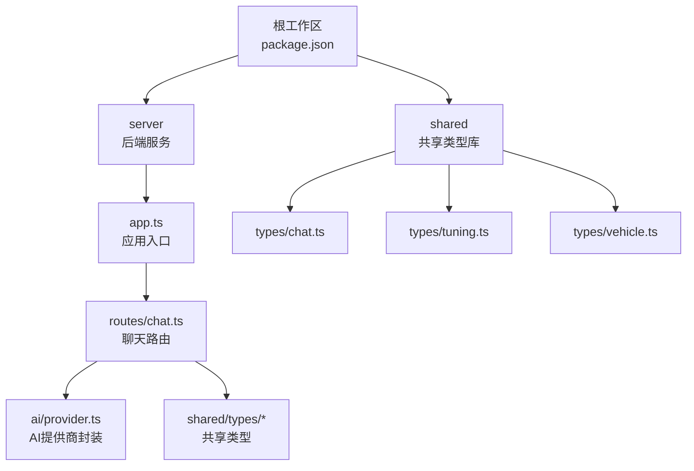
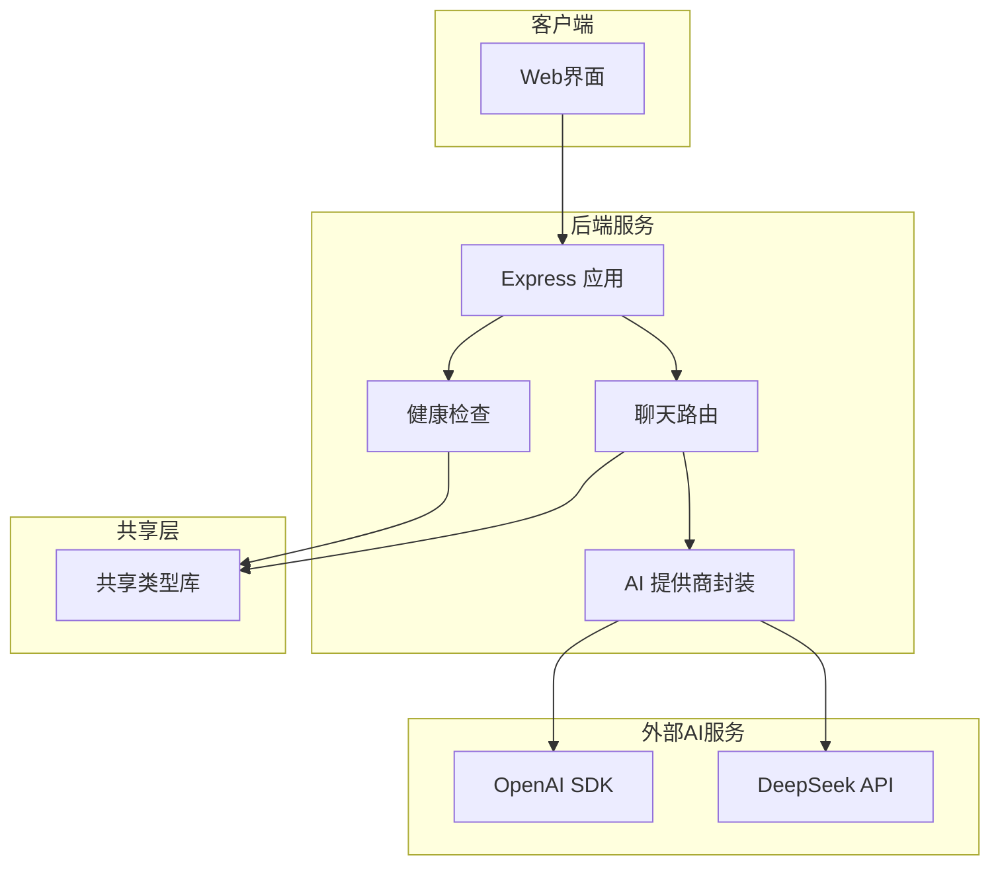
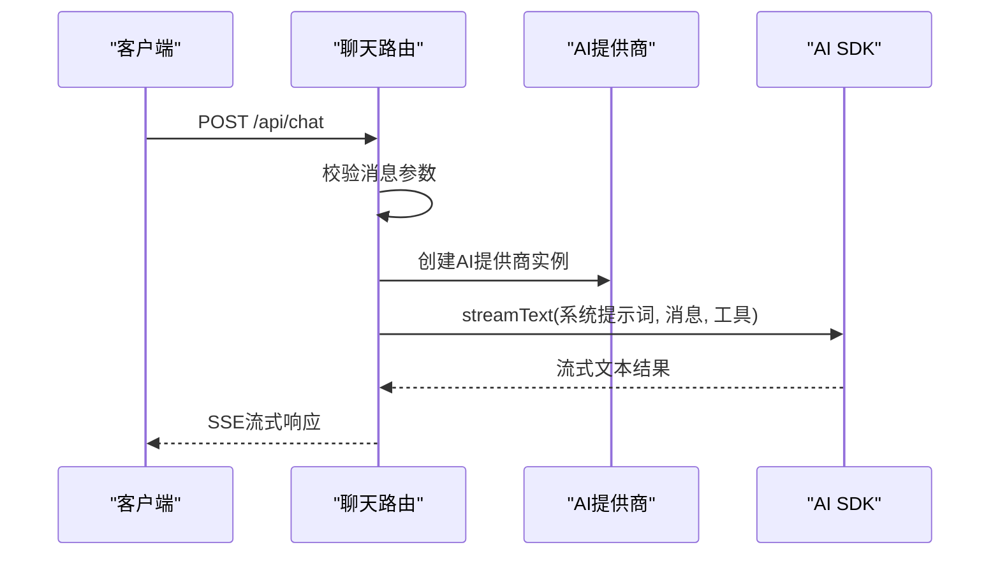
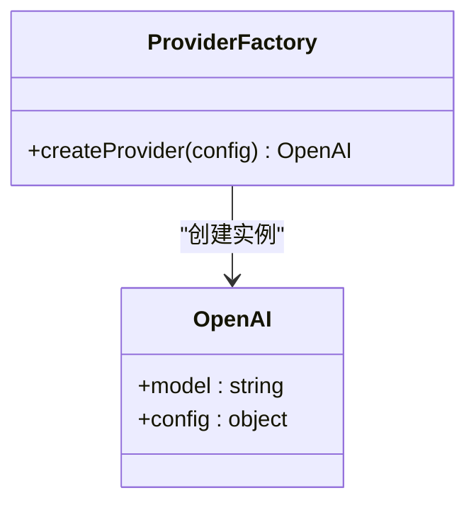
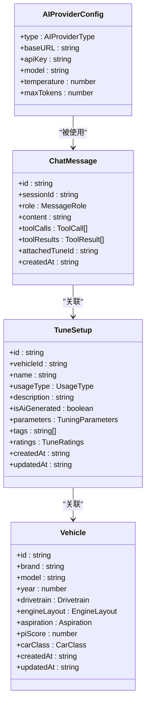
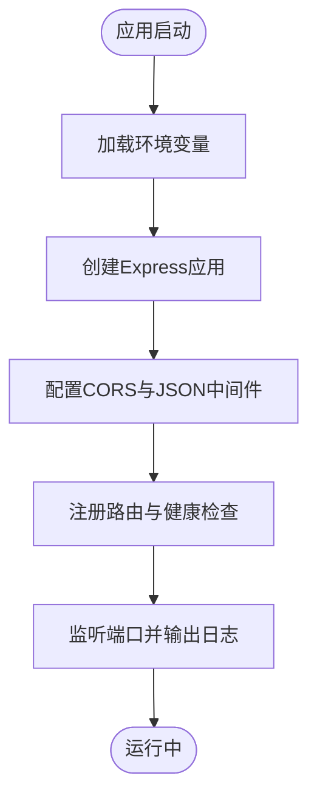
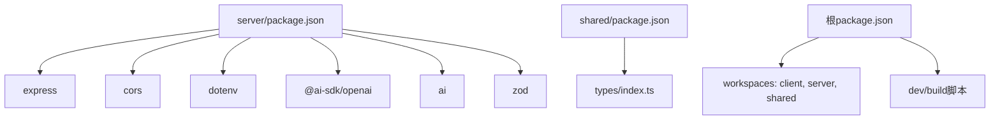

# 项目概述

<cite>
**本文档引用的文件**
- [server/src/index.ts](file://server/src/index.ts)
- [server/src/app.ts](file://server/src/app.ts)
- [server/src/routes/chat.ts](file://server/src/routes/chat.ts)
- [server/src/ai/provider.ts](file://server/src/ai/provider.ts)
- [server/package.json](file://server/package.json)
- [shared/types/index.ts](file://shared/types/index.ts)
- [shared/types/chat.ts](file://shared/types/chat.ts)
- [shared/types/tuning.ts](file://shared/types/tuning.ts)
- [shared/types/vehicle.ts](file://shared/types/vehicle.ts)
- [shared/package.json](file://shared/package.json)
- [package.json](file://package.json)
</cite>

## 目录
1. [引言](#引言)
2. [项目结构](#项目结构)
3. [核心组件](#核心组件)
4. [架构总览](#架构总览)
5. [详细组件分析](#详细组件分析)
6. [依赖关系分析](#依赖关系分析)
7. [性能考虑](#性能考虑)
8. [故障排除指南](#故障排除指南)
9. [结论](#结论)
10. [附录](#附录)

## 引言
FH6汽车设置工具是一个基于AI驱动的汽车配置管理平台，专注于为《极限竞速：地平线6》（Forza Horizon 6）玩家提供智能化的车辆参数调优、聊天对话与用户偏好设置能力。项目采用Monorepo架构，通过共享类型定义与模块化服务，实现前后端协作与可扩展的AI集成。

本项目的核心目标是：
- 提供智能聊天对话，结合系统提示词与工具调用，实现对车辆调校参数的建议与执行
- 支持用户偏好设置与会话管理，便于个性化体验
- 通过统一的共享类型库，确保前后端数据契约一致
- 以Express.js作为后端框架，配合AI SDK实现流式响应与工具调用

## 项目结构
项目采用Monorepo组织方式，包含以下主要模块：
- server：后端服务，提供REST API与AI集成，当前实现聊天接口
- shared：共享类型库，集中定义聊天、调校、车辆等类型
- 根目录：工作区配置与开发脚本，支持并发启动与构建

图表来源
- [package.json:6-10](file://package.json#L6-L10)
- [server/src/app.ts:1-40](file://server/src/app.ts#L1-L40)
- [server/src/routes/chat.ts:1-74](file://server/src/routes/chat.ts#L1-L74)
- [server/src/ai/provider.ts:1-15](file://server/src/ai/provider.ts#L1-L15)
- [shared/types/index.ts:1-5](file://shared/types/index.ts#L1-L5)

章节来源
- [package.json:6-10](file://package.json#L6-L10)
- [server/src/app.ts:1-40](file://server/src/app.ts#L1-L40)
- [shared/types/index.ts:1-5](file://shared/types/index.ts#L1-L5)

## 核心组件
- 应用入口与健康检查：负责启动Express应用、配置CORS与中间件，并提供健康检查接口，展示AI模型与端点信息
- 聊天路由：接收消息列表，进行参数校验，调用AI提供商，使用工具调用生成调校建议，并通过Server-Sent Events流式返回
- AI提供商封装：根据环境变量创建AI SDK客户端，支持多种提供商类型
- 共享类型库：定义AI配置、消息角色、工具调用、调校参数、车辆信息等核心数据结构

章节来源
- [server/src/app.ts:1-40](file://server/src/app.ts#L1-L40)
- [server/src/routes/chat.ts:1-74](file://server/src/routes/chat.ts#L1-L74)
- [server/src/ai/provider.ts:1-15](file://server/src/ai/provider.ts#L1-L15)
- [shared/types/chat.ts:1-75](file://shared/types/chat.ts#L1-L75)
- [shared/types/tuning.ts:1-126](file://shared/types/tuning.ts#L1-L126)
- [shared/types/vehicle.ts:1-30](file://shared/types/vehicle.ts#L1-L30)

## 架构总览
系统采用分层架构，后端服务通过Express提供REST接口，AI集成通过AI SDK与提供商适配器完成，共享类型库贯穿前后端，确保一致性。

图表来源
- [server/src/app.ts:1-40](file://server/src/app.ts#L1-L40)
- [server/src/routes/chat.ts:1-74](file://server/src/routes/chat.ts#L1-L74)
- [server/src/ai/provider.ts:1-15](file://server/src/ai/provider.ts#L1-L15)
- [shared/types/index.ts:1-5](file://shared/types/index.ts#L1-L5)

## 详细组件分析

### 聊天路由组件
聊天路由负责接收前端请求，校验消息参数，创建AI提供商实例，配置系统提示词与工具集，最终通过流式响应返回AI生成的内容。

图表来源
- [server/src/routes/chat.ts:9-73](file://server/src/routes/chat.ts#L9-L73)
- [server/src/ai/provider.ts:9-15](file://server/src/ai/provider.ts#L9-L15)

章节来源
- [server/src/routes/chat.ts:1-74](file://server/src/routes/chat.ts#L1-L74)

### AI提供商封装
AI提供商封装根据基础URL、API密钥与模型名创建SDK客户端，支持不同提供商类型的统一接入。

图表来源
- [server/src/ai/provider.ts:1-15](file://server/src/ai/provider.ts#L1-L15)

章节来源
- [server/src/ai/provider.ts:1-15](file://server/src/ai/provider.ts#L1-L15)

### 共享类型库
共享类型库集中定义了AI配置、消息角色、工具调用、调校参数与车辆信息等核心数据结构，确保前后端数据契约一致。

图表来源
- [shared/types/chat.ts:5-22](file://shared/types/chat.ts#L5-L22)
- [shared/types/chat.ts:41-50](file://shared/types/chat.ts#L41-L50)
- [shared/types/tuning.ts:90-102](file://shared/types/tuning.ts#L90-L102)
- [shared/types/vehicle.ts:17-29](file://shared/types/vehicle.ts#L17-L29)

章节来源
- [shared/types/chat.ts:1-75](file://shared/types/chat.ts#L1-L75)
- [shared/types/tuning.ts:1-126](file://shared/types/tuning.ts#L1-L126)
- [shared/types/vehicle.ts:1-30](file://shared/types/vehicle.ts#L1-L30)

### 应用入口与健康检查
应用入口负责加载环境变量、启动Express应用并监听端口；健康检查接口返回AI模型、端点与密钥状态等信息。

图表来源
- [server/src/index.ts:1-11](file://server/src/index.ts#L1-L11)
- [server/src/app.ts:14-26](file://server/src/app.ts#L14-L26)

章节来源
- [server/src/index.ts:1-11](file://server/src/index.ts#L1-L11)
- [server/src/app.ts:14-26](file://server/src/app.ts#L14-L26)

## 依赖关系分析
- 服务器依赖：Express用于HTTP服务，CORS跨域，dotenv环境变量，AI SDK与OpenAI适配器，Zod数据验证
- 共享类型库：作为server的类型依赖，提供统一的数据契约
- 工作区脚本：支持并发开发与构建，分别启动client、server与shared

图表来源
- [server/package.json:10-24](file://server/package.json#L10-L24)
- [shared/package.json:1-8](file://shared/package.json#L1-L8)
- [package.json:6-18](file://package.json#L6-L18)

章节来源
- [server/package.json:1-26](file://server/package.json#L1-L26)
- [shared/package.json:1-8](file://shared/package.json#L1-L8)
- [package.json:1-23](file://package.json#L1-L23)

## 性能考虑
- 流式响应：使用Server-Sent Events实现流式传输，降低延迟并提升交互体验
- 工具调用限制：通过最大步数限制控制AI推理深度，避免长时间计算
- 中间件优化：启用CORS与JSON解析，减少不必要的处理开销
- 环境变量：通过环境变量配置AI端点与模型，便于在不同环境下快速切换

## 故障排除指南
- AI密钥缺失：当未配置AI API密钥时，聊天路由返回401错误；请在环境变量中设置密钥
- 参数校验失败：消息数组为空或格式不正确时，返回400错误；请检查请求体格式
- 服务器内部错误：捕获异常并返回500错误；查看控制台日志获取详细信息
- 健康检查：通过健康检查接口确认AI模型、端点与密钥状态是否正常

章节来源
- [server/src/routes/chat.ts:12-24](file://server/src/routes/chat.ts#L12-L24)
- [server/src/app.ts:31-39](file://server/src/app.ts#L31-L39)

## 结论
FH6汽车设置工具通过Monorepo架构实现了清晰的职责分离与可扩展的AI集成。后端服务以Express为核心，结合AI SDK与工具调用，为用户提供智能化的车辆调校建议；共享类型库确保前后端数据一致性。该架构既适合初学者快速上手，也为有经验的开发者提供了灵活的技术选型与扩展空间。

## 附录
- 技术栈概览
  - 后端：Express.js、TypeScript
  - AI集成：@ai-sdk/openai、ai
  - 工具与实用：CORS、dotenv、Zod
  - 开发工具：tsx、concurrently
- Monorepo工作区
  - server：后端服务
  - shared：共享类型库
  - client：前端应用（工作区声明存在，具体实现不在当前上下文中）